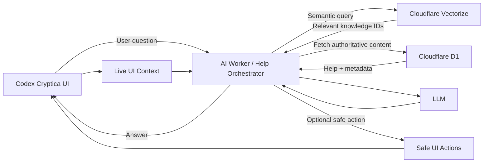
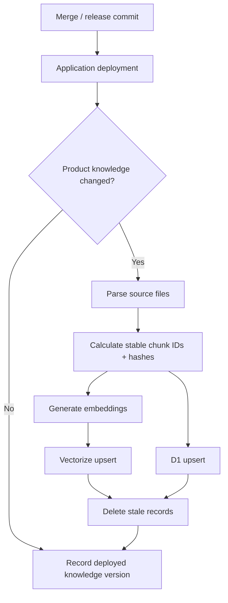

# Contextual AI Help Assistant Architecture

**Status:** Proposed  
**Version:** 0.1  
**Date:** 2026-09-25

## 1. Overview

Codex Cryptica has grown into a broad worldbuilding and RPG platform with generators, vault entities, graphs, tables, editors, import/export, AI features, sharing, and other workflows.

That breadth creates a discoverability problem:

- users may not know which feature to use;
- users may know what they want to accomplish but not where to do it;
- static help can explain a feature but cannot understand what the user is currently doing;
- onboarding cannot reasonably teach every workflow up front;
- each new feature increases the amount of product knowledge users must acquire.

Codex Cryptica should therefore provide a **context-aware AI help assistant** embedded in the product.

The assistant should understand:

1. what Codex Cryptica can do;
2. how individual features work;
3. where the user currently is in the application;
4. what the user is currently working on;
5. which safe actions are available in the current context;
6. the recent help conversation.

The initial product promise is:

> **Ask Codex how to use Codex.**

The assistant is a product guide, not a general autonomous agent.

---

## 2. Goals

The assistant should support questions such as:

- "What can I do on this page?"
- "How do I connect this character to a faction?"
- "Where are my previous generator results?"
- "Can I turn this result into an entity?"
- "How do I import this into my vault?"
- "What is the difference between a table and a deck?"
- "How do I make this faction appear in the graph?"
- "What should I do next?"
- "Show me where that button is."

Answers should be grounded in actual Codex Cryptica product knowledge rather than the model's generic memory.

Where possible, the assistant should also be able to navigate or visually guide the user to the relevant UI.

---

## 3. Non-goals for the first release

The first version should not:

- allow unrestricted DOM manipulation by the LLM;
- give the model direct database access;
- execute arbitrary application commands;
- automatically modify vault content;
- constantly interrupt the user with suggestions;
- index the entire source repository indiscriminately;
- treat the LLM's built-in knowledge as authoritative documentation for Codex Cryptica.

The LLM is the **reasoning and language layer**, not the source of truth for product behaviour.

---

## 4. High-level architecture



The core pattern is:

> **Retrieval + live application context + controlled actions.**

RAG alone is not enough. Retrieval can explain Codex Cryptica, but it cannot reliably resolve phrases such as "this page", "this character", "here", or "what should I do next?" without live application context.

---

## 5. Core responsibilities

### 5.1 Frontend

The frontend knows the user's immediate application state.

When the user asks the assistant a question, the frontend should send a small structured context packet alongside the message.

Example:

```json
{
  "route": "/vault/entities/:entityId",
  "area": "entity-editor",
  "entityType": "settlement",
  "selectedTab": "connections",
  "mode": "edit",
  "vaultEnabled": true,
  "availableActions": ["add-connection", "open-graph", "create-related-entity"]
}
```

This must be a deliberate help context, not a dump of application state.
Entity identifiers stay in the browser; send a route template rather than a
route containing a user's identifier. The help flow does not need the actual
entity ID to explain the current screen or validate a UI action.

#### Context may include

- current route;
- current feature;
- current entity type;
- editor mode;
- selected tab or panel;
- enabled capabilities;
- registered safe UI actions;
- generator currently being used;
- whether a generated result exists;
- relevant validation state;
- whether the user is in the Vault or on a public page;
- feature flags that materially change the visible UI.

#### Context should generally not include

- the entire vault;
- arbitrary entity text;
- large state objects;
- vault, entity, or other stable user-specific identifiers;
- secrets or credentials;
- information unrelated to the help question.

Additional user content should only be supplied when a help task genuinely requires it.

---

### 5.2 AI Worker / Help Orchestrator

The existing AI Worker proxy should act as the orchestration layer.

The Worker should not contain hard-coded copies of all documentation.

Its responsibilities are to:

1. receive the user's question;
2. receive live UI context;
3. apply help-assistant policy;
4. create a semantic retrieval query;
5. retrieve relevant product knowledge;
6. fetch authoritative help content;
7. construct the LLM request;
8. validate any proposed UI action;
9. return the answer and optional safe actions;
10. record suitable telemetry.

Conceptually:

```text
User question
      +
Live UI context
      +
Recent help conversation
      ↓
Help Worker
      ↓
Knowledge retrieval
      ↓
Prompt construction
      ↓
LLM
      ↓
Response + optional safe action
```

The Worker remains the trust boundary between the model and Codex Cryptica.

---

## 6. Product knowledge

### 6.1 Git is the source of truth

Product knowledge should remain version-controlled with Codex Cryptica.

D1 and Vectorize are runtime projections of that knowledge, not authoring systems.

A possible repository structure:

```text
/product-knowledge
    /features
        entity-connections.yaml
        graph-view.yaml
        session-hub.yaml
        generators.yaml

    /workflows
        create-first-settlement.md
        connect-two-entities.md
        save-generator-result.md

    /help
        vault.md
        imports.md
        exports.md
        tables.md
```

This keeps product behaviour and product documentation evolving together.

Existing help documentation can be ingested as part of this knowledge set rather than rewritten immediately.

---

## 7. Feature registry

Codex Cryptica should introduce a structured feature registry.

Example:

```yaml
id: entity-connections
title: Entity Connections

description: >
  Connect one vault entity to another and describe the
  relationship between them.

routes:
  - /vault/entities/*

available_for:
  - character
  - faction
  - settlement
  - location
  - organisation

tasks:
  add_connection:
    description: Connect the current entity to another entity.
    action: open-connection-dialog

  view_graph:
    description: View this entity and its relationships in the graph.
    action: open-graph

related_features:
  - graph-view
  - relationship-types

help:
  - /help/entity-connections.md
```

Structured feature metadata is especially useful for deterministic questions such as:

- "What can I do here?"
- "Can settlements have connections?"
- "Where is this feature available?"
- "What feature should I use?"
- "Can you show me where to do that?"

These questions should not depend only on fuzzy semantic retrieval.

---

## 8. Cloudflare D1

Cloudflare D1 should hold the deployed, queryable representation of product knowledge.

D1 stores the actual text and structured metadata used by the assistant.

Example logical model:

```sql
knowledge_documents
-------------------
id
source_path
title
type
feature_id
route
version
content_hash
content
created_at
updated_at

knowledge_chunks
----------------
id
document_id
chunk_index
content
content_hash
metadata_json
embedding_version
```

D1 can hold:

- help text;
- workflow documentation;
- feature metadata;
- routes;
- product versions;
- source references;
- chunk metadata.

D1 is not an AI-specific database. It is the structured runtime knowledge store.

---

## 9. Cloudflare Vectorize

Cloudflare Vectorize should provide semantic retrieval.

Vectorize stores embeddings for knowledge chunks plus metadata pointing back to the authoritative content in D1.

Example metadata:

```text
Vector ID
Embedding
Metadata
    documentId
    chunkId
    featureId
    contentType
    route
    productVersion
```

The relationship is:

> **D1 stores the knowledge. Vectorize finds the relevant knowledge.**

Vectorize should not be treated as the canonical documentation store.

---

## 10. Runtime retrieval flow

Example user question:

> "How do I make this character belong to a faction?"

Runtime flow:

```text
1. Frontend sends the question.

2. Frontend also sends:
   entityType = character
   feature = entity-editor
   selectedTab = connections

3. Worker constructs the retrieval query.

4. Worker searches Vectorize.

5. Vectorize returns relevant chunk IDs:
   - entity-connections:add
   - faction-membership
   - relationship-types

6. Worker loads authoritative content from D1.

7. Worker builds LLM context.

8. LLM generates the answer.

9. Worker validates any requested UI action.

10. Frontend displays the answer and optionally highlights
    or opens the relevant control.
```

---

## 11. Context-aware retrieval

Semantic similarity should not be the only ranking signal.

The Worker should boost knowledge that matches the user's current application context.

Example:

```text
User location:
  Entity Editor → Settlement → Connections

Question:
  "How do I add the guild?"
```

Potential ranking signals:

```text
semanticSimilarity = 0.74
routeMatch          = +0.15
featureMatch        = +0.20
entityTypeMatch     = +0.10
```

This should make entity-connection help outrank a generic guild-generator article even if both contain similar words.

The exact scoring model can evolve later.

---

## 12. LLM request shape

A typical request to the model might conceptually contain:

```text
SYSTEM

You are the Codex Cryptica product assistant.

Only describe Codex functionality supported by supplied
product knowledge or registered actions.

LIVE APPLICATION CONTEXT

Feature: Entity Editor
Entity type: Settlement
Current tab: Connections

Available actions:
- open-connection-dialog
- open-graph

RETRIEVED PRODUCT KNOWLEDGE

[Entity Connections documentation]

[Faction Relationships documentation]

RECENT CONVERSATION

User previously asked how to create a faction.

USER

How do I connect the faction I just created?
```

The assistant should answer concisely and contextually.

---

## 13. Safe UI actions

The assistant becomes much more useful when it can guide the interface rather than only describe it.

The model must not receive unrestricted frontend access.

Codex should expose a typed catalogue of safe commands.

Example:

```typescript
type HelpAction =
  | { type: "navigate"; route: string }
  | { type: "highlight"; target: string }
  | { type: "openPanel"; panel: string }
  | { type: "openGenerator"; generatorId: string }
  | { type: "openHelp"; helpId: string };
```

A model response could request:

```json
{
  "message": "Open Connections and choose Add Connection.",
  "action": {
    "type": "highlight",
    "target": "add-connection-button"
  }
}
```

The Worker and frontend must validate the action against the feature registry before executing it.

The model must never invent arbitrary selectors, routes, JavaScript commands, or database operations.

---

## 14. Interaction model

The assistant should support explicit levels of initiative.

### Level 0 — Silent

The assistant exists only as an icon or button.

It never initiates interaction.

### Level 1 — Reactive

The assistant answers when the user asks for help.

This should be the default behaviour for the initial release.

### Level 2 — Contextual suggestions

Codex may occasionally show a short, deterministic suggestion.

Example:

> You've created a faction. Want to connect it to this settlement?

The application decides whether a suggestion is appropriate.

The LLM may phrase the message, but it does not independently decide to interrupt the user.

### Level 3 — Guided workflow

The user explicitly enters a guided flow.

Example:

> Help me set up my first campaign.

The assistant may then proactively guide the user through multiple steps.

---

## 15. Proactive suggestion policy

Proactive behaviour should be controlled by Codex Cryptica rather than model personality.

Example:

```text
IF
  first time using graph
AND
  entity count >= 5
AND
  user has never opened graph help

THEN
  offer graph explanation
```

Another example:

```text
IF
  generator result exists
AND
  user has never used Save to Vault
AND
  suggestion has not already been dismissed

THEN
  offer Save to Vault help
```

This keeps the assistant predictable and avoids recreating the annoying side of Clippy.

Users should be able to control proactive assistance, for example:

```text
AI Help Suggestions

○ Off
● Occasional
○ Guided
```

The assistant should remain manually available even when proactive suggestions are disabled.

---

## 16. Conversation state

The assistant should preserve short-term task state.

Example:

```json
{
  "goal": "Create a faction connected to my settlement",
  "recentSteps": ["User generated a faction", "User saved faction to vault"]
}
```

This enables natural follow-ups such as:

> "Okay, now what?"

Long-term conversational memory is not required for the MVP.

The help system should avoid storing unnecessary user content merely to provide product assistance.

---

## 17. Knowledge ingestion pipeline

Knowledge should be published automatically from Git after deployment.

Recommended flow:



The knowledge sync must run only after the corresponding application deploy succeeds.

This prevents the assistant from explaining functionality that has not reached that environment yet.

---

## 18. Incremental updates

The pipeline should be idempotent.

Each document and chunk should have:

- a stable ID;
- a content hash;
- a source path;
- a product version or commit SHA;
- an embedding version.

Example chunk IDs:

```text
feature:entity-connections:introduction
feature:entity-connections:add-connection
workflow:generator-result:save-to-vault
help:graph:filters
```

Deployment behaviour:

```text
Same ID + same hash
→ do nothing

Same ID + changed hash
→ update D1
→ regenerate embedding
→ upsert Vectorize

New ID
→ insert

Missing previous ID
→ delete from D1 and Vectorize
```

This avoids rebuilding the complete vector index for every production deployment.

---

## 19. Environment isolation

Staging and production should use separate knowledge resources.

Example:

```text
STAGING

cc-help-staging-d1
cc-help-staging-vectorize

PRODUCTION

cc-help-prod-d1
cc-help-prod-vectorize
```

The staging assistant can therefore understand staging-only functionality without leaking those instructions into production help.

Every knowledge deployment should record the application commit SHA or version it represents.

---

## 20. Deployment workflows

Schema management and knowledge publishing should be separate concerns.

### D1 schema workflow

Responsible for:

- tables;
- indexes;
- schema migrations.

### Knowledge synchronization workflow

Responsible for:

- parsing documentation;
- chunking;
- hashing;
- D1 content upserts;
- embedding generation;
- Vectorize upserts;
- removing deleted knowledge;
- recording knowledge version.

This separation keeps ordinary documentation changes independent of database schema migration.

---

## 21. Knowledge quality

Assistant reliability will depend heavily on the quality of the source knowledge.

Feature documentation should answer:

- What does this feature do?
- Where is it available?
- What entity types does it apply to?
- What prerequisite state is required?
- What actions can the user perform?
- What related features exist?
- What terminology does Codex use?
- What common user goals does this feature satisfy?

High-quality structured product knowledge is likely to improve the assistant more than simply indexing more text.

---

## 22. Source code ingestion

The entire Codex Cryptica source repository should not be embedded automatically.

Raw source can:

- contain irrelevant implementation details;
- expose internal architecture unnecessarily;
- include unfinished features;
- include feature flags;
- contain misleading legacy paths;
- reduce retrieval quality.

Selected code-derived metadata may eventually be generated automatically where it has a clear product-help purpose.

---

## 23. Security

The system should maintain clear trust boundaries.

### Browser context is untrusted input

Route names, entity identifiers, and state values must still be validated.

### The LLM cannot execute arbitrary actions

Every model-proposed action must match an allow-listed action contract.

### Retrieved text cannot grant authority

Knowledge content must never override system policy, authentication, authorization, or application permission checks.

### Existing Codex permissions remain authoritative

The assistant must not expose or modify anything the current user could not access normally.

---

## 24. Privacy

Use data minimisation by default.

Answering:

> "What does the Connections tab do?"

does not require sending the settlement description to the model.

If later capabilities need access to actual vault content, that should be introduced as a separate explicit capability rather than silently expanding help context.

---

## 25. Observability

Useful events include:

```text
help.opened
help.question_asked
help.answer_shown
help.action_offered
help.action_used
help.nudge_shown
help.nudge_dismissed
help.answer_feedback_positive
help.answer_feedback_negative
help.retrieval_failed
help.no_relevant_knowledge
```

Do not automatically log private worldbuilding content.

Telemetry should primarily answer:

- Which features confuse users?
- Which questions recur?
- Which help content fails retrieval?
- Which answers lead users to the intended feature?
- Which suggestions are dismissed?
- Where does documentation need improvement?

The assistant can therefore become a product-discovery signal as well as a support feature.

---

## 26. UX concept

The assistant should have a small persistent presence rather than behaving like a modal chatbot that interrupts work.

Possible entry point:

```text
┌──────────────────────────────────────────────┐
│ Codex Guide                             ×    │
├──────────────────────────────────────────────┤
│                                              │
│ You're editing a Settlement.                 │
│                                              │
│ Ask me how this page works, where to find    │
│ something, or what you can do next.          │
│                                              │
│ ┌──────────────────────────────────────────┐ │
│ │ How do I connect a faction?              │ │
│ └──────────────────────────────────────────┘ │
│                                              │
└──────────────────────────────────────────────┘
```

Contextual quick prompts can come from the feature registry rather than the LLM:

- What can I do here?
- Explain this screen.
- What should I do next?
- Show me how to connect something.

---

## 27. Example interaction

The user is editing a settlement.

Current UI context:

```text
Feature: Entity Editor
Entity: Settlement
Tab: Connections
```

User:

> "I just created a merchants guild. How do I attach it here?"

Retrieved knowledge:

- Entity Connections;
- faction relationships;
- Add Connection workflow.

Assistant:

> You can connect the guild directly to this settlement. Use **Add Connection**, choose the guild, then select or describe the relationship between them. I can highlight the Add Connection control for you.

Optional action:

```json
{
  "type": "highlight",
  "target": "add-connection-button"
}
```

This is the intended experience: contextual product guidance rather than generic documentation search.

---

## 28. MVP

### Required

- persistent AI help entry point;
- reactive chat;
- current route awareness;
- current feature awareness;
- current entity type awareness;
- feature registry;
- product-help knowledge in Git;
- D1 runtime knowledge store;
- Vectorize semantic retrieval;
- Worker orchestration;
- staging/production isolation;
- automated knowledge synchronization;
- links or navigation to relevant Codex pages.

### Nice to have

- highlight a UI control;
- suggested questions based on the current page;
- basic answer feedback.

### Explicitly deferred

- autonomous editing;
- creating entities through the assistant;
- deleting or modifying content;
- complex multi-step agents;
- highly proactive suggestions;
- full vault awareness;
- long-term assistant memory.

---

## 29. Later phases

### Phase 2

Potential additions:

- highlight controls directly;
- open relevant panels;
- start generators;
- guided onboarding flows;
- controlled proactive suggestions;
- detect common stuck states;
- explain validation errors;
- recommend relevant Codex workflows;
- preserve immediate task state across several interactions.

### Phase 3

Controlled application actions may be introduced, for example:

- "Create a faction for this settlement."
- "Save this generator result to my vault."
- "Connect these two entities."

Mutating actions should:

1. use explicit typed tool contracts;
2. be validated server-side;
3. respect existing permissions;
4. require confirmation where appropriate;
5. return a clear success or failure result.

The assistant should evolve through:

```text
Explain → Guide → Navigate → Assist
```

rather than jumping directly to autonomous agency.

---

## 30. Alternative: managed RAG

Cloudflare's managed AI-search capabilities can be reconsidered later if maintaining the ingestion pipeline becomes unnecessary overhead.

The initial preference is still **D1 + Vectorize** because Codex product knowledge is highly structured and needs explicit control over:

- feature IDs;
- routes;
- actions;
- environment versions;
- chunk identity;
- metadata filtering;
- ranking signals;
- deployment synchronization.

---

## 31. Architecture decisions

### ADR-01 — Git is the canonical product-knowledge source

Runtime databases are generated projections.

**Reason:** Product behaviour and product documentation should evolve together.

### ADR-02 — Worker acts as orchestrator

The existing AI Worker controls retrieval, context, model calls, policy, and permitted actions.

**Reason:** This provides a clear server-side trust boundary.

### ADR-03 — D1 stores authoritative runtime knowledge

D1 stores help content, metadata, workflows, and feature definitions.

**Reason:** Structured SQL retrieval complements semantic search and supports explicit product metadata.

### ADR-04 — Vectorize performs semantic retrieval

Embeddings are separate from authoritative content.

**Reason:** Natural-language discovery is useful without making the vector database the source of truth.

### ADR-05 — Frontend supplies live context

The model should not infer application state from conversation alone.

**Reason:** Explicit context makes phrases such as "this", "here", and "what next?" understandable.

### ADR-06 — Model actions are constrained

The model may only request registered actions.

**Reason:** The LLM must not have arbitrary application control.

### ADR-07 — Proactive help is application-controlled

The LLM does not independently decide when to interrupt users.

**Reason:** Predictable assistance is less likely to become annoying.

### ADR-08 — Knowledge sync follows successful deployment

Environment knowledge should match the application version users are actually running.

**Reason:** The assistant must not instruct users to use functionality that is not deployed.

---

## 32. Summary

The proposed design separates five responsibilities:

```text
Git
    knows what Codex Cryptica is.

D1
    stores the deployed product knowledge.

Vectorize
    finds the relevant knowledge.

Frontend Context
    explains what the user is doing right now.

AI Worker
    combines context, knowledge, policy, and the LLM.
```

The assistant is therefore not merely a chatbot embedded in Codex Cryptica.

It becomes a context-sensitive interface to the product itself.

> **The assistant should know both Codex Cryptica and where the user is standing inside Codex Cryptica.**
