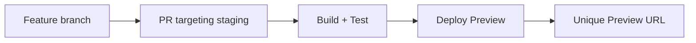
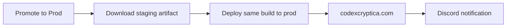

# CI/CD Deployment Architecture

This document describes the automated build and deployment pipeline for Codex Cryptica.

## Overview

Codex Cryptica uses **Cloudflare Pages** for hosting with an **artifact promotion** model. The application is built once on staging, and that exact same build artifact is promoted to production — no rebuilds, no drift.

- **Production:** `codexcryptica.com`
- **Staging:** `staging.codexcryptica.com`

## The Deployment Pipeline

### 1. Feature → Preview (Verification)



1. Open a Pull Request targeting the `staging` branch.
2. The [`deploy.yml`](.github/workflows/deploy.yml) workflow triggers on `pull_request`:
   - Installs dependencies, runs lint and tests.
   - Builds the application.
   - Deploys a **Preview** to Cloudflare Pages.
   - Cloudflare automatically adds a comment to the PR with a unique preview URL.
3. Review the preview and ensure everything works as expected.

### 2. Merge → Staging (Shared Environment)

Once the PR is approved and manually merged:

1. `deploy.yml` triggers on `push` to the `staging` branch.
2. It deploys the build to `staging.codexcryptica.com`.
3. It uploads a **staging artifact** (`staging-dist`) with 30-day retention for production promotion.

> [!IMPORTANT]
> To support the "artifact promotion" model, staging builds must be production-ready. We bake production URLs (`codexcryptica.com`) and indexing directives into the staging build to ensure the promoted artifact is correct for the live site. To prevent staging from being indexed, use Cloudflare-level overrides (headers or workers) rather than build-time environment variables.

### 2. Staging → Production (Artifact Promotion)



Production uses a **manual promotion workflow** — there is no automatic promotion from staging to production.

**To promote:**

1. Go to **Actions** → **Promote Staging to Production**
2. Click **Run workflow**
3. Optionally specify a staging run ID (leave blank to use the latest successful staging deployment)
4. Click **Run workflow**

The promotion workflow:

- Finds the latest successful staging deployment (or the specific run you provided)
- Downloads the exact `staging-dist` artifact from that run
- Deploys it to Cloudflare Pages on the production branch
- Sends a notification to the Discord prod-deployment channel with the source run link

**Artifact retention:** Staging build artifacts are kept for 30 days. If you need to promote an older build, re-run the staging deployment for that commit first.

## Workflow Files

| File                                                                       | Purpose                                                            |
| -------------------------------------------------------------------------- | ------------------------------------------------------------------ |
| [`deploy.yml`](.github/workflows/deploy.yml)                               | Build + deploy on push to `main` or `staging`                      |
| [`promote-to-prod.yml`](.github/workflows/promote-to-prod.yml)             | Manual promotion of staging artifact to production                 |
| [`auto-merge-staging.yml`](.github/workflows/auto-merge-staging.yml)       | Auto-enables merge for staging-targeted PRs                        |
| [`auto-bump-web-version.yml`](.github/workflows/auto-bump-web-version.yml) | Auto-increments `apps/web/package.json` version on merge to `main` |
| [`release.yml`](.github/workflows/release.yml)                             | Creates GitHub releases for major/minor version bumps              |

## Branch Flow

```
Feature branch → PR → staging (auto-merge) → staging.codexcryptica.com
                                                    ↓
                                    [Promote to Prod] button
                                                    ↓
                                              codexcryptica.com
```

## Environment Variables

The following secrets must be configured in GitHub repository settings:

| Secret                             | Purpose                                                                      |
| ---------------------------------- | ---------------------------------------------------------------------------- |
| `VITE_GOOGLE_CLIENT_ID`            | OAuth client ID                                                              |
| `VITE_GEMINI_API_KEY`              | API key for the Lore Oracle                                                  |
| `VITE_SHARED_GEMINI_KEY`           | Shared API key for the basic/lite model tier                                 |
| `CLOUDFLARE_ACCOUNT_ID`            | Cloudflare account ID                                                        |
| `CLOUDFLARE_API_TOKEN`             | Cloudflare API token with Pages deploy permissions                           |
| `DISCORD_WEBHOOK_URL_PROD_DEPLOY`  | Webhook URL for the prod-deployment Discord channel                          |
| `VITE_DISCORD_WEBHOOK_URL_RELEASE` | Webhook URL for the release Discord channel (used for staging notifications) |

## Concurrency

The `deploy.yml` workflow uses `concurrency: cloudflare-pages` with `cancel-in-progress: true`. This means:

- If multiple pushes happen in quick succession, only the latest build + deploy runs
- You may see "Cancelled" runs in the Actions tab — this is normal

The `promote-to-prod.yml` workflow does **not** cancel in-progress promotions to prevent accidental double-deploys.

## Troubleshooting

**Staging deployed but promotion fails:**

1. Check that the staging build artifact exists (Actions → staging run → Artifacts)
2. Artifacts expire after 30 days; re-run the staging deploy if needed

**Production deploy didn't update the site:**

1. Check the **Actions** tab for the latest "Deploy to Cloudflare Pages" or "Promote Staging to Production" run
2. If it failed, check the deploy step for Cloudflare API errors
3. If it was cancelled, a newer push superseded it — wait for the latest run to finish

**Staging notification went to the wrong Discord channel:**

- Staging notifications use `VITE_DISCORD_WEBHOOK_URL_RELEASE`
- Production notifications use `DISCORD_WEBHOOK_URL_PROD_DEPLOY`
