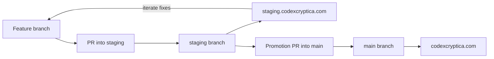

# CI/CD Deployment Architecture

This document describes the automated build and deployment pipeline for Codex Cryptica.

## Overview

Codex Cryptica now uses **Cloudflare Pages** for hosting. We still keep a staged deployment path so changes can be tested before they are promoted live.

- **Production:** Hosted at the root (`codexcryptica.com`).
- **Staging:** Hosted as a Cloudflare Pages staging deployment or subdomain.
  - If you want a dedicated staging URL, attach `staging.codexcryptica.com` to the `staging` branch and point the DNS record at `staging.codex-cryptica.pages.dev`.

## The Deployment Workflow (`deploy.yml`)

The main deployment script is located at `.github/workflows/deploy.yml`. It triggers on pushes to the main deployment branches and builds the current branch once before uploading it to Cloudflare Pages.

### 1. Build Phase

The workflow installs dependencies, runs lint and tests, and then builds the web app with the current branch content.

### 2. Deploy Phase

The deployment job uploads the static build to Cloudflare Pages:

- `main` deploys to production
- `staging` deploys to the staging Pages branch

## Branch Flow

The intended GitHub flow is:

1. Create a feature branch and open a PR into `staging`.
2. Let the `auto-merge-staging` workflow enable merge-on-green for that PR.
3. Test the deployed result on `staging.codexcryptica.com`.
4. Push fixes to the same feature branch and let the PR update and redeploy to staging.
5. When the staging result is good, open a promotion PR from `staging` into `main`.
6. Merge that promotion PR to release the same validated changes to production.

For release promotion PRs, the goal is to move already-validated staging work into `main`, not to re-review the feature implementation from scratch.

## The Version Bump Workflow (`auto-bump-web-version.yml`)

When a Pull Request is merged into `main`:

1. **Auto-Bump Trigger:** A workflow runs to increment the version in `apps/web/package.json`.
2. **Commit & Push:** The bot commits the new version back to `main`.
3. **Redundant Triggers:** This push triggers `deploy.yml` automatically.
4. **Manual Dispatch:** The bot can also execute `gh workflow run deploy.yml`.

**Note:** Because of the `concurrency` setting in `deploy.yml`, you may see "Cancelled" runs in your Actions tab after a merge. This is normal behavior; the system is simply cancelling the earlier deployment in favor of the later one.

## Staging Promotion Workflow

Pull requests targeting `staging` can be promoted automatically once they are ready.

- [`/.github/workflows/auto-merge-staging.yml`](/home/espen/proj/Codex-Arcana/.github/workflows/auto-merge-staging.yml) enables GitHub auto-merge for non-draft PRs that target `staging`.
- GitHub repository settings must allow auto-merge for the workflow to take effect.
- The workflow only applies to PRs from the same repository, so forked contributions are left alone.

Once auto-merge is enabled, GitHub will merge the PR into `staging` after the required checks and review conditions pass.

## Blog Content Deployment

The blog now has its own content-only deployment path that publishes markdown into a dedicated `blog-content` branch.

See [`docs/BLOG_DEPLOYMENT.md`](/home/espen/proj/Codex-Arcana/docs/BLOG_DEPLOYMENT.md) for the workflow, runtime fetch path, and branch layout.

## Environment Variables

The following secrets must be configured in GitHub for the build to succeed:

- `VITE_GOOGLE_CLIENT_ID`: OAuth client ID.
- `VITE_GEMINI_API_KEY`: API key for the Lore Oracle.
- `CLOUDFLARE_ACCOUNT_ID`: Cloudflare account ID for Pages deployments.
- `CLOUDFLARE_API_TOKEN`: Cloudflare API token with Pages deploy permissions.
- `VITE_DISCORD_WEBHOOK_URL_PROD`: For production notifications.
- `VITE_DISCORD_WEBHOOK_URL_STAGING`: For staging notifications.

## Troubleshooting

If a merge to `main` doesn't result in a site update:

1. Check the **Actions** tab. Look for the _latest_ "Deploy to Cloudflare Pages" run.
2. If it failed, check the "Build Application" step for linting or test errors.
3. If it was cancelled, wait for the subsequent run (the one triggered by the bot) to finish.
