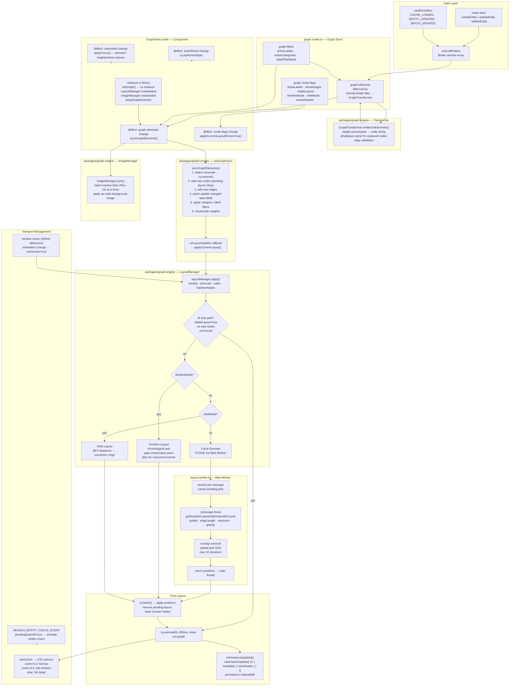
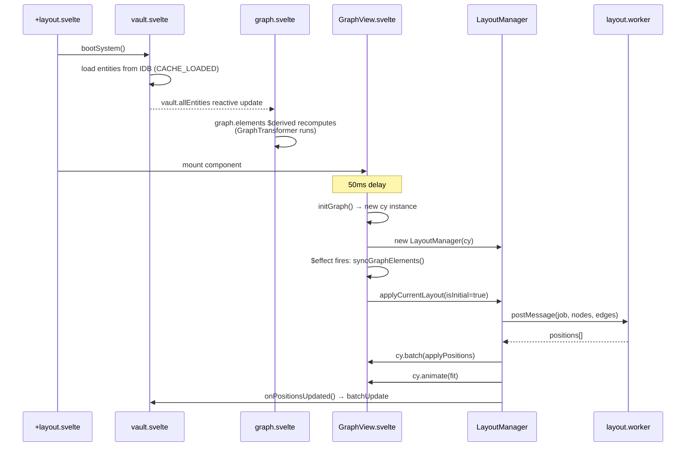
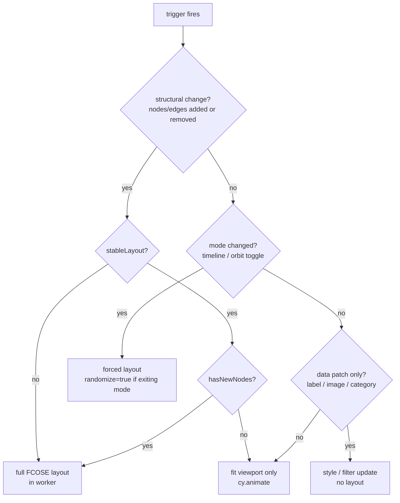

# Graph Rendering Flow

Traces the complete data flow from vault entities through layout computation to the Cytoscape DOM, including all re-render triggers.

---

## Flow Diagram

---

## Initialization Sequence

---

## Re-render Decision Tree

---

## Key Subsystems

### GraphTransformer (`packages/graph-engine/src/transformer.ts`)

Converts vault entities to Cytoscape elements in a single pass:

1. **Weight pass** — counts visible connections per node to determine size (48px – 128px)
2. **Node creation** — assigns phyllotaxis spiral positions to unplaced nodes; marks them `pending-layout` (opacity 0) until the worker returns
3. **Edge creation** — filters edges whose target no longer exists in the vault

### Element Sync (`packages/graph-engine/src/sync/useGraphSync.ts`)

Incremental diffing — avoids full cy teardown on every vault change:

- O(1) map lookups for existing nodes
- Patch updates: only changed fields written to cy data
- Special equality checks for coordinates, arrays, temporal metadata
- Batched `cy.batch()` writes for DOM efficiency

### Layout Worker (`packages/graph-engine/src/layout.worker.ts`)

Job-based, cancellable. Timeout scales at 30ms/node (min 15s, max 60s).

Dynamic options scale with graph size:

| Parameter      | Formula                                        |
| -------------- | ---------------------------------------------- |
| Edge length    | `90 + √nodeCount × 9`                          |
| Node repulsion | `250000 + nodeCount × 2400`                    |
| Gravity        | `max(0.005, 0.05 − nodeCount × 0.00015)`       |
| Quality        | `"draft"` if nodeCount ≥ 500, else `"default"` |

After worker positions are applied, a grid-based overlap removal pass runs (O(N) per iteration, max 32 rounds).

### Image Manager (`packages/graph-engine/src/sync/ImageManager.ts`)

Lazy, batched blob URL resolution: resolves 10 nodes per tick, caches resolved URLs, revokes stale blob URLs on data change or image toggle.

### Level-of-Detail

Zoom thresholds: `< 0.2` → `lod-low`, `< 0.5` → `lod-medium`, else full detail. Applied via CSS classes on pan/zoom events.

---

## Re-render Trigger Reference

| Trigger                  | Source                      | Layout?     | Type                         |
| ------------------------ | --------------------------- | ----------- | ---------------------------- |
| Entity created           | `vault.createEntity()`      | Yes         | FCOSE (hasNewNodes=true)     |
| Entity deleted           | `vault.deleteEntity()`      | Yes         | FCOSE                        |
| Entity data updated      | `vault.updateEntity()`      | No          | data patch only              |
| Connection added/removed | entity.connections change   | Yes         | FCOSE                        |
| Label filter changed     | `graph.activeLabels`        | No          | CSS class toggle             |
| Category filter changed  | `graph.activeCategories`    | No          | CSS class toggle             |
| Timeline mode toggled    | `graph.timelineMode`        | Yes         | Timeline layout (forced)     |
| Orbit mode toggled       | `graph.orbitMode`           | Yes         | Orbit layout (forced)        |
| Show labels toggled      | `graph.showLabels`          | No          | style update                 |
| Show images toggled      | `graph.showImages`          | No          | ImageManager sync            |
| Stable layout toggled    | `graph.stableLayout`        | No          | affects next layout decision |
| Vault load complete      | `vault.status → idle`       | Yes         | FCOSE (forced)               |
| Window resize            | ResizeObserver              | Conditional | fit-only or FCOSE            |
| Orientation change       | resize handler              | Yes         | FCOSE (randomize=true)       |
| Search focus             | `SEARCH_ENTITY_FOCUS_EVENT` | No          | animate center+zoom          |
| Theme change             | `themeStore.activeTheme`    | No          | `cy.style()` update          |
| Manual redraw            | UI button                   | Yes         | FCOSE (forced)               |

---

## Related Documents

- [`GRAPH_LAYOUT_TUNING.md`](./GRAPH_LAYOUT_TUNING.md) — FCOSE parameter reference and tuning guide
- [`GRAPH_STABILITY.md`](./GRAPH_STABILITY.md) — stable layout mode and position persistence
- [`VAULT_INIT_FLOW.md`](./VAULT_INIT_FLOW.md) — vault boot sequence that precedes graph initialization
