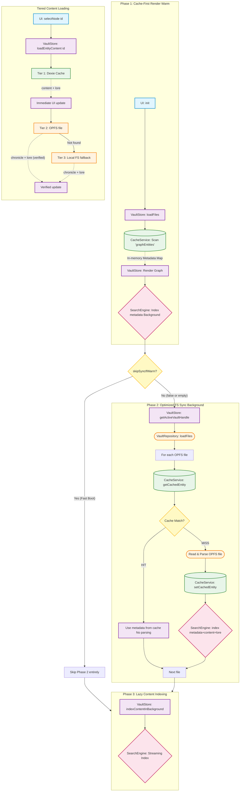

# Vault Initialization & Tiered Storage Flow

This document describes the interaction between the `VaultStore`, `CacheService` (Dexie), and the `VaultRepository` (OPFS) during application startup, vault switching, and user interaction.

## High-Level Sequence

## Storage vs. Memory Strategy

A critical design goal of Codex Cryptica is to support massive vaults (1,000+ entities) with extensive GM lore while maintaining a low memory footprint and instant startup.

### 1. Persistent Storage (Disk)

- **OPFS (Origin Private File System)**: The source of truth. Data is stored as standard Markdown files on the user's hard drive.
- **Dexie (IndexedDB)**: A high-performance structured cache on the user's hard drive. It mirrors the OPFS data but splits it into metadata (`graphEntities`) and heavy text (`entityContent`).
- **RAM Impact**: Zero. 100MB of lore on disk uses 0MB of RAM while dormant.

### 2. Reactive Store (RAM)

- **VaultStore (Svelte 5 Runes)**: Holds the active state of the vault in JavaScript memory.
- **Initial Load**: Only **Metadata** (ID, Title, Type, Tags, Connections) is loaded into RAM. The `content` and `lore` fields for all entities are initialized as empty strings (`""`).
- **Lazy Loading**: Heavy text is only moved from **Disk (Dexie/OPFS)** to **RAM (VaultStore)** when a specific entity is "opened" or "queried". This ensures that even if a vault contains 1 million words, the browser only ever holds the few thousand words the user is currently reading.

## Detailed Breakdown

### Phase 1: Cache-First Render

- **Trigger**: `VaultStore.loadFiles()`
- **Action**: `CacheService.preloadVault()` performs a **single bulk read** from the `graphEntities` table in Dexie.
- **Optimization**: The UI is populated with cached metadata **before** the app even requests the OPFS directory handle or starts scanning files. This makes the initial graph appearance near-instant (~50ms for 300+ entities).
- **Search**: Title and Tag indexing happens immediately so the user can filter the graph while the filesystem syncs in the background.

### Phase 2: Optimized File System Synchronization

- **Trigger**: `VaultRepository.loadFiles()` (after `getActiveVaultHandle()`)
- **Background Sync**: This phase ensures the cache is consistent with the actual files on disk.
- **Cache Check**: For each file, it compares the OPFS `lastModified` timestamp with the preloaded cache entry.
- **Differential Update**:
  - If they match (**HIT**), no file read or parsing occurs.
  - If they don't match (**MISS**), the file is re-parsed, the Dexie cache is updated via an **atomic transaction** (updating both metadata and content tables), and the search engine is notified.
- **Quiet Mode**: On warm loads where no files have changed, this phase is completely silent and consumes minimal CPU/IO.

### Phase 3: Lazy Content Indexing

- **Background Indexing**: Since metadata-only loads skip file parsing, the full-text search index for `content` and `lore` is populated by streaming from the Dexie `entityContent` table in the background. It uses the `each()` cursor API to keep memory usage constant and avoid UI jank.

### User Interaction: Tiered Content Loading

When a user opens an entity (Detail Panel, Edit Mode, Read Modal) or the Lore Oracle needs context, `VaultStore.loadEntityContent(id)` is called:

1.  **Tier 1 (Dexie Cache)**: The system first checks the `entityContent` table in Dexie. If found, both **Content** and **Lore** are applied immediately to the UI.
2.  **Tier 2 (OPFS)**: In parallel, the app reads the source Markdown file from OPFS. This is the **Source of Truth** for the latest version of the data.
3.  **Tier 3 (Local FS Fallback)**: If the file is missing from OPFS (e.g. during an active sync), the app attempts to read directly from the user's linked local folder.
4.  **Sync**: Once the file is read, the Dexie cache is updated to match the disk state if they differ.

## Key Performance Design Decisions

1.  **Cache-First UI**: Graph visibility is decoupled from filesystem I/O latency.
2.  **In-Memory Search Index**: While Dexie persists the raw data, the **Search Engine (FlexSearch)** is currently purely in-memory (running in a Web Worker). This means it **must** be re-fed from Dexie on every app load to enable filtering and search.
3.  **Fast Metadata Warming**: To provide immediate searchability, Phase 1 performs a lightweight metadata-only index (Titles/Tags) in the background.
4.  **Differential Sync**: Phase 2 only processes actual filesystem changes, skipping redundant work for 99% of typical loads.
5.  **Table Splitting**: Metadata is separated from Content/Lore. The graph view only needs metadata, allowing the heavy text to stay on disk until needed.
6.  **Streaming Indexing**: Avoids `toArray()` when indexing the full vault to prevent JS heap spikes.
7.  **Timestamp Normalization**: `lastModified` is floored to integer milliseconds to ensure consistent cache hits across different browsers and storage engines.
8.  **Atomic Persistence**: Writes to metadata and content are wrapped in a single transaction to prevent "split-brain" states where a node exists but its content is missing.
