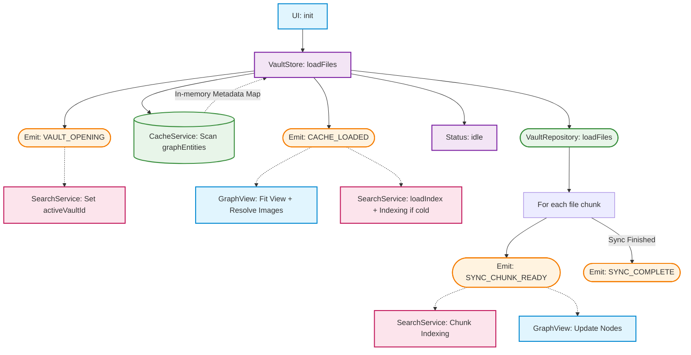

# Vault Initialization & Tiered Storage Flow

This document describes the interaction between the `VaultStore`, `VaultEventBus`, `SearchService`, and the underlying storage engines during application startup and synchronization.

## High-Level Sequence

## Storage vs. Memory Strategy

Codex Cryptica supports massive vaults (1,000+ entities) by maintaining a strict separation between metadata needed for the graph and heavy content needed for reading.

### 1. Persistent Storage (Disk)

- **OPFS (Origin Private File System)**: The source of truth (Markdown).
- **Dexie (IndexedDB)**: A structured mirror split into `graphEntities` (metadata) and `entityContent` (heavy text).
- **Search Index (IndexedDB)**: The FlexSearch index is exported and persisted to IndexedDB between reloads to avoid redundant indexing.

### 2. Reactive Store (RAM)

- **VaultStore**: Holds the active metadata map. `content` and `lore` fields are initialized as `""` and lazy-loaded only when requested.

## Detailed Breakdown

### Phase 1: Event-Based Boot

- **`VAULT_OPENING`**: Broadcast as soon as initialization begins. `SearchService` reacts by setting the current vault context.
- **`CACHE_LOADED`**: Broadcast as soon as the Dexie metadata scan completes.
  - **UI**: The `VaultStore` status becomes `"idle"` **immediately**. This makes the graph interactive and visible while other tasks run.
  - **Images**: `GraphView` starts resolving image URLs from the cache.
  - **Search**: `SearchService` attempts to **load the persisted index** from IndexedDB. If no index exists (Cold Boot), it begins background metadata indexing.

### Phase 2: Optimized Background Sync

- **Trigger**: `VaultRepository.loadFiles()`
- **Incremental Updates**: As OPFS files are scanned, chunks are processed and broadcast via **`SYNC_CHUNK_READY`**.
- **Non-Blocking**: Because the store is already `"idle"`, this synchronization does not cause UI "loading" overlays or hide the graph.

### Phase 3: Lazy Content Indexing

- If the search index is missing content (Cold Boot), a streaming background job indexes the full text from the Dexie `entityContent` table using a cursor to keep memory usage constant.

## Key Performance Design Decisions

1.  **Immediate Interactivity**: `VaultStore` status is decoupled from background services. The UI is usable the moment metadata is available.
2.  **Persistent Search Index**: Restoring the index from IndexedDB eliminates the "1-2 second" indexing delay on warm reloads. Restoration is deferred to the `CACHE_LOADED` phase to ensure worker readiness.
3.  **Autonomous Services**: Services (Search, Maps, AI) manage their own state by listening to the `VaultEventBus` rather than being manually orchestrated by the `VaultStore`.
4.  **Debounced Persistence**: `SearchService` debounces index saves (2s) to ensure high-frequency CRUD operations don't cause disk I/O bottlenecks.
