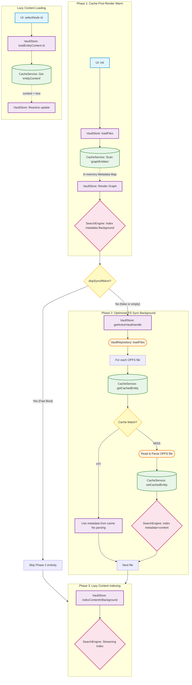

# Vault Initialization & Cache Flow

This document describes the interaction between the `VaultStore`, `CacheService` (Dexie), and the `VaultRepository` (OPFS) during the application startup and vault switching.

## High-Level Sequence

## Detailed Breakdown

### Phase 1: Cache-First Render

- **Trigger**: `VaultStore.loadFiles()`
- **Action**: `CacheService.preloadVault()` performs a **single bulk read** from the `graphEntities` table in Dexie.
- **Optimization**: The UI is populated with cached metadata **before** the app even requests the OPFS directory handle or starts scanning files. This makes the initial graph appearance near-instant (~50ms for 300+ entities).
- **Search**: Title and Tag indexing happens immediately so the user can filter the graph while the filesystem syncs in the background.

### Phase 2: Optimized File System Synchronization

- **Trigger**: `VaultRepository.loadFiles()` (after `getActiveVaultHandle()`)
- **Background Sync**: This phase ensures the cache is consistent with the actual files on disk.
- **Cache Check**: For each file, it compares the OPFS `lastModified` timestamp with the preloaded cache entry.
- **Differential Update**:
  - If they match (**HIT**), no file read or parsing occurs, and the search engine is **not** notified (avoiding redundant async indexing).
  - If they don't match (**MISS**), the file is re-parsed, the Dexie cache is updated via an **atomic transaction**, and only then is the search engine notified of the change.
- **Quiet Mode**: On warm loads where no files have changed, this phase is completely silent and consumes minimal CPU/IO.

### Phase 3: Lazy Content Loading & Background Indexing

- **Background Indexing**: Since metadata-only loads skip file parsing, the full-text search index for `content` is populated by streaming from the Dexie `entityContent` table in the background. It uses the `each()` cursor API to keep memory usage constant.
- **On-Demand Content**: When a user opens an entity (Detail Panel, Edit Mode, Read Modal), `VaultStore.loadEntityContent(id)` is called.
- **Dexie Fetch**: It retrieves the heavy `content` and `lore` fields from the dedicated Dexie table and merges them into the reactive Svelte state.

## Key Performance Design Decisions

1.  **Cache-First UI**: Graph visibility is decoupled from filesystem I/O latency.
2.  **In-Memory Search Index**: While Dexie persists the raw data, the **Search Engine (FlexSearch)** is currently purely in-memory (running in a Web Worker). This means it **must** be re-fed from Dexie on every app load to enable filtering and search.
3.  **Fast Metadata Warming**: To provide immediate searchability, Phase 1 performs a lightweight metadata-only index (Titles/Tags) in the background.
4.  **Differential Sync**: Phase 2 only processes actual filesystem changes, skipping redundant work for 99% of typical loads.
5.  **Table Splitting**: Metadata is separated from Content/Lore. The graph view only needs metadata, allowing the heavy text to stay on disk until needed.
6.  **Streaming Indexing**: Avoids `toArray()` when indexing the full vault to prevent JS heap spikes.
7.  **Timestamp Normalization**: `lastModified` is floored to integer milliseconds to ensure consistent cache hits across different browsers and storage engines.
