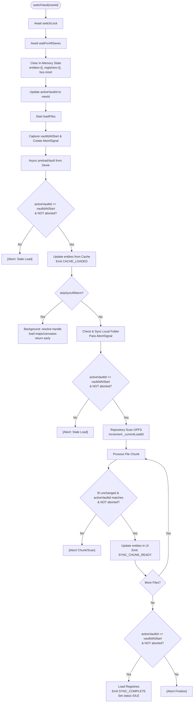

# Vault Switching & Data Isolation Process

This document describes how vault switching works to prevent data from one campaign "bleeding" into another.

## Overview

Vault switching clears in-memory state and reloads data from the Origin Private File System (OPFS) and Dexie (IndexedDB). Race conditions are prevented by a combination of:

1. **Serialization**: A mutual exclusion lock ensuring switches happen one-at-a-time.
2. **Abortion**: `AbortSignal` support to immediately terminate stale background syncs.
3. **Validation**: Checking the vault ID at every async boundary.

## The Switching Sequence

When `switchVault(newId)` is called, the following steps occur in `VaultLifecycleManager`:

### 0. Await switchLock

All `switchVault` calls are wrapped in a mutual exclusion lock. If a user clicks between vaults rapidly, the calls are queued and executed sequentially. This prevents the system from being in two states at once.

### 1. Flush Pending Saves

Before any state is cleared, the system awaits `repository.waitForAllSaves()`. This ensures that all in-progress edits to the _current_ vault are safely written to disk and cache before the transition begins.

### 2. In-Memory Purge

The system explicitly clears all reactive state associated with the previous vault:

- **Repository**: `this.entities` is reset to `{}`.
- **Asset Manager**: URL caches for images/blobs are cleared.
- **Registries**: Map and Canvas registries are emptied.
- **Selection**: `selectedEntityId` is reset to `null`.
- **UI State**: Conflict flags and sync statuses are reset.

### 3. Identity Update

The `activeVaultId` is updated in the `VaultRegistry`. This is a normal state update — subsequent race checks validate against it, providing safety rather than being a hard "point of no return".

### 4. Load Files (`loadFiles`)

The loading process uses a "Cache-First" strategy: try to show data immediately from Dexie, then optionally sync with OPFS in the background for accuracy.

#### Step A: Capture vaultIdAtStart & Abort Previous Sync

At the very beginning of `loadFiles`:

1. The current `activeVaultId` is captured as `vaultIdAtStart`.
2. Any ongoing `syncAbortController` is aborted.
3. A new `AbortController` is created for the current load.

#### Step B: Cache-First Load

The system calls `cacheService.preloadVault(vaultIdAtStart)` to perform a bulk-load of graph metadata from Dexie.

- **Race Check**: After the async read, if `activeVaultId !== vaultIdAtStart` OR the `signal` is aborted, the function returns immediately.
- **Isolation**: A fresh `entityMap` object is created — it does _not_ inherit or spread from the existing repository state.

If cache is populated and `skipSyncIfWarm` is true (default), the function returns early with status set to `idle`. The vault is visible with cached data while maps/canvases load in the background and the OPFS handle resolves.

#### Step C: Local File Synchronization (if not warm)

If the vault has a linked local filesystem folder and we didn't take the early return, `SyncCoordinator` runs a bidirectional sync between OPFS and the external folder.

- **Abort Signal**: The `AbortSignal` is passed down to the `SyncService`, which checks it during FS/OPFS scans and between every individual file operation.
- **Race Check**: After sync completes, the vault ID and abort state are verified again before proceeding.

#### Step D: OPFS Incremental Scan (if not warm)

The `VaultRepository` scans the OPFS directory for the new vault.

- **Load ID Protection**: The repository increments `_currentLoadId` at the start of each `loadFiles` call. Every chunk processes only if `_currentLoadId` still matches the local load ID.
- **Incremental Updates**: Entities are pushed to the UI in chunks. Each chunk performs a race check against both `activeVaultId` and the `AbortSignal`.

## Data Isolation Guardrails

### 1. Switch Lock

Implemented in `VaultLifecycleManager`, this `Promise`-based lock ensures that the complex state-clearing and identity-switching logic never interleaves.

### 2. Pervasive Abort Signals

The `syncAbortController` in `VaultStore` ensures that long-running background tasks (like binary file comparisons in `SyncService`) are killed immediately when the user switches vaults. This prevents a background task from "waking up" and writing data to the wrong vault context.

### 3. Race Checks (`activeVaultId !== vaultIdAtStart`)

`VaultStore.loadFiles` performs validation checks after every async operation:

1. After Dexie metadata preload.
2. After OPFS directory handle resolution.
3. After local folder synchronization.
4. Inside every chunk callback from the repository scan.

### 4. Load ID Mechanism

`VaultRepository` maintains an integer `_currentLoadId`. On each `loadFiles` call, it captures the current value as a local `loadId`. All loops and async callbacks check this — if it doesn't match, the operation exits early.

### 5. Event Bus Validation

Events are emitted during load (`VAULT_OPENING`, `CACHE_LOADED`, `SYNC_CHUNK_READY`, `SYNC_COMPLETE`) with the `vaultId` attached.

- **Search Service**: Validates `event.vaultId` against its own `activeVaultId` before indexing chunks. It ignores any data that belongs to an aborted load.
