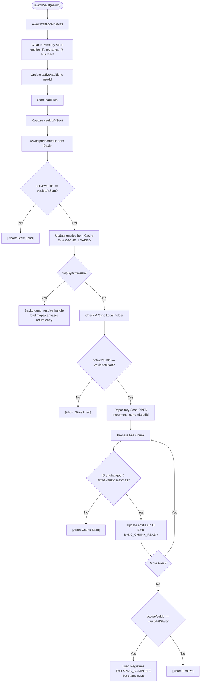

# Vault Switching & Data Isolation Process

This document describes how vault switching works to prevent data from one campaign "bleeding" into another.

## Overview

Vault switching clears in-memory state and reloads data from the Origin Private File System (OPFS) and Dexie (IndexedDB). Race conditions are prevented by checking the vault ID at every async boundary — if the ID changes during loading, the stale operation aborts silently.

## The Switching Sequence

When `switchVault(newId)` is called, the following steps occur in `VaultLifecycleManager`:

### 1. Flush Pending Saves

Before any state is cleared, the system awaits `repository.waitForAllSaves()`. This ensures that all in-progress edits to the _current_ vault are safely written to disk and cache before the transition begins.

### 2. In-Memory Purge

The system explicitly clears all reactive state associated with the previous vault:

- **Repository**: `this.entities` is reset to `{}`.
- **Asset Manager**: URL caches for images/blobs are cleared.
- **Registries**: Map and Canvas registries are emptied.
- **Selection**: `selectedEntityId` is reset to `null`.
- **UI State**: Conflict flags and sync statuses are reset.

### 3. Identity Update

The `activeVaultId` is updated in the `VaultRegistry`. This is a normal state update — subsequent race checks validate against it, providing safety rather than being a hard "point of no return".

### 4. Load Files (`loadFiles`)

The loading process uses a "Cache-First" strategy: try to show data immediately from Dexie, then optionally sync with OPFS in the background for accuracy.

#### Step A: Capture vaultIdAtStart

At the very beginning of `loadFiles`, the current `activeVaultId` is captured as `vaultIdAtStart`. This is the reference point for all subsequent race checks.

#### Step B: Cache-First Load

The system calls `cacheService.preloadVault(vaultIdAtStart)` to perform a bulk-load of graph metadata from Dexie.

- **Race Check**: After the async read, if `activeVaultId !== vaultIdAtStart`, the function returns immediately.
- **Isolation**: A fresh `entityMap` object is created — it does _not_ inherit or spread from the existing repository state.

If cache is populated and `skipSyncIfWarm` is true (default), the function returns early with status set to `idle`. The vault is visible with cached data while maps/canvases load in the background and the OPFS handle resolves.

#### Step C: Local File Synchronization (if not warm)

If the vault has a linked local filesystem folder and we didn't take the early return, `SyncCoordinator` runs a bidirectional sync between OPFS and the external folder.

- **Race Check**: After sync completes, the vault ID is verified again before proceeding.

#### Step D: OPFS Incremental Scan (if not warm)

The `VaultRepository` scans the OPFS directory for the new vault.

- **Load ID Protection**: The repository increments `_currentLoadId` at the start of each `loadFiles` call. Every chunk processes only if `_currentLoadId` still matches the local load ID — if a new load started (rapid switch), the old scan aborts.
- **Incremental Updates**: Entities are pushed to the UI in chunks. Each chunk performs a race check against `activeVaultId`.

## Data Isolation Guardrails

### Race Checks (`activeVaultId !== vaultIdAtStart`)

`VaultStore.loadFiles` performs validation checks after every async operation:

1. After Dexie metadata preload (line 372)
2. After OPFS directory handle resolution (line 428)
3. After local folder synchronization (line 473)
4. Inside every chunk callback from the repository scan (line 485)

If any check fails, the function returns early — the stale load's results are discarded.

### Load ID Mechanism

`VaultRepository` maintains an integer `_currentLoadId`. On each `loadFiles` call, it captures the current value as a local `loadId`. All loops and async callbacks check this — if it doesn't match, the operation exits early. This prevents a slow OPFS scan from a previous vault switch from populating the current vault.

### Direct Cache Returns

`CacheService.preloadVault` returns the data to the caller as a `Map`. It also stores the result in `this.preloaded` for potential future lookups. This doesn't cause issues because:

1. The caller uses the returned `Map` directly to build `entityMap`
2. The race check after preload ensures stale data is discarded before use
3. On the next vault load, `preloadVault` is called again, overwriting the previous cache

### Event Bus

Events are emitted during load (`VAULT_OPENING`, `CACHE_LOADED`, `SYNC_CHUNK_READY`, `SYNC_COMPLETE`) with the `vaultId` attached. The race checks in `VaultStore.loadFiles` ensure that by the time any listener receives an event, the load hasn't been aborted — listeners don't need to independently verify the vault ID.
