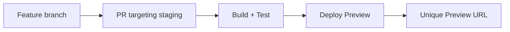
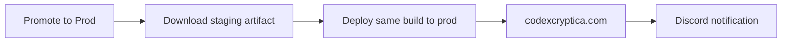

# CI/CD Deployment Architecture

This document describes the automated build and deployment pipeline for Codex Cryptica.

## Overview

Codex Cryptica uses **Cloudflare Pages** for hosting with an **artifact promotion** model. The application is built once on staging, and that exact same build artifact is promoted to production — no rebuilds, no drift.

- **Production:** `codexcryptica.com`
- **Staging:** `staging.codexcryptica.com`

## The Deployment Pipeline

### 1. Feature → Preview (Verification)



1. Open a Pull Request targeting the `staging` branch.
2. The [`deploy.yml`](../../.github/workflows/deploy.yml) workflow triggers on `pull_request`:
   - Installs dependencies, then runs type-check, lint and tests, scoped to the workspaces the diff actually touches (`scripts/affected-workspaces.mjs`).
   - Builds the application.
   - Deploys a **Preview** to Cloudflare Pages.
   - Cloudflare automatically adds a comment to the PR with a unique preview URL.
3. Review the preview and ensure everything works as expected.

### 2. Merge → Staging (Shared Environment)

Once the PR is approved and manually merged:

1. `deploy.yml` triggers on `push` to the `staging` branch. **It does not rerun type-check, lint, or tests** (#2952) — the merged PR already ran those against this diff, and rerunning the full suite on every merge was pure CI cost with no added confidence.
2. It builds fresh (the deploy needs a real artifact; a squash merge can produce a commit that isn't byte-identical to the PR head) and deploys that build to `staging.codexcryptica.com`.
3. A **smoke test** job then hits the live staging URL (homepage, a representative `/answers/*` page, a representative `/generators/*` page) and fails the workflow if any of them don't return 200 with the expected app shell content. This is what actually catches a broken deploy now — a passing type-check on a diff says nothing about whether the CDN served the right assets.
4. It uploads a **staging artifact** (`staging-dist`) with 30-day retention for production promotion.

> [!WARNING]
> `staging`'s branch ruleset does not currently enforce required status checks — a PR can be merged even if the `pull_request` checks in step 1 are failing or still running (see `mainforcer` vs the disabled `CC branch ruleset` in the repo's rulesets). Skipping the post-merge full-suite rerun means that gap is no longer backstopped by a redundant test run either. Treat "PR checks are green" as a merge precondition in practice until the ruleset gap is closed; this doc doesn't fix that, it just names it (see #2952).

> [!IMPORTANT]
> To support the "artifact promotion" model, staging builds must be production-ready. We bake production URLs (`codexcryptica.com`) and indexing directives into the staging build to ensure the promoted artifact is correct for the live site. To prevent staging from being indexed, use Cloudflare-level overrides (headers or workers) rather than build-time environment variables.

### 2. Staging → Production (Artifact Promotion)



Production uses a **manual promotion workflow** — there is no automatic promotion from staging to production.

**To promote:**

1. Go to **Actions** → **Promote Staging to Production**
2. Click **Run workflow**
3. Optionally specify a staging run ID (leave blank to use the latest successful staging deployment)
4. Click **Run workflow**

The promotion workflow:

- Finds the latest successful staging deployment (or the specific run you provided)
- Downloads the exact `staging-dist` artifact from that run (no rebuild, no re-test — it's promoting the artifact that already passed the PR gate and the staging smoke test)
- Deploys it to Cloudflare Pages on the production branch
- Runs the same smoke test as staging, against `codexcryptica.com`, and fails before notifying anyone if it doesn't pass
- Sends a notification to the Discord prod-deployment channel with the source run link

**Artifact retention:** Staging build artifacts are kept for 30 days. If you need to promote an older build, re-run the staging deployment for that commit first.

## Workflow Files

| File                                                                             | Purpose                                                                              |
| -------------------------------------------------------------------------------- | ------------------------------------------------------------------------------------ |
| [`deploy.yml`](../../.github/workflows/deploy.yml)                               | Full checks + preview deploy on PR; build + deploy + smoke test on push to `staging` |
| [`promote-to-prod.yml`](../../.github/workflows/promote-to-prod.yml)             | Manual promotion of staging artifact to production, with a smoke test                |
| [`auto-bump-web-version.yml`](../../.github/workflows/auto-bump-web-version.yml) | Auto-increments `apps/web/package.json` version on merge to `main`                   |
| [`release.yml`](../../.github/workflows/release.yml)                             | Creates GitHub releases for major/minor version bumps                                |

## CI Checks by Stage

| Stage                 | Trigger                    | Type-check / Lint / Test                  | Build                            | Smoke test                               |
| --------------------- | -------------------------- | ----------------------------------------- | -------------------------------- | ---------------------------------------- |
| PR → `staging`/`main` | `pull_request`             | Yes, scoped to affected workspaces        | Yes (preview deploy)             | No                                       |
| Merge → `staging`     | `push` to `staging`        | **No** (already ran in the PR, see above) | Yes, fresh                       | Yes, against `staging.codexcryptica.com` |
| Promote → production  | Manual `workflow_dispatch` | No (artifact already built + tested)      | No (reuses the staging artifact) | Yes, against `codexcryptica.com`         |

## Branch Flow

```
Feature branch → PR → staging (auto-merge) → staging.codexcryptica.com
                                                    ↓
                                    [Promote to Prod] button
                                                    ↓
                                              codexcryptica.com
```

## Environment Variables

The following secrets must be configured in GitHub repository settings:

| Secret                             | Purpose                                                                      |
| ---------------------------------- | ---------------------------------------------------------------------------- |
| `VITE_GOOGLE_CLIENT_ID`            | OAuth client ID                                                              |
| `VITE_GEMINI_API_KEY`              | API key for the Lore Oracle                                                  |
| `VITE_SHARED_GEMINI_KEY`           | Shared API key for the basic/lite model tier                                 |
| `CLOUDFLARE_ACCOUNT_ID`            | Cloudflare account ID                                                        |
| `CLOUDFLARE_API_TOKEN`             | Cloudflare API token with Pages deploy permissions                           |
| `VITE_DISCORD_WEBHOOK_URL_PROD`    | Webhook URL for the prod-deployment Discord channel                          |
| `VITE_DISCORD_WEBHOOK_URL_RELEASE` | Webhook URL for the release Discord channel (used for staging notifications) |

## Concurrency

The `deploy.yml` workflow uses `concurrency: cloudflare-pages` with `cancel-in-progress: true`. This means:

- If multiple pushes happen in quick succession, only the latest build + deploy runs
- You may see "Cancelled" runs in the Actions tab — this is normal

The `promote-to-prod.yml` workflow does **not** cancel in-progress promotions to prevent accidental double-deploys.

## Troubleshooting

**Staging deployed but promotion fails:**

1. Check that the staging build artifact exists (Actions → staging run → Artifacts)
2. Artifacts expire after 30 days; re-run the staging deploy if needed

**Production deploy didn't update the site:**

1. Check the **Actions** tab for the latest "Deploy to Cloudflare Pages" or "Promote Staging to Production" run
2. If it failed, check the deploy step for Cloudflare API errors
3. If it was cancelled, a newer push superseded it — wait for the latest run to finish

**Staging notification went to the wrong Discord channel:**

- Staging notifications use `VITE_DISCORD_WEBHOOK_URL_RELEASE`
- Production notifications use `VITE_DISCORD_WEBHOOK_URL_PROD`

**Smoke test failed after a staging or production deploy:**

1. The deploy itself already succeeded at this point — the smoke test only checks the live site afterwards. Since type-check/lint/test no longer rerun on push (see above), this is the first signal something's actually wrong with the deployed build, not just slow CDN propagation.
2. Open the failing job's log; it names the exact URL and status code/content check that failed.
3. Try the same URL manually. A transient failure (Cloudflare still propagating) can be retried by re-running the job. A repeated failure means the merged commit itself is broken in a way the PR's affected-only checks didn't catch — investigate before promoting to production.
