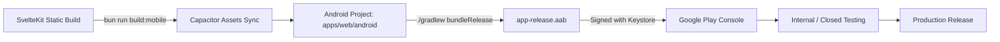
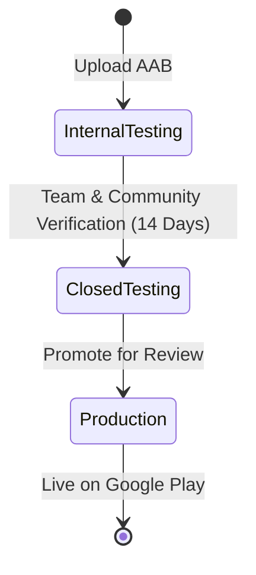

# Android Play Store Release & DevOps Guide

This document outlines the build, signing, automated CI/CD pipeline, and Google Play Store deployment process for **Codex Cryptica Mobile**.

---

## 1. Architecture Overview

Codex Cryptica Mobile uses **Capacitor** to package the static SvelteKit web application (`apps/web/build`) into a native Android application (`apps/web/android`).



- **Application ID**: `com.codexcryptica.app`
- **Output Target**: Android App Bundle (`.aab`) & APK (`.apk`)
- **Minimum SDK**: 24 (Android 7.0+)
- **Target SDK / Compile SDK**: 36 (Android 16 / latest modern target)

---

## 2. Keystore Signing & Secret Management

Google Play requires all release builds to be signed with a production upload key.

### A. Generate Local Keystore (One-Time)

Run the following command to generate a 2048-bit RSA upload key:

```bash
keytool -genkey -v \
  -keystore codex-release.keystore \
  -alias codex-release \
  -keyalg RSA \
  -keysize 2048 \
  -validity 10000
```

> [!CAUTION]
> **Never commit `.keystore` or `.jks` files to git.** Keep secure offline backups of this keystore; losing the upload key prevents publishing updates to Google Play without a manual key-reset request to Google Developer Support.

### B. CI/CD Secrets Configuration

To enable automated GitHub Actions builds, encode the keystore in Base64 and add the following repository secrets (**Settings → Secrets and variables → Actions**):

| Secret Name                       | Description                                                            | Example / Format                   |
| :-------------------------------- | :--------------------------------------------------------------------- | :--------------------------------- |
| `ANDROID_KEYSTORE_BASE64`         | Base64-encoded `.keystore` file (`base64 -w 0 codex-release.keystore`) | `MIIEvgIBADANBgkq...`              |
| `ANDROID_KEYSTORE_PASSWORD`       | Password used to encrypt the keystore file                             | `SecretPassword123`                |
| `ANDROID_KEY_ALIAS`               | Key alias inside keystore                                              | `codex-release`                    |
| `ANDROID_KEY_PASSWORD`            | Password for the key alias                                             | `SecretPassword123`                |
| `PLAY_STORE_SERVICE_ACCOUNT_JSON` | Google Cloud Service Account JSON with Play Developer API access       | `{"type": "service_account", ...}` |

---

## 3. Local Build & Packaging

### Step 1: Build Web App & Sync Native Assets

Whenever web application code or assets change, run the build and sync pipeline to copy static assets into the native Android wrapper:

```bash
# From apps/web directory:
cd apps/web
bun run build:mobile

# Or from repository root:
bun run --filter web build:mobile
```

This compiles the SvelteKit frontend to `apps/web/build` and copies assets to `apps/web/android/app/src/main/assets/public`.

### Step 2: Configure Android SDK Environment

#### Option A: Using Android Studio (Recommended GUI)

Open the Android native project in Android Studio:

```bash
cd apps/web
bun run cap:open:android
```

Android Studio will automatically detect the SDK, index Gradle dependencies, and allow visual building and running.

#### Option B: Using Gradle CLI

If building from the command line, ensure Gradle knows where your Android SDK is located:

```bash
# Set ANDROID_HOME in your shell:
export ANDROID_HOME="$HOME/Android/Sdk"

# Or configure local.properties for the Android project:
echo "sdk.dir=$HOME/Android/Sdk" > apps/web/android/local.properties
```

### Step 3: Bundle & Packaging Commands

Navigate to `apps/web/android`:

```bash
cd apps/web/android
```

#### A. Build a Debug APK (For fast local testing / sideloading)

```bash
./gradlew assembleDebug
```

- **Output artifact**: `apps/web/android/app/build/outputs/apk/debug/app-debug.apk`
- **Direct install to USB-connected device / emulator**:
  ```bash
  ./gradlew installDebug
  ```

#### B. Build a Release Android App Bundle (.aab) (For Google Play Store)

Google Play requires `.aab` format for publishing:

```bash
export KEYSTORE_FILE="/path/to/codex-release.keystore"
export KEYSTORE_PASSWORD="your-keystore-password"
export KEY_ALIAS="codex-release"
export KEY_PASSWORD="your-key-password"

./gradlew bundleRelease
```

- **Output artifact**: `apps/web/android/app/build/outputs/bundle/release/app-release.aab`

#### C. Build an Unsigned Release APK

If you need a standalone release `.apk` for manual distribution or testing:

```bash
./gradlew assembleRelease
```

- **Output artifact**: `apps/web/android/app/build/outputs/apk/release/app-release-unsigned.apk`

### Step 4: Manual Signing (If Not Signed via Gradle)

If you have an unsigned `.aab` or `.apk` and wish to sign it manually:

```bash
# Sign Android App Bundle (.aab):
jarsigner -verbose \
  -sigalg SHA256withRSA \
  -digestalg SHA-256 \
  -keystore /path/to/codex-release.keystore \
  app-release.aab \
  codex-release

# Or sign an APK with apksigner (from Android SDK build-tools):
$ANDROID_HOME/build-tools/36.0.0/apksigner sign \
  --ks /path/to/codex-release.keystore \
  --ks-key-alias codex-release \
  --out app-release-signed.apk \
  app-release-unsigned.apk
```

---

## 4. Automated GitHub Actions Workflow

Here is the reference workflow (`.github/workflows/android-release.yml`) for building and publishing release bundles on tag creation or manual dispatch:

```yaml
name: Android Release Build

on:
  workflow_dispatch:
    inputs:
      track:
        description: "Google Play Release Track"
        required: true
        default: "internal"
        type: choice
        options:
          - internal
          - alpha
          - beta
          - production
  push:
    tags:
      - "mobile-v*"

jobs:
  build-android:
    runs-on: ubuntu-latest
    steps:
      - name: Checkout Code
        uses: actions/checkout@v4

      - name: Setup Bun
        uses: oven-sh/setup-bun@v2
        with:
          bun-version: 1.3.14

      - name: Setup Java JDK
        uses: actions/setup-java@v4
        with:
          distribution: "zulu"
          java-version: "17"

      - name: Install Dependencies
        run: bun install

      - name: Build Web & Sync Capacitor
        run: |
          cd apps/web
          bun run build:mobile

      - name: Decode Keystore
        env:
          KEYSTORE_BASE64: ${{ secrets.ANDROID_KEYSTORE_BASE64 }}
        run: |
          echo "$KEYSTORE_BASE64" | base64 --decode > apps/web/android/app/release.keystore

      - name: Build Signed AAB
        env:
          KEYSTORE_FILE: release.keystore
          KEYSTORE_PASSWORD: ${{ secrets.ANDROID_KEYSTORE_PASSWORD }}
          KEY_ALIAS: ${{ secrets.ANDROID_KEY_ALIAS }}
          KEY_PASSWORD: ${{ secrets.ANDROID_KEY_PASSWORD }}
        run: |
          cd apps/web/android
          ./gradlew bundleRelease

      - name: Upload Build Artifact
        uses: actions/upload-artifact@v4
        with:
          name: codex-cryptica-release-aab
          path: apps/web/android/app/build/outputs/bundle/release/app-release.aab
          retention-days: 14

      - name: Publish to Google Play
        if: env.PLAY_STORE_SERVICE_ACCOUNT_JSON != ''
        uses: r0adkll/upload-google-play@v1
        env:
          PLAY_STORE_SERVICE_ACCOUNT_JSON: ${{ secrets.PLAY_STORE_SERVICE_ACCOUNT_JSON }}
        with:
          serviceAccountJsonPlainText: ${{ secrets.PLAY_STORE_SERVICE_ACCOUNT_JSON }}
          packageName: com.codexcryptica.app
          releaseFiles: apps/web/android/app/build/outputs/bundle/release/app-release.aab
          track: ${{ inputs.track || 'internal' }}
          status: completed
```

---

## 5. Google Play Console Setup & Declarations

### A. Store Listing Assets

- **App Icon**: 512×512 px 32-bit PNG (max 1 MB).
- **Feature Graphic**: 1024×500 px JPEG/PNG (max 15 MB).
- **Screenshots**: At least 2 phone screenshots (minimum 1080px along the short side). Recommended views:
  1. _Campaign/Entity Explorer_ (Tabletop view).
  2. _Generators / NPC Forge_.
  3. _Solo Adventure / Oracle AI Chat_.

### B. Mandatory Declarations

1. **Privacy Policy**: `https://codexcryptica.com/privacy`
2. **Data Safety**:
   - **Data Collection**: No personal data, location, or financial info collected.
   - **Local Storage**: IndexedDB/OPFS data resides strictly on the local device.
   - **Security Practices**: All network transit encrypted via HTTPS.
3. **App Access**: All app functionality available without credentials or payment locks.
4. **Target Audience**: Age 13+ (Teens & Adults).

---

## 6. Release Tracks & Deployment Strategy



1. **Internal Testing**:
   - Immediate distribution without Google review delays.
   - Add tester emails for fast team verification on physical devices.
2. **Closed Testing**:
   - Required by Google for new personal developer accounts (14 consecutive days with at least 12 active opt-in testers).
3. **Production Promotion**:
   - Promote verified release from Closed Testing directly to Production.
   - Review typically completes in 24–72 hours.
