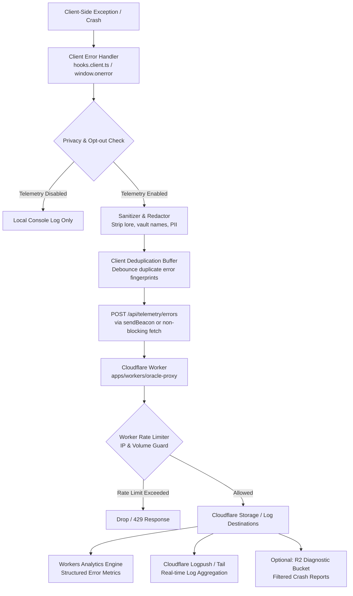

# Proposal: Privacy-Preserving Client Error Logging via Cloudflare

**Status**: Draft / RFC  
**Date**: 2026-08-20  
**Authors**: Codex Cryptica Team  
**Relevant Constitution Principles**: Principle I (Library-First), Principle V (Privacy & Client-Side Processing), Principle VI (Clean Implementation)

---

## 1. Context & Motivation

Codex Cryptica is a client-first, local-first application where campaign lore, graph visualizations, and entity state run primarily inside the user's browser using OPFS (Origin Private File System) and IndexedDB.

### Current State

1. **Client-Side App (`apps/web`)**:
   - Errors caught in SvelteKit lifecycle ([`apps/web/src/hooks.client.ts`](file:///home/espen/proj/remotecodexarcana/apps/web/src/hooks.client.ts)) or unhandled promise rejections are only printed locally to the developer console (`console.error("[Client Error]", error)`).
   - When users experience crashes, rendering failures, or edge-case sync errors in production, engineering receives zero diagnostics unless the user manually files a GitHub issue with copied console output.
2. **Server-Side Proxy (`apps/workers/oracle-proxy`)**:
   - Backend operations (AI model proxying, R2 world publishing, Turnstile moderation) emit logs to Cloudflare Workers Logs / Logpush.
   - There is currently **no ingestion route** for client-side telemetry or runtime crash reports.

### Problem Statement

We need an automated, robust error monitoring pipeline to detect, group, and fix client crashes and unhandled exceptions in production without violating Codex Cryptica's local-first privacy commitments.

---

## 2. Design Goals & Non-Goals

### Goals

- **Privacy-Safe by Construction**: Automatically strip all user lore, notes, entity titles, vault paths, custom fields, and personally identifiable information (PII) before sending.
- **Zero Third-Party Tracking**: Send error reports directly to our existing Cloudflare infrastructure (`oracle-proxy`), avoiding heavy third-party SaaS SDKs (like Sentry or Datadog) that add bundle bloat and tracking concerns.
- **Resilient & Low Overhead**: Transport via `navigator.sendBeacon` or non-blocking background `fetch`, with client-side deduplication, rate limiting, and an exponential backoff circuit breaker.
- **Actionable Diagnostics**: Capture error message fingerprints, stack traces, component names, browser/OS metadata, route patterns, and release version numbers.
- **User Control**: Provide a clear setting in App Preferences to disable anonymous diagnostic error reporting.

### Non-Goals

- Real-time session replay or DOM snapshot recording.
- Logging normal application events or user activity tracking.
- Transmitting file contents, entity data, or prompt text.

---

## 3. Architecture & Data Flow



---

## 4. Privacy & Scrubbing Contract

To guarantee compliance with **Constitution Principle V (Privacy & Client-Side Processing)**, the client scrubber must enforce strict sanitization rules before any payload leaves the device:

1. **Path & File Redaction**:
   - Replace user filesystem paths and local vault identifiers:
     - `opfs:/vaults/my_secret_campaign/...` $\rightarrow$ `opfs:/vaults/[REDACTED_VAULT]/...`
     - `entity-local-stat-sheet:npc-12345` $\rightarrow$ `entity-local-stat-sheet:[ID]`
2. **Entity & Lore Redaction**:
   - Strip dynamic text within error messages that matches user inputs or note content.
   - Discard all query parameters and hash fragments containing identifiers (e.g. `?entity=Lord+Voldemort` $\rightarrow$ `?entity=[REDACTED]`).
3. **Network Header Hygiene**:
   - Do not transmit cookies, authorization headers, or session capability secrets in error payloads.

---

## 5. Telemetry Payload Schema

The telemetry schema will be defined in `packages/schema/src/telemetry.ts`:

```typescript
import { z } from "zod";

export const ClientErrorPayloadSchema = z.object({
  schemaVersion: z.literal(1),
  /** Deterministic hash of error name + top 3 stack frames for deduplication */
  fingerprint: z.string().max(64),
  errorType: z.string().max(100), // e.g., "TypeError", "ChunkLoadError", "SvelteComponentError"
  message: z.string().max(500),
  stack: z.string().max(4000).optional(),
  componentStack: z.string().max(2000).optional(),
  route: z.string().max(200), // Normalized route pattern, e.g. "/vault/[id]/stats"
  appVersion: z.string().max(50), // e.g., "1.4.2" or git commit sha
  environment: z.enum(["production", "staging", "preview", "development"]),
  client: z.object({
    userAgent: z.string().max(250),
    language: z.string().max(20),
    screen: z.string().max(30), // e.g. "1920x1080"
    isPwa: z.boolean(),
    isTouch: z.boolean(),
  }),
  timestamp: z.string().datetime(),
});

export type ClientErrorPayload = z.infer<typeof ClientErrorPayloadSchema>;
```

---

## 6. Implementation Strategy

### Step 1: Worker Endpoint (`apps/workers/oracle-proxy`)

- Add a new route `POST /api/telemetry/errors`.
- Apply `CORS` validation and bind to `ERROR_TELEMETRY_RATE_LIMITER` (e.g. max 10 error posts per client IP per minute).
- Pipe validated errors to:
  - **Cloudflare Workers Analytics Engine** (`env.ERROR_ANALYTICS.writeDataPoint(...)`) for metrics aggregation (error counts by type, version, route).
  - Standard worker `console.error` formatted for **Cloudflare Logpush** log ingestion.

### Step 2: Client Telemetry Client (`packages/performance-observability` or `apps/web`)

- Create `ErrorTelemetryService`:
  - Maintains an in-memory Set of recently emitted error fingerprints (cleared every 60 seconds) to prevent error loops.
  - Implements `reportError(error: unknown, context?: Record<string, unknown>): Promise<void>`.
  - Uses `navigator.sendBeacon` if available, falling back to `fetch(..., { keepalive: true })`.

### Step 3: Application Hook Integration (`apps/web`)

- Integrate into [`apps/web/src/hooks.client.ts`](file:///home/espen/proj/remotecodexarcana/apps/web/src/hooks.client.ts) in `handleError`.
- Add global listener in `src/routes/+layout.svelte` for `window.addEventListener("unhandledrejection")` and `window.addEventListener("error")`.
- Add user toggle in Settings: `"Anonymous Diagnostic & Error Reporting"` (default: enabled in production, with one-click opt-out saved in IndexedDB / LocalStorage).

---

## 7. Operational Benefits

1. **Immediate Skew / Rollout Detection**: Instant alerts if a new release introduces unexpected Svelte 5 hydration crashes or worker proxy deserialization bugs.
2. **Zero Maintenance Burden**: Built directly on Cloudflare serverless primitives without recurring third-party subscriptions or external privacy liability.
3. **Triage Efficiency**: Stack traces and error fingerprints directly correlate with source-mapped release tags.
