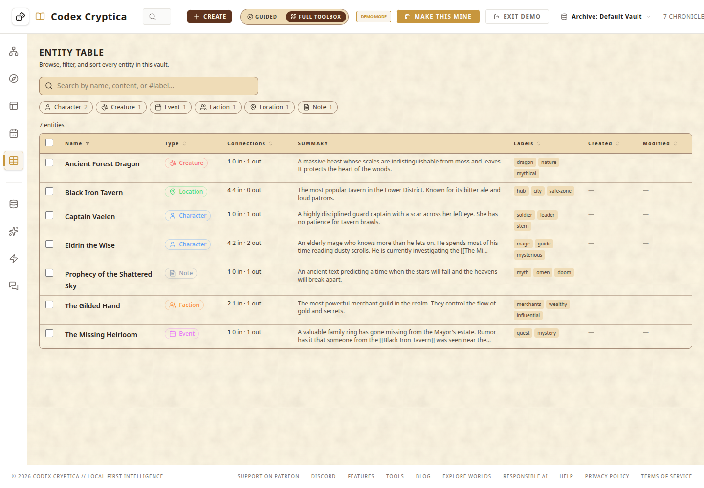
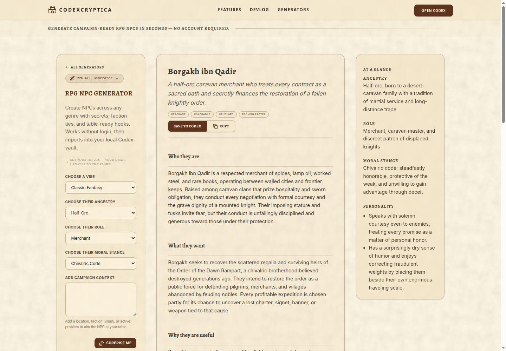
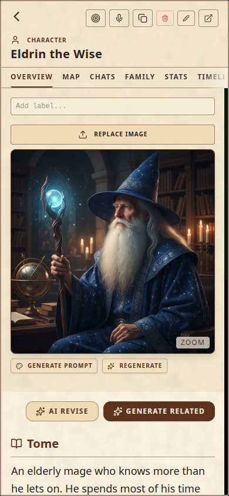
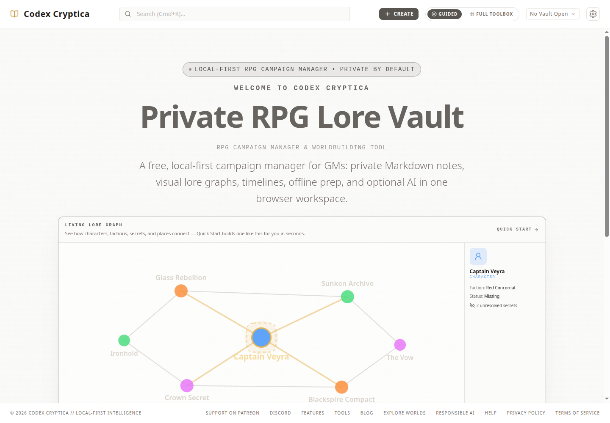
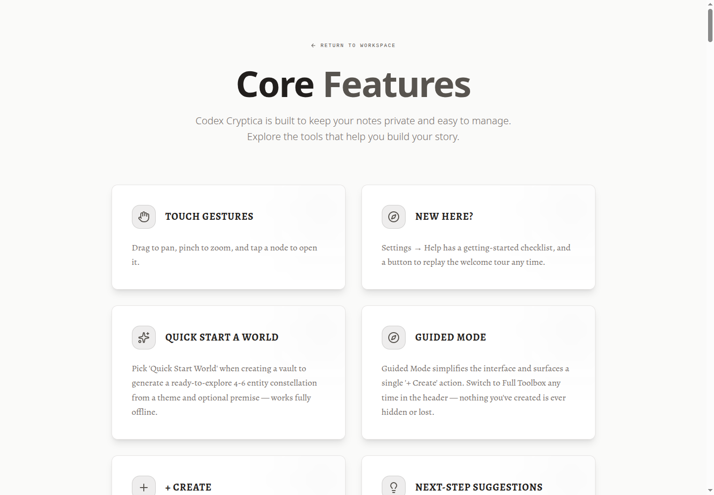
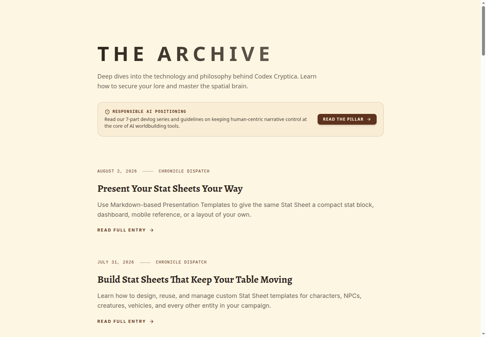
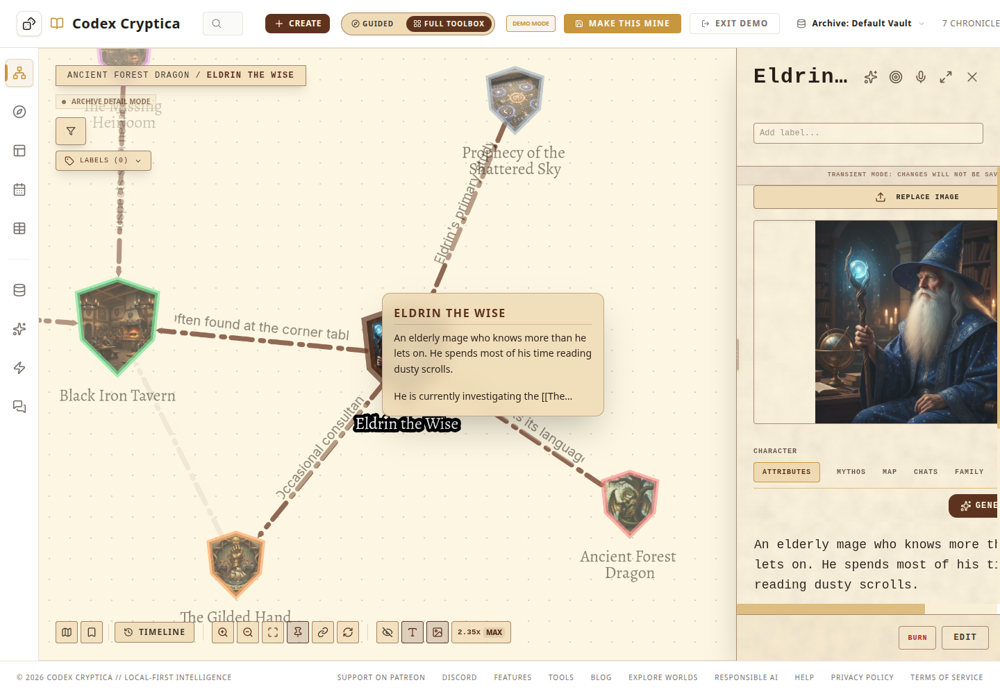
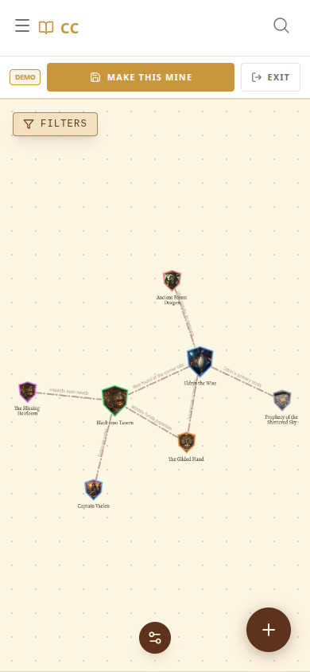
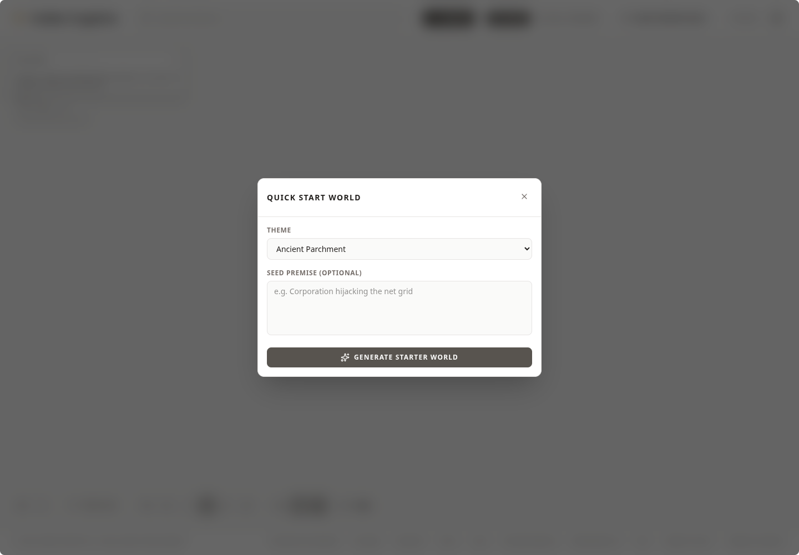
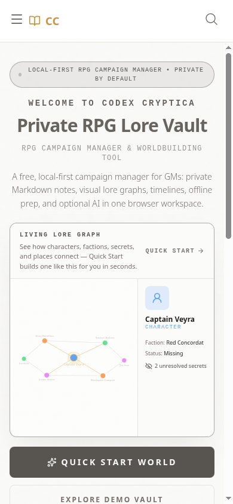

# Codex Cryptica: UI/UX and "AI-Made" Perception Assessment

**Date:** 2026-08-07
**Amended:** 2026-08-08 (revision 3)

**Surface reviewed:** Production at `https://codexcryptica.com/`

**Viewports:** Desktop Chrome at 1440 × 1000; mobile Chrome at 390 × 844

**Method:** Browser-driven heuristic review using Playwright, accessibility
snapshots, interaction walkthroughs, and visual screenshot review, plus a
follow-up source audit of the claims (revision 2). This is not a moderated
usability study and it cites no product analytics, so every perception finding
is a hypothesis until tested. See [Confidence tiers](#confidence-tiers).

## Revision 3 changelog

This revision records delivery after the original assessment:

- marks **Chunk 3: Application shell reclamation** as shipped to `staging` in
  PR #2096;
- marks **Chunk 4: Full Toolbox action hierarchy** as shipped to `staging` in
  PR #2098;
- updates the M5 and S1 findings and the dependency table so this document
  remains the delivery record rather than a stale backlog.

## Revision 2 changelog

Revision 1 was written before any of its own recommendations shipped and stated
several claims with more confidence than the evidence supported. This revision:

- corrects **M7**, whose premise about the AI provider was factually wrong;
- marks **chunks 1 and 2 as shipped** and the constitution amendment as done;
- adds [Confidence tiers](#confidence-tiers) separating verified defects from
  unvalidated taste claims;
- adds a [cut line](#if-you-do-nothing-else) so the plan is not read as a
  seventeen-item mandate;
- quantifies the uppercase and byline claims that were previously assertions;
- moves perception validation from the end of the plan (chunk 17) to the front
  (chunk 0), because chunks 9 through 14 are the largest block of work and rest
  entirely on an untested premise;
- adds a traffic precondition to chunk 12, the only recommendation that can
  actively lose something;
- corrects the demo-imagery recommendation, which as written would have made the
  demo less honest about a shipped feature;
- records the [evidence gaps](#evidence-gaps) in the review itself.

## Confidence tiers

The original document gave equal standing to two very different kinds of claim.
They should not be actioned the same way.

| Tier                              | What it covers                                                                     | Evidence                                      | How to treat it                                                                   |
| --------------------------------- | ---------------------------------------------------------------------------------- | --------------------------------------------- | --------------------------------------------------------------------------------- |
| **A. Verified defects**           | M1–M7, S1–S4                                                                       | Reproduced in-browser and confirmed in source | Fix. No further validation needed.                                                |
| **B. Quantified content signals** | Duplicate generators, blog batch cadence, missing bylines, uppercase saturation    | Counted in the repository, numbers below      | Fix. The numbers are not in dispute; the priority is.                             |
| **C. Perception hypothesis**      | "Looks AI-made", the hero recipe, cardification, brand-shell incoherence, demo art | One reviewer, no users, no analytics          | **Validate before building.** This is chunks 9–14, the largest block in the plan. |

Tier C is not weak reasoning. It is a well-argued read by one person. But it
prescribes months of work on the basis of taste, and the cheapest possible test
(chunk 0) costs an afternoon.

## Executive summary

The criticism is **partly fair, but it is aimed at the wrong layer**.

Codex Cryptica's core workspace does not look like a generic AI-generated
product. The parchment system, spatial graph, node shields, local-first model,
table view, and mobile entity reader have a recognizable point of view. The
product itself has more visual personality than most campaign tools.

The "obviously made by AI" impression is created mainly by the surrounding
marketing and content system:

- a familiar AI-template hero formula: eyebrow, welcome line, oversized
  headline, secondary headline, broad explanatory paragraph;
- repeated all-caps, heavily letter-spaced labels on nearly every surface
  (1135 `uppercase` occurrences across 252 of 367 Svelte components, plus 937
  `tracking-wide/wider/widest` occurrences);
- large grids of equally weighted rounded cards;
- polished but generic phrases such as "campaign-ready," "in seconds," "unique,
  rich lore," and "next generation";
- a feature page that reads like an automatically dumped changelog rather than
  an edited product story;
- three near-duplicate NPC generator entries in the tools directory;
- a blog index with many similarly structured articles, seven of them published
  on the same day at exact two-hour intervals, and not one carrying a human
  byline;
- visual shells that change noticeably between the workspace, tools directory,
  public generator, feature page, and blog.

In short: **the product looks authored; the presentation layer often looks
generated.** The best response is not a broad redesign. It is tighter editing, a
more consistent global shell, less cardification, more real product evidence,
and immediate fixes to several responsive workspace defects.

## If you do nothing else

The plan below has seventeen chunks. That is a backlog, not a roadmap. Chunks 1
through 4 are shipped; the next three priorities are:

1. **Chunk 5: Desktop graph-label legibility.** The graph is the product's
   signature surface, and unreadable relationship labels undermine that value
   immediately.
2. **Chunk 13: Editorial blog structure.** Zero of 22 posts have a byline and
   seven were published in one machine-cadenced batch. This is the single
   loudest "generated" signal in the product and the cheapest to fix. Adding a
   human author to the frontmatter and the rendered page is hours, not weeks.
3. **Chunk 0: Perception validation.** Before committing to chunks 9 through
   14, spend an afternoon finding out whether the perception thesis is real.

Chunks 5, 6, and 7 (graph legibility, mobile entry state, accessible
navigation) are the highest-value _product_ work and should follow. Chunks 9
through 14 should not start until chunk 0 reports.

## Delivery status since revision 1

| Item                                       | Status                                    | Evidence                                                                                                                                                                                                                             |
| ------------------------------------------ | ----------------------------------------- | ------------------------------------------------------------------------------------------------------------------------------------------------------------------------------------------------------------------------------------ |
| Chunk 1: Provider and privacy copy audit   | **Shipped**, but see M7 correction        | `0f4275e8`, `16253868`, PR #2094. No `Gemini` string remains under `src/routes` or `src/lib/config`.                                                                                                                                 |
| Chunk 2: Responsive entity-detail contract | **Shipped**                               | `154693a8`, `633540a9`, `49ef7486`, PR #2095, with viewport snapshots at 1280/1440/1600.                                                                                                                                             |
| Chunk 3: Application shell reclamation     | **Shipped**                               | `4dae1425`, `85c98049`, PR #2096. Marketing footer removed from workspace routes; guest Help remains available.                                                                                                                      |
| Chunk 4: Full Toolbox action hierarchy     | **Shipped**                               | `799a6f74`, `271a5b02`, `be0efc59`, PR #2098. Merged to `staging` after all CI checks passed.                                                                                                                                        |
| Chunk 5: Desktop graph-label legibility    | **Shipped**                               | `c2053615`, `f9f962df`, PR #2099.                                                                                                                                                                                                    |
| Chunk 6: Useful mobile graph entry state   | **Shipped**                               | `310e76ed`, `49bad9b8`, `2a0a163f`, PR #2103. Both 390×844 journeys pass; see the verification note under Chunk 6 about a false regression report.                                                                                   |
| Chunk 7: Accessible graph navigation       | **Shipped**                               | PR #2105 (phases 1 to 3) and the phase 4 follow-up: canvas text alternatives, table route from the graph controls, connection-list semantics, axe + keyboard e2e, and `docs/accessibility-contract.md`. Theme contrast remains open. |
| Chunk 8: Quick Start decision model        | **Shipped**                               | PR #2107. "Theme" renamed to World genre and look, both names shown per option, a preview of the five entities in the genre's own vocabulary, genre-derived premise placeholder, and a visible no-AI path.                           |
| Constitution Principle IV amendment        | **Done, but reintroduces the same fault** | `.specify/memory/constitution.md:34` now reads "powered by OpenAI/Luna or a provider-neutral contract". See M7.                                                                                                                      |

## Overall assessment

| Area                      | Assessment | Why                                                                                                                                                                                                                        |
| ------------------------- | ---------- | -------------------------------------------------------------------------------------------------------------------------------------------------------------------------------------------------------------------------- |
| Core visual identity      | Strong     | Parchment, graph shields, restrained amber/brown palette, and spatial model are distinctive.                                                                                                                               |
| Marketing distinctiveness | Weak–mixed | The welcome hierarchy and card grids use common AI/SaaS composition patterns. (Tier C.)                                                                                                                                    |
| Product clarity           | Mixed      | Local-first is clear, but too many terms and controls compete at once.                                                                                                                                                     |
| Content design            | Weak       | Features and blog content are insufficiently curated and look programmatically accumulated. (Tier B, quantified.)                                                                                                          |
| Desktop workspace         | Improved   | Chunk 2 fixed the detail panel, chunk 3 reclaimed workspace height, and chunk 4 is ready to reduce header density.                                                                                                         |
| Mobile experience         | Mixed–good | Entity reading is strong; graph discovery and initial legibility are weak.                                                                                                                                                 |
| Accessibility foundation  | Improved   | Dialog, tab, status, navigation, and control semantics are generally strong. Chunk 7 gave the canvas text alternatives and named its operable equivalent; automated checks and a screen-reader pass are still outstanding. |
| Human trust signals       | Weak       | Very little creator voice, user evidence, real-world screenshots, or authored explanation balances the AI framing.                                                                                                         |

## What is already good

### 1. The core product has a real visual thesis

The default parchment workspace is not another purple-gradient dashboard. The
node shields, dotted drafting surface, editorial serif type, compact metadata,
and physical-workbench feeling support the worldbuilding use case. The graph and
table feel like two views of the same archive rather than unrelated features.

The table view is especially effective:

- hierarchy is immediate;
- type colors add meaning without dominating;
- summaries are dense but scannable;
- filter chips and search sit where users expect them;
- the screen feels like a working tool, not a marketing mockup.

### 2. "Local-first, no account" is a meaningful differentiator

The product repeatedly communicates that a user can begin without registration
and keep notes locally. That is concrete, relevant, and increasingly rare. It
should remain the center of the brand, but expressed with fewer repeated
synonyms.

### 3. The public generator has a strong genre-specific atmosphere

The generator is one of the most convincing surfaces. The parchment, narrow
input rail, generated dossier, contextual summary, and themed loading copy
create an actual workbench.

The flow also behaves well:

- `Surprise Me` changes inputs and starts generation;
- the loading state clearly masks stale output;
- save and copy actions are prominent;
- generated drafts enter a session hub instead of disappearing;
- mobile reorders the interface into a sensible form, action, output sequence.

### 4. Mobile entity reading is visually strong

The full-screen mobile entity view has a clear title, readable image treatment,
obvious section tabs, and large primary actions. It feels closer to a campaign
field guide than a compressed desktop panel.

### 5. Interaction semantics are better than the visuals sometimes imply

The browser accessibility snapshots exposed meaningful dialogs, tablists, tabs,
status messages, navigation landmarks, switches, and descriptive control labels.
The mobile menu correctly behaves as a dialog, and the entity screen exposes its
sections as tabs. This is solid foundational work.

## Why parts of the product look "AI-made"

_Tier C unless a subsection is marked otherwise._

### 1. The welcome page uses the default AI/SaaS hero recipe

The first viewport stacks five layers before the product preview:

1. a pill-shaped local-first eyebrow;
2. "Welcome to Codex Cryptica";
3. "Private RPG Lore Vault";
4. "RPG Campaign Manager & Worldbuilding Tool";
5. a broad feature-list paragraph.

This is grammatically correct but editorially timid. Each line restates the one
above it. The primary actions sit below a large graph preview, so the page
spends more above-the-fold space naming the product than helping the user choose
what to do.

**Change:** reduce the hero to one opinionated headline, one proof sentence, and
two actions. For example:

> **Keep your campaign connected, and on your device.**
>
> Write characters, places, secrets, and timelines in one local archive. No
> account required.

Primary action: **Explore a sample world**

Secondary action: **Start my own**

Keep the graph preview, but place it after the decision point on mobile and
beside the copy on wide desktop screens.

### 2. The same typographic device is used everywhere

**Tier B, quantified.** Uppercase labels with wide tracking appear in eyebrows,
headings, buttons, tabs, metadata, status banners, footers, and navigation. The
scale of the repetition is measurable:

- `uppercase`: 1135 occurrences across 252 of 367 Svelte components (69% of all
  components);
- `tracking-wide` / `tracking-wider` / `tracking-widest`: 937 occurrences.

Because the pattern is applied regardless of importance, it stops feeling like a
deliberate archival motif and starts feeling like a design token applied
globally.

**Change:** reserve uppercase mono/letterspaced text for true metadata: dates,
entity types, breadcrumb context, and small status labels. Use sentence case for
buttons, section titles, navigation, and instructional text. A motif feels
authored when it is selective.

**Practical first step:** the counts above are a finite worklist, not an
impression. Audit the 252 files, classify each usage as metadata or not, and the
scope of chunk 9 becomes concrete instead of aesthetic.

### 3. Everything becomes a card

The feature page is the clearest example: every item receives the same rounded
rectangle, icon tile, heading, and paragraph. A two-sentence touch hint receives
the same weight as Oracle memory, family trees, VTT voice chat, import formats,
and presentation templates.

The page continues for dozens of cards. Some entries are implementation details
rather than customer features, including "SEO Prerendering" and "P2P Connection
Manager." Several paragraphs are long enough to become miniature documentation
pages inside cards.

This creates three AI-content signals:

- no visible editorial selection;
- no distinction between flagship capability, supporting feature, and technical
  note;
- no visual evidence that any feature exists in the real product.

**Change:** replace the flat feature wall with 4 to 6 user journeys:

1. **Capture the world**: entities, nested notes, templates, imports;
2. **See what connects**: graph, family tree, timeline, maps;
3. **Run the session**: VTT, dice, player view, voice;
4. **Expand with control**: generators, drafts, Oracle, review;
5. **Keep ownership**: local storage, folders, exports, publishing boundaries.

Each journey should use one real screenshot, a short outcome, and links to
focused documentation. Put the exhaustive list behind searchable documentation
or release notes.

### 4. The site looks like several adjacent templates

The global presentation changes between surfaces:

- welcome: neutral white, modern sans, full application header and persistent
  footer;
- features: centered SaaS hero and soft white card grid;
- tools directory: editorial serif and three-column cards;
- generator: full parchment workbench;
- blog: sparse archival list without the same global navigation;
- mobile generator logo: "Codex"; desktop generator logo: "CODEXCRYPTICA";
  workspace: "Codex Cryptica."

Theme variation is a product strength, but the global brand shell should not
feel variable. Inconsistent naming, navigation, type hierarchy, and spacing make
the site feel assembled from independently generated pages.

**Change:** define one cross-surface shell: consistent wordmark, navigation
vocabulary, footer behavior, content width, heading rhythm, and action style.
Let themes alter the work area, not the basic product identity.

### 5. Marketing content is optimized before it is edited

**Tier B, quantified.** The tools directory presents **D&D NPC Generator**,
**RPG NPC Generator**, and **Procedural NPC Generator** next to each other
(`apps/web/src/routes/(marketing)/tools/+page.svelte:48`, plus the
`/tools/dnd-npc-generator` and `/tools/rpg-npc-generator` routes), with
descriptions that imply substantial overlap. Even if the routes exist for valid
technical or search reasons, the user sees duplication.

The blog compounds the effect, and the frontmatter makes it explicit:

- the seven-part responsible-AI series is stamped `publishedAt: 2026-06-06` at
  10:00, 12:00, 14:00, 16:00, 18:00, 20:00, and 22:00, an exact two-hour
  cadence;
- **zero of 22 posts carry an `author` frontmatter field**;
- the only author data anywhere is a JSON-LD `Organization` node
  (`apps/web/src/routes/(marketing)/blog/[slug]/+page.svelte:26`), never a
  person, and never rendered visibly.

Combined with phrases such as "ultimate guide," "supercharged discovery,"
"complete guide," and "next generation," the index resembles an SEO content
program more than a person's archive. That is not an inference from tone. It is
what the data says.

**Change:**

- add a real human byline to the frontmatter schema and render it, starting with
  the seven-part series;
- group the responsible-AI series into one editorial collection card;
- add a short creator note and real screenshots or diagrams;
- feature fewer articles at once and provide topic filters/search for the
  archive;
- prefer concrete titles over superlatives;
- for the generators, see the traffic precondition in chunk 12 before
  consolidating anything.

### 6. AI imagery is the product's first proof, and its art direction is inconsistent

_Revision 2 correction. Revision 1 recommended replacing the generated demo art
with ink portraits, woodcuts, or iconographic silhouettes. That would make the
demo more coherent and less honest: AI image generation is a shipped feature,
and a hand-styled demo would stop showing users what they will actually get._

The real defect is not that the images are generated. It is that their
compositions, palettes, and rendering styles vary from one to the next, so the
graph reads as an unrelated image collection before it reads as a knowledge
tool.

**Change:** curate one fixed demo asset set generated under a single art
direction: one style specification, one palette, consistent framing and crop,
recorded prompts and seeds so the set can be regenerated reproducibly. The demo
should look like one illustrator worked on one campaign. Additionally, lead the
marketing surfaces with real annotated interface screenshots rather than
character art, so relationships are the first thing demonstrated and portraits
are supporting evidence.

## Must change: usability defects and trust risks

_Tier A. All reproduced in-browser and confirmed in source._

### M1. Fix desktop detail-panel overflow and clipping (shipped)

At 1440px, opening an entity while Full Toolbox mode is active clipped the
title, action row, tab row, Generate Related action, and body text inside the
right panel.

**Resolved** by chunk 2 (`154693a8`, `633540a9`, `49ef7486`, PR #2095), with
viewport snapshots at 1280, 1440, and 1600px for both ordinary and stress
content. Retained here for history; re-verify during chunk 17.

### M2. Fix graph-label readability

The demo's connection labels overlap node names, run underneath panels, rotate
into each other, and become low-contrast against the parchment. The
selected-node popover also obscures nearby labels. Because the graph is the hero
feature, this defect damages the product claim more than a minor screen
elsewhere would.

**Required outcome:**

- edge labels avoid node bounding boxes and selected popovers;
- labels use readable contrast and a compact background/halo;
- long labels truncate or reveal on hover/focus;
- default layout leaves more breathing room around high-degree nodes;
- fit-to-screen considers label bounds, not only node bounds.

### M3. Do not fit the entire mobile graph into an unreadable thumbnail

After dismissing mobile coaching, the graph defaults to a full-world fit. Nodes
are tiny, labels are effectively unreadable, and the primary interaction becomes
guessing where to tap.

**Required outcome:** open mobile graph at a useful reading zoom, centered on one
important/recent node, with a visible "Show whole world" action. The first mobile
viewport should support selection, not prove that every node technically fits.

### M4. Verify keyboard and assistive access to graph nodes

In the Playwright accessibility snapshot, toolbar controls were exposed, but
individual graph nodes were not available as interactive element references.
Selecting Eldrin required a coordinate click. The semantic Table view is an
excellent fallback, but the graph does not clearly present it as such.

**Required outcome:** verify real keyboard and screen-reader navigation for
nodes. If the canvas cannot expose a robust node interaction model, add an
explicit, nearby **Browse graph as list/table** action and maintain focus
synchronization between the list and canvas.

**Partly resolved** by Chunk 7 phases 1 to 3 (PR #2105); verification work
(phase 4) is still open. Two claims above needed correcting once the source was
read. The Table view is not buried: it is a top-level ActivityBar item
(`ActivityBar.svelte:56`) whose markup is genuinely semantic (`<table>`,
`<th scope="col">`, `aria-sort`, and a real `<a href>` per row). Its defect was
being icon-only with no stated relationship to the graph. And a keyboard-only
user could already find and open every entity through Ctrl/Cmd+K search
(`SearchModal.svelte:325`, a correctly wired combobox/listbox), the Table view,
and the Explorer sidebar. The genuine gaps were that the canvas never declared
itself to assistive tech, never announced its selection, and never pointed at
its own alternative.

### M5. Remove marketing footer chrome from the working application

Confirmed in source: `AppFooter` renders in the application layout
(`apps/web/src/routes/(app)/+layout.svelte:693`) guarded only by `isPopup`,
`isVttFullscreen`, and `isZenPopout`, so the graph, map, canvas, and table
routes all carry it. It consumes vertical workspace while displaying Patreon,
Blog, Privacy, and other marketing links.

**Required outcome:** move these links into Help, Settings, or the
mobile/application menu. Let graph, map, canvas, table, and entity views use the
full application viewport.

**Resolved** by Chunk 3 (`4dae1425`, `85c98049`, PR #2096). `AppFooter` no
longer renders on workspace routes, reclaiming the application viewport. The
desktop guest header retains a Help entry, and the existing application menu and
settings surfaces retain access to support and legal information. Re-verify
route-shell separation during Chunk 17.

### M6. Clarify Quick Start's "Theme" decision

The Quick Start dialog asks for a **Theme**, but its options mix visual skins and
genre concepts: Ancient Parchment, Clean Modern, Workspace Light, Sci-Fi
Terminal, Blood & Noir, LCARS Interface, and others. The placeholder premise
mentions a corporation hijacking a net grid while Ancient Parchment is selected.

It is unclear whether this choice controls interface appearance, generated-world
genre, or both. That ambiguity is especially risky because the next action
generates a whole starter world.

**Required outcome:** separate **World genre** from **Workspace appearance**, or
explicitly explain the combined effect with a small preview and example premise
that updates with the selection.

**Resolved** by Chunk 8 (PR #2107) along the second path. The source confirms
the ambiguity was worse than the screenshot suggests: one id drives both the
generated genre and the workspace skin, and the two carry _different names_ in
different files. `THEMES[id].name` supplies the dropdown label while
`THEME_ARCHETYPES[id].themeName` supplies the genre, so "Ancient Parchment"
generates Classic Fantasy, "LCARS Interface" generates Space Exploration,
"Pip-Boy Terminal" generates a Retro-Futurist Wasteland, and "Charted Waters"
generates High Seas. The dialog showed only the first of each pair.

### M7. Make provider language provider-neutral (corrected and reopened)

**Revision 1 stated this incorrectly.** It claimed the live copy described
Google Gemini while "the current product direction uses OpenAI/Luna," framing
the problem as stale copy left behind by a completed migration. That premise is
wrong.

What the code actually does: oracle-proxy is **dual-provider by registry**.
`handleInteraction` looks up the registry key, routes `luna-fast` to OpenAI's
Responses API threading `previous_response_id`, and forwards everything else,
including raw Gemini model ids, to Gemini's `/v1beta/interactions` threading
`previous_interaction_id` (`apps/workers/oracle-proxy/src/index.ts:697-712`).
The Gemini adaptor is still imported and live (`index.ts:34`). There is no
completed migration. There are two providers behind one provider-neutral wire
contract, and which one serves a request is a server-side registry decision.

This matters because the fix that revision 1 triggered inherited the error.
Constitution Principle IV now reads "powered by OpenAI/Luna or a provider-neutral
contract" (`.specify/memory/constitution.md:34`), which names a vendor again and
will be stale the next time the registry changes. Chunk 1's own acceptance
criterion said the right thing: _"the provider name does not appear where it is
irrelevant to the user's decision."_ The constitution edit contradicted it.

**Required outcome:**

- public copy describes the **data flow**, not the vendor: vault contents stay in
  the browser; generation requests go to our proxy, which routes them to a
  third-party model provider; providers may change without notice;
- no vendor name appears in user-facing copy unless the user is making a
  decision that depends on it (for example, bring-your-own-key settings, where
  naming the provider is required and correct);
- amend Principle IV through the constitution workflow to drop the vendor names
  and state the provider-neutral Oracle contract instead;
- add a repository check for vendor names in marketing routes so this cannot
  silently regress a third time.

**Status:** the copy sweep shipped (PR #2094) and no `Gemini` string remains
under `src/routes` or `src/lib/config`. The neutrality principle and the
constitution wording are still outstanding.

## Should change: high-value improvements

_Tier A for S1–S4, Tier C for S5._

### S1. Reduce Full Toolbox header density

At 1440px the header contains the logo, dice, search, Create, mode toggle, demo
status, conversion, exit, vault selector, entity count,
import/save/generate/share/public-world/settings controls, plus the activity
rail. Most controls receive similar visual weight.

Group actions by intent:

- **Create** remains primary;
- vault identity and save state remain persistent;
- import/export/share move into a Vault menu;
- demo conversion stays in a focused demo banner;
- secondary tools remain in the activity rail or command palette.

**Resolved** by Chunk 4 (`799a6f74`, `271a5b02`, `be0efc59`, PR #2098). The
labeled **Vault** menu groups Import data, Export backup, and Share
campaign, while Create and the live save state remain visible. The menu supports
arrow-key opening, item navigation, Escape focus restoration, and a full-width
mobile-drawer treatment. Interaction tests cover the labels, keyboard behavior,
and vertical layout; all PR checks are green. Re-verify at the target desktop
widths in Chunk 17 after merge.

### S2. Make generated output scannable by default

The public generator's three-column desktop layout is distinctive, but long AI
results become a wall of equally weighted sections. Preserve the detailed
dossier while adding a default table-facing summary:

- identity and one-line concept;
- three memorable traits;
- immediate hook;
- secret;
- relationships;
- expandable "Full lore."

This would make the output feel edited rather than merely emitted.

### S3. Simplify mobile entity actions

The mobile entity header shows many icon-only actions, including destructive
delete, in one row. Accessible names are present, but the visual hierarchy is
weak and accidental activation risk is higher.

Keep Back, Edit, and one context action visible. Move copy, sound bite, graph
location, open-in-new-tab, and delete into a labeled overflow sheet. Keep delete
separated and confirmed.

### S4. Improve mobile tab discoverability

The entity tab row clips "Timeline" at the right edge. If horizontal scrolling
is intentional, add an edge fade or partial next tab with sufficient spacing;
otherwise collapse lower-priority sections into More. The user should not have
to infer that the tab bar scrolls.

### S5. Add human proof to the welcome experience

The welcome screen explains the product but does not show who made it, how it is
used at a table, or what a real vault looks like after weeks of play.

Add one or two of the following:

- a short creator note signed by the maker;
- a real campaign screenshot with an annotated workflow;
- a user quote tied to a concrete use case;
- a "built in public" release cadence or changelog excerpt;
- a brief privacy architecture diagram.

Human evidence is a stronger antidote to "AI-made" perception than ornamental
imperfection.

## Evidence gaps

Recorded so that later readers weigh this document correctly.

1. **No analytics.** This review never cites a bounce rate, a time-on-page, a
   scroll depth, or a conversion figure. For a document arguing that the
   marketing layer is the problem, the product's own instrumentation is the
   cheapest available evidence and it is unused. Generator pages and outbound
   save-to-vault clicks are tracked; those numbers should inform chunks 10
   through 12 before any of them start.
2. **Sample size of one.** Every perception claim comes from a single reviewer
   in a single session. Chunk 0 exists to fix this.
3. **No competitive baseline.** "Looks AI-made" is a relative judgment, and the
   review never looks at World Anvil, LegendKeeper, Obsidian, or Kanka. Some of
   the criticized patterns (card grids, uppercase eyebrows) may be genre
   convention that users read as normal rather than as generated.
4. **No performance data.** Load time and interaction latency are trust signals
   too. A slow marketing page reads as low-effort regardless of its typography.
5. **Register.** This document is written in the style it criticizes: tidy
   parallel triads, bolded verdict lines, symmetrical bullet lists. That is
   worth noting given the argument that generated prose has a tell.

## A tighter design direction

### Keep

- parchment and genre themes;
- amber/brown brand color;
- graph shields and spatial metaphor;
- local-first/no-account positioning;
- compact table view;
- archival language used selectively;
- generator loading personality;
- semantic dialogs, tabs, and labeled controls.

### Reduce

- all-caps UI text;
- universal rounded cards and soft shadows;
- repeated explanatory subheadings;
- generic superlatives and "in seconds" claims;
- icon-only action rows;
- simultaneous header controls;
- inconsistent demo art direction;
- exhaustive feature lists on marketing pages.

### Add

- real product screenshots on feature pages;
- human bylines and provenance on written content;
- editorial grouping and navigation;
- one consistent global brand shell;
- creator voice;
- responsive overflow rules for panels and tabs;
- compact generated-output summaries;
- a legible mobile graph starting state;
- clear alternative navigation for non-canvas users.

## Implementation chunks

These are implementation-sized workstreams, not GitHub issues. Each chunk should
normally fit in one focused pull request, though the graph work may need a short
technical spike before its implementation pull request. Product changes include
tests for both the expected path and a meaningful failure, fallback, or narrow-
viewport path.

**Read the [cut line](#if-you-do-nothing-else) first.** Seventeen chunks is a
backlog. Nothing here obligates the full sequence, and chunks 9 through 14
should not begin before chunk 0 reports.

### Constitution alignment

The chunks preserve the constitution's local-first privacy, plain-language, TDD,
reuse-before-extraction, DI, documentation, and coverage requirements. Each code
chunk must run the repository lint and test suites in addition to the focused
validation named below.

Principle IV was amended on 2026-08-07 but currently reads "powered by
OpenAI/Luna or a provider-neutral contract"
(`.specify/memory/constitution.md:34`), which still names vendors. Amend it again
through the constitution workflow to describe the provider-neutral Oracle
contract only, per M7. This is a planning prerequisite, not a GitHub issue.

### Sequence and dependencies

| Chunk | Workstream                          | Size | Tier | Depends on | Covers          | Status                                               |
| ----- | ----------------------------------- | ---- | ---- | ---------- | --------------- | ---------------------------------------------------- |
| 0     | Perception validation               | S    | n/a  | none       | Gate for 9–14   | Not started                                          |
| 1     | Provider and privacy copy audit     | S    | A    | none       | M7              | Copy sweep shipped; neutrality principle outstanding |
| 2     | Responsive entity-detail contract   | M    | A    | none       | M1              | **Shipped** (PR #2095)                               |
| 3     | Application shell reclamation       | M    | A    | none       | M5              | **Shipped** (PR #2096)                               |
| 4     | Full Toolbox action hierarchy       | M    | A    | 3          | S1              | **Shipped** (PR #2098)                               |
| 5     | Desktop graph-label legibility      | L    | A    | none       | M2              | **Shipped** (PR #2099)                               |
| 6     | Useful mobile graph entry state     | M    | A    | none       | M3              | **In review** (PR #2103)                             |
| 7     | Accessible graph navigation         | L    | A    | none       | M4              | Not started                                          |
| 8     | Quick Start decision model          | M    | A    | none       | M6              | Not started                                          |
| 9     | Shared brand and layout grammar     | L    | C    | 0          | AI sameness     | Blocked on 0                                         |
| 10    | Decision-first welcome experience   | M    | C    | 0, 9       | AI sameness, S5 | Blocked on 0                                         |
| 11    | Workflow-led Features page          | L    | C    | 0, 1, 9    | AI sameness     | Blocked on 0                                         |
| 12    | Canonical public generator model    | L    | C    | 0, 9, data | AI sameness     | Blocked on 0 and traffic data                        |
| 13    | Editorial blog structure            | M    | B    | none       | AI sameness     | Not started, **recommended early**                   |
| 14    | Coherent demonstration assets       | M    | C    | 0, 9       | AI sameness     | Blocked on 0                                         |
| 15    | Generator output information design | M    | A    | none       | S2              | Not started                                          |
| 16    | Mobile entity actions and tabs      | M    | A    | 2          | S3–S4           | Unblocked by 2                                       |
| 17    | Cross-surface validation and tuning | M    | n/a  | 2–16       | All             | Not started                                          |

Chunks 0, 5, 6, 7, 8, 13, 15, and 16 can begin independently now. Chunks 3 and
4 are complete. Chunk 17 is the release gate, but its
automated viewport checks should be added incrementally by each earlier chunk
rather than deferred to the end.

Note that chunk 13 does not depend on chunk 9. Adding bylines and grouping the
series requires no brand grammar and should not wait for it.

### Chunk 0: Perception validation

**Outcome:** The premise behind chunks 9 through 14 is either confirmed or
discarded before any of that work is scheduled.

**Scope:** Recruit five to eight GMs who have not seen the product. Run the two
cheapest questions from the [validation list](#suggested-validation-questions),
questions 1 and 6, on the current production site. Record verbatim first
impressions. In parallel, pull existing analytics for the welcome, Features,
Tools, and generator routes: entry, bounce, scroll depth, and save-to-vault
conversion. No design work happens in this chunk.

**Acceptance criteria:** A one-page finding that states, with participant
counts, whether visitors spontaneously describe the product as generic,
templated, or AI-made, and which surface prompts it. If fewer than a third
raise it unprompted, chunks 9 through 14 are rescoped to the Tier B items only
(duplicate generators, blog structure, uppercase audit) and the brand-shell
rebuild is dropped. If a majority raise it, chunks 9 through 14 proceed with
their named surface as the priority order.

**Why this is chunk 0:** chunks 9 through 14 contain four L-sized workstreams and
represent the majority of the plan by effort. They rest on one reviewer's read.
This chunk costs an afternoon.

### Chunk 1: Provider and privacy copy audit

**Outcome:** Public explanations describe the actual data flow and name no
vendor where the user is not making a vendor-dependent decision.

**Scope:** The copy sweep is done (PR #2094). What remains: adopt the neutrality
principle from M7 as the standing rule, amend constitution Principle IV to drop
the OpenAI/Luna naming, and add a repository check that fails when a vendor name
appears in marketing routes. This is a copy, content-source, and governance
change; it does not change the generation API.

**Acceptance criteria:** No user-facing page names a model vendor except where a
user decision depends on it; privacy claims distinguish browser-local vault data
from generation requests; Principle IV describes a provider-neutral contract; a
route-level content test covers vendor terms and fails on regression.

### Chunk 2: Responsive entity-detail contract (shipped)

**Outcome:** The entity detail panel remains usable without clipping or
horizontal page overflow at supported desktop widths.

**Delivered** in `154693a8`, `633540a9`, `49ef7486` (PR #2095): panel min/max
widths, title and metadata wrapping, action and tab overflow, independent panel
scrolling, plus viewport snapshots at 1280, 1440, and 1600px for ordinary and
stress content, and accessibility coverage. Chunk 16 reuses this sizing
contract. Re-verify in chunk 17.

### Chunk 3: Application shell reclamation (shipped)

**Outcome:** Workspace routes feel like focused tools, not marketing pages
wrapped around an application.

**Scope:** Remove the marketing footer from graph, map, canvas, table, editor,
and other workspace routes; the current render is at
`apps/web/src/routes/(app)/+layout.svelte:693`. Let each workspace occupy the
available viewport. Keep the footer on public marketing/content routes and
relocate essential support, legal, and privacy links to Help, Settings, or the
application menu.

**Acceptance criteria:** No application canvas is shortened by marketing chrome;
all legally or operationally necessary links remain reachable; route transitions
do not briefly flash the wrong shell. Cover representative public and application
routes in layout tests.

**Delivered** in `4dae1425` and `85c98049` (PR #2096): the application layout
no longer mounts the marketing footer; representative layout tests protect the
route boundary; and Help remains reachable in the desktop guest header. Merged
to `staging` on 2026-08-08.

### Chunk 4: Full Toolbox action hierarchy (shipped)

**Outcome:** The desktop header presents a small set of frequent actions and keeps
infrequent vault operations discoverable without showing all controls at once.

**Scope:** Rank current actions by frequency and consequence. Keep Create plus clear
vault/save state visible; group import, export, sharing, and infrequent management
actions under a labeled menu. Define collapse behavior at narrower widths and retain
tooltips, keyboard access, and destructive-action separation.

**Acceptance criteria:** Frequent creation and navigation require no extra step;
every displaced action remains findable by label; the header fits without collision
at supported widths; menu focus and Escape behavior are covered by interaction tests.

**Delivered** in `799a6f74` and `271a5b02`, merged as `be0efc59` (PR #2098):
Import data, Export backup, and Share campaign now live in a labeled Vault menu;
Create and save state remain visible. The menu has arrow-key, item-navigation,
and Escape focus handling, plus full-width mobile-drawer sizing. Focus, Escape,
labels, and the vertical layout are covered by unit tests. All GitHub checks
passed before the merge to `staging` on 2026-08-08.

### Chunk 5: Desktop graph-label legibility

**Outcome:** Relationship labels communicate the graph instead of obscuring it.

**Scope:** Prototype and select a collision strategy for dense edge labels. Options
may include layout-aware offsetting, truncation with reveal, selective labels by zoom
or importance, and stronger text backplates. Include label bounds in fit calculations
and prevent collision with open detail panels where feasible.

**Acceptance criteria:** Labels are readable at default zoom in the demo world;
crossing or nearby edges do not create stacked illegible text; a user can reveal any
suppressed full label; node and edge selection still works at every zoom. Validate
against small, medium, and deliberately dense graph fixtures before implementation
is accepted.

**Implementation note (2026-08-08):** The selected strategy keeps labels horizontal,
strengthens their backplates, truncates long text, and uses the existing zoom-level
detail policy. Selecting an entity suppresses dimmed background-edge labels while
retaining its immediate relationship labels; selecting an edge reveals its full label
in the connection details dialog, including in guest mode. Fit requests retain an
expanded label-safe margin. This deliberately avoids a custom canvas-label collision
router, which would add fragile layout behavior without solving label density at its
source.

### Chunk 6: Useful mobile graph entry state

**Outcome:** Opening a graph on a phone immediately shows something understandable.

**Scope:** Replace the initial "fit the entire world" behavior with a useful zoom
centered on an important, recent, or explicitly selected node. Add a clearly labeled
"Show whole world" action and a brief gesture hint. Preserve user-controlled zoom
during the session and avoid resetting it after unrelated state changes.

**Acceptance criteria:** The initial node and at least its immediate relationships
are legible at 390×844; the whole graph remains one action away; returning from an
entity preserves the user's prior camera where appropriate; empty and one-node
graphs have intentional states. Cover camera persistence and fallback selection in
tests.

**Implementation note (2026-08-08):** Phone entry selects an explicitly selected
entity first, then an `important` entity, then the most recently changed entity,
and finally the most connected entity (or first entity). It centers that focal node
at a legible minimum zoom once per vault/session, leaving subsequent camera movement
under the user's control. The overview stays one action away through the existing
**Fit to Screen** control in the graph controls group, so no separate always-on
"Show whole world" button was added; the existing mobile coach mark and Visual
Graph help now explain drag, pinch, and node-tap gestures.
The resolver, selector contract, and isolated 390×844 browser journey are covered
by automated tests.

**Verification note (2026-08-08):** an earlier revision of this document
recorded a zoom regression here (an entry zoom of 0.673 against the asserted
0.75). That was a measurement error, not a defect: Playwright's `webServer`
config sets `reuseExistingServer: !process.env.CI`, and an unrelated dev server
from a different checkout was already holding port 5173, so those runs
exercised the wrong working tree. Re-run against a dedicated port
(`E2E_PORT=5199`), both 390×844 journeys pass. The entry zoom behaves as
specified.

### Chunk 7: Accessible graph navigation

**Outcome:** The graph's information and navigation are available without precise
pointer or canvas interaction.

**Scope:** Audit the rendered graph with keyboard and screen-reader tooling. Either
make nodes operable through a synchronized accessible structure or present a clearly
labeled Browse as table/list path next to the graph controls. Synchronize selection
and focus where that improves orientation, and document the chosen accessibility
contract.

**Acceptance criteria:** A keyboard-only user can find and open every entity and can
understand the selected entity; the alternative is visible rather than buried in
Help; focus is not lost when switching views; automated accessibility checks and a
manual screen-reader pass cover the primary journey.

**Scope correction (2026-08-08):** the "synchronized accessible structure" branch
was rejected deliberately. Mirroring cytoscape's canvas into a hidden DOM tree
drifts from the renderer the moment layout, filters, or focus view change, and it
adds little on top of paths that already work. The chunk was retargeted at what
was actually missing: the canvas declaring itself, announcing its state, and
naming its own alternative.

**Implementation note (2026-08-08, phases 1 to 3, PR #2105):** `graph-canvas` is
now `aria-hidden` and its meaning is carried in text instead. A visually hidden
description states the graph's scale, whether focus view or filters are culling
it, and where the operable equivalents are; a single polite `role="status"`
region announces selection changes from any source (canvas tap, search, table);
and a visible **Browse as table** link sits in the graph controls, worded exactly
as the hidden description names it, so acting on the instruction finds the
control. Connection lists in the entity detail and both zen surfaces now state
direction in text rather than by icon shape and dot colour alone, spell out the
past-label asterisk (which has no visible legend anywhere), and name each row's
target in its Edit, Delete, and Establish actions, so a list of twelve
connections no longer presents twelve identical "Delete connection" buttons.
Wording lives in `graph-a11y.ts` as pure functions, unit-testable without
mounting cytoscape.

**Implementation note (2026-08-08, phase 4):** `@axe-core/playwright` now scans
the graph, table, and entity-detail states in
`apps/web/tests/a11y-workspace.spec.ts`, failing on `serious` and `critical`
violations, alongside a keyboard journey (graph to table to entity, asserting
tab-order membership and that focus is never stranded on a detached node) and a
check that the canvas stays `aria-hidden` while its description and announcer
carry the meaning. The contract itself, including the manual screen-reader
checklist, is `docs/accessibility-contract.md`.

The scan found and fixed two real defects: the minimap nested a `role="button"`
viewport rectangle inside a `role="button"` container (the container's Enter
handler also synthesised a click at coordinates 0,0, jumping the graph to the
minimap's top-left corner), and the Tiptap editing surface rendered a
`role="textbox"` with no accessible name.

**Still open after phase 4:** three controls in the entity detail measure 2.70
to 3.39 contrast against the 4.5 AA threshold for small bold text. The colours
are shared theme tokens, so this is a palette decision across every theme rather
than a fix belonging to this chunk; the scan reports it without gating, and the
exception is recorded in the contract. Also unresolved: Playwright runs only on
the daily schedule, not on pull requests, so this spec does not gate a merge.
Either move it into the pull-request workflow or stop claiming e2e coverage in
these acceptance criteria. When checking any of them locally, pass an explicit
`E2E_PORT`: `reuseExistingServer` will silently bind to whatever already holds
port 5173, including a dev server from an entirely different checkout, and the
results will look like product defects.

### Chunk 8: Quick Start decision model

**Outcome:** "Theme" no longer ambiguously combines world genre and interface
appearance.

**Scope:** Decide whether genre and visual appearance are separate choices. If they
remain coupled, rename the choice and show exactly what it changes. Add short examples
or previews, preserve sensible defaults, and verify behavior when optional generation
is unavailable or declined.

**Acceptance criteria:** Test participants can predict what their selection changes;
the flow works without AI; back navigation retains choices; the resulting workspace
matches the preview or explanation. Update onboarding copy and tests together.

**Implementation note (2026-08-08, PR #2107):** genre and appearance stay
coupled, deliberately. They are 1:1 in the data, and Quick Start's whole promise
is one decision; decoupling would add a second choice to the fastest path and
require inventing a cross-product mapping. Instead the coupling is made
explicit:

- the control is labelled **World genre and look**, not "Theme", and every
  option names both halves, e.g. "Classic Fantasy (Ancient Parchment look)";
- help text under it states the two effects in one sentence and says the
  appearance can be changed later in Settings;
- a preview panel lists the five entities that will be created, in the selected
  genre's own vocabulary (Region/Settlement/Threat for fantasy becomes
  System/Outpost/Anomaly for space exploration) with an example name each, and
  says plainly that names are examples;
- the seed-premise placeholder is drawn from the selected genre, replacing the
  fixed cyberpunk suggestion the screenshot caught under Ancient Parchment;
- a line under the button states whether the Oracle or the built-in offline
  generator will write the entries, so the no-AI path is visible rather than
  discovered;
- the selection survives closing and reopening the dialog within a session.

`getStarterConstellationPreview` in generator-engine supplies the genre name,
flavor, and slots, unit-tested across every offered theme.

### Chunk 9: Shared brand and layout grammar

_Blocked on chunk 0._

**Outcome:** Public pages look like one authored product instead of a collection of
independently generated landing-page patterns.

**Scope:** Define and implement the shared public wordmark, navigation, footer,
content widths, primary/secondary action hierarchy, typography roles, and spacing.
Document when cards, uppercase labels, shadows, gradients, and genre ornament are
appropriate. Apply the grammar to reusable shell components first, without replacing
the workspace's user-selected themes.

Start from the uppercase audit: 252 components carry `uppercase` and the codebase
has 937 wide-tracking utilities. Classifying those into metadata (keep) and
non-metadata (convert) turns this chunk from an aesthetic exercise into a
countable migration.

**Acceptance criteria:** Welcome, Features, Tools, Blog, Privacy, and generator pages
share recognizable structure and controls; card and all-caps use is purposeful rather
than default, with the non-metadata uppercase count reduced by a stated target;
responsive shell behavior is consistent. Add visual fixtures for the shared
components before page-specific redesigns begin.

### Chunk 10: Decision-first welcome experience

_Blocked on chunk 0._

**Outcome:** A first-time visitor understands the product and chooses a next step
before encountering decorative complexity.

**Scope:** Reduce the opening to one concrete value proposition, one proof point,
and two differentiated actions: explore a sample or start a world. Reposition the
graph preview so it supports that decision, particularly on mobile. Add one compact
human-proof module such as a signed creator note, real campaign workflow, or specific
user story, while preserving existing analytics signals.

**Acceptance criteria:** Both actions appear before or immediately adjacent to the
primary demonstration on desktop and before a large graph on mobile; copy contains no
generic unsupported superlatives; all existing destination flows and action tracking
still work. Compare bounce and first-click distribution against the chunk 0 baseline.

### Chunk 11: Workflow-led Features page

_Blocked on chunk 0._

**Outcome:** The page teaches a handful of real campaign workflows instead of
presenting an exhaustive feature-card wall.

**Scope:** Group capabilities into four to six jobs such as prepare, connect, run,
improvise, and keep data private. Lead each group with a real product screenshot and
a short outcome. Move exhaustive or technical details to searchable documentation,
Help, or the changelog, and remove implementation details such as SEO prerendering
from the product pitch.

**Acceptance criteria:** Every section maps to a user goal and a visible product
surface; the page has a meaningful content hierarchy when skimmed; provider and
privacy language follows chunk 1's neutrality rule; mobile does not become another
long stack of identical cards.

### Chunk 12: Canonical public generator model

_Blocked on chunk 0 and on traffic data. This is the one chunk in the plan that
can actively lose something._

**Outcome:** Public generator entries feel like intentional presets of one product,
not duplicated microsites competing with one another.

**Precondition:** Before any consolidation, pull per-route search impressions,
entry traffic, and save-to-vault conversion for `/tools/dnd-npc-generator`,
`/tools/rpg-npc-generator`, and the procedural entry. These routes almost
certainly exist for a search reason, and generator pages are among the few
surfaces with real conversion instrumentation. If the three routes attract
materially distinct queries, **do not merge them**. The fix in that case is
shared interaction components plus genuinely differentiated copy and examples,
which addresses the duplication a user perceives without discarding the traffic.

**Scope:** Define one canonical generator interaction and content structure. Treat
NPC, character, faction, location, and similar pages as clearly named presets or
aliases where their behavior is the same. Preserve valuable inbound routes with
canonical metadata or redirects, and explain genuine differences where consolidation
would be misleading.

**Acceptance criteria:** Equivalent tools share interaction, state handling, actions,
and analytics; users can understand why separate entries exist; existing public URLs
continue to resolve safely; organic entry traffic to the affected routes does not
decline beyond a stated tolerance in the following month; Save to Codex, Copy, Open
Codex, Surprise Me, started, and completed signals remain correctly differentiated
and tested.

### Chunk 13: Editorial blog structure

_Recommended early. Does not depend on chunk 9._

**Outcome:** The blog reads as an authored publication with a point of view.

**Scope:** Add an `author` field to the blog frontmatter schema and render a
visible human byline; today zero of 22 posts have one, and the only author
metadata is a JSON-LD `Organization`
(`apps/web/src/routes/(marketing)/blog/[slug]/+page.svelte:26`). Group the
responsible-AI series under a single landing or collection, restagger or
de-emphasize the seven identical `2026-06-06` publication timestamps, surface
provenance and last-updated dates, feature a smaller number of current articles,
and add topic navigation or filtering. Distinguish product updates, practical GM
guidance, and policy/editorial writing.

**Acceptance criteria:** Every post renders a human author; readers can identify
when an article changed and what series or topic it belongs to; the index no
longer presents near-identical articles as equal standalone promotions; JSON-LD
`author` reflects the person, not only the organization; feeds, metadata, and
existing article URLs remain valid.

### Chunk 14: Coherent demonstration assets

_Blocked on chunk 0._

**Outcome:** Product demonstrations resemble one lived-in campaign rather than a set
of unrelated generated samples.

**Scope:** Establish a small canonical demo world with a consistent art direction,
entity naming voice, maps, portraits, and meaningful graph relationships. The
portraits stay AI-generated, because that is a shipped feature and the demo
should show what users actually get; what changes is that they are produced under
one style specification, palette, and framing, with prompts and seeds recorded so
the set is reproducible. Favor real interface screenshots and annotated workflows
over decorative character art on marketing surfaces. Record asset provenance and
usage rights.

**Acceptance criteria:** Welcome, Features, and onboarding reuse a coherent cast and
world; portraits read as one illustrator's output; screenshots display believable
data density and relationships; assets remain legible in both light and dark contexts
where used; every external or generated asset has documented provenance including
the prompt and seed where applicable.

### Chunk 15: Generator output information design

**Outcome:** Dense generated output supports fast use at the table without discarding
the full result.

**Scope:** Make generated content open in a compact summary with expandable full lore
while preserving Save and Copy. Define which fields belong in the compact state per
generator family, provide a clear expansion control, and keep section-level actions
associated with the content they affect.

**Acceptance criteria:** A GM can identify the generated result's most actionable
fact without scrolling through every section; full generated content is still
available and copied/saved without data loss; expanding and collapsing does not
regenerate or mutate the draft; focus remains predictable. Include success plus
copy/save failure tests for compact and full states.

### Chunk 16: Mobile entity actions and tabs

**Outcome:** Small-screen entity controls remain understandable and all sections are
discoverable without an icon-decoding exercise.

**Scope:** Keep Back, Edit, and the main contextual action visible on mobile entity
views. Move secondary actions into a labeled overflow sheet, separate destructive
actions, and add a tab-scroll cue or a More destination for clipped sections. Reuse
the responsive sizing contract established in chunk 2.

**Acceptance criteria:** Visible and overflow actions use clear labels; destructive
actions require confirmation and are visually separated; every tab is discoverable
at 390×844 without accidental page overflow; opening and closing the overflow or More
surface restores focus correctly. Cover the primary action, cancellation, and a long
tab-label fixture in interaction tests.

### Chunk 17: Cross-surface validation and tuning

**Outcome:** The revised experience is demonstrably clearer, more cohesive, and more
usable rather than merely visually different.

**Scope:** Run automated and manual passes at 1280, 1440, and 1600px desktop widths,
390×844 mobile, and one tablet viewport. Cover keyboard operation, reduced motion,
light/dark or representative genre themes, long content, offline behavior, and empty
states. Re-run the full validation question set with five to eight GMs, comparing
against the chunk 0 baseline, then make narrowly scoped tuning changes.

**Acceptance criteria:** Must-change findings M2–M7 are closed with evidence and M1
is confirmed not regressed; no critical regression exists in welcome, demo, entity,
graph or generator, save, Codex journeys; the perception measure defined in
[Suggested validation questions](#suggested-validation-questions) improves against
the chunk 0 baseline; unresolved observations are recorded with severity and
supporting evidence instead of being silently folded into subjective polish.

## Suggested validation questions

For short moderated sessions, ask users to think aloud while completing these
tasks:

1. "What do you think this product is, and what would you click first?"
2. "Open the sample world and tell me what is connected to Eldrin."
3. "Find every character without using the graph."
4. "Generate an NPC and identify the one fact you would use at tonight's table."
5. "Start your own world. What do you think Theme will change?"
6. "Which parts feel handcrafted, and which feel automated?"

Questions 1 and 6 alone constitute chunk 0 and can be run on production today.

### Measure

Success is not "nobody mentions AI." Codex Cryptica openly includes optional AI.
The measure, stated so it can be graded rather than argued:

- **Baseline (chunk 0):** record what fraction of participants describe the
  product as generic, templated, or AI-made _unprompted_ in question 1, and
  which surfaces they name in question 6.
- **Target (chunk 17):** at least **4 of 6** participants describe the product
  first as a private campaign workspace, a lore vault, or an equivalent
  category, before mentioning AI or generation; and no single surface is named
  as "automated" by a majority in question 6.
- **Failure mode to watch:** if participants describe it as handcrafted but
  still cannot complete question 2 or 3, the work improved perception and not
  usability, which is the wrong trade.

## Screenshot appendix

### Mobile welcome

The mobile welcome is cleaner than desktop, but the primary action still follows
the full graph preview instead of preceding it.

### Desktop table

This is the strongest reference for future UI work: clear, compact, specific, and
visually tied to the archive metaphor without overusing decoration.
