# SEO-strategi for Codex Cryptica

## Executive summary

Codex Cryptica bør ikke prøve å vinne markedet først og fremst gjennom brede produktfraser som _worldbuilding tool_ alene. Den raskeste og mest konverterbare SEO-veien er en kombinasjon av tre innganger: offentlige generatorer som løser et konkret GM-problem på sekunder, fokuserte alternativsider mot etablerte verktøy som World Anvil, Obsidian, Kanka og LegendKeeper, og import-/migreringssider som senker byttekostnaden for brukere som allerede har data i andre systemer. Det er et tydelig marked for alle tre: generator-SERPer er allerede fylt av dedikerte verktøy, konkurrenter lager selv alternative-/vs-sider for å fange kjøpsnære søk, og det finnes en reell nisje rundt offline/private worldbuilding-verktøy som Obsidian, Fantasia Archive og Chronicler. citeturn36search11turn36search13turn22view0turn22view1turn37view0turn37view1turn23view0

Den sterkeste posisjoneringen for Codex Cryptica er derfor ikke “enda et worldbuilding-verktøy”, men **local-first RPG campaign manager + private lore vault + structured entities + optional AI assistance**. Det skiller produktet fra Obsidian, som er sterkt på lokalt eierskap og plugins, men generisk og plugin-tungt for TTRPG-oppsett; fra Kanka og World Anvil, som er sterke på struktur og kampanjehåndtering, men cloud-first; og fra LegendKeeper, som er sterk på kart, wikier og samarbeid, men fortsatt nettleserbasert og med prosedyriske generatorer listet som planlagte, ikke nåværende, funksjoner. citeturn21view6turn23view0turn27view0turn25search1turn26view0turn33search13

SEO-arkitekturen bør være offentlig, crawlbar og i hovedsak engelskspråklig for markedsfangst, mens selve appen/Vault-delen kan ligge bak innlogging eller appgrensesnitt. Google anbefaler klar teknisk struktur, crawlbare lenker, beskrivende URL-er, sitemaps og språk-/locale-signalisering ved flere språkversjoner. For AI-søk anbefaler Google fortsatt vanlig SEO: unikt, nyttig innhold, crawlbarhet og tydelig struktur; ikke “AEO-hacks”, ikke LLMS.txt, og ikke kunstig chunking bare for AI. citeturn34view0turn34view1turn34view2turn34view3turn34view5turn35view1turn35view2turn35view0

Den operative anbefalingen er derfor å prioritere følgende i denne rekkefølgen: først generatorer for NPC, quest, faction, location og rumours; deretter World Anvil-/Obsidian-alternativsider og import-sider; så lokale/private feature-sider og AI-GM-assistant-sider; og til slutt guider, case-sider og programatiske long-tail-landingssider basert på entitetstyper. Dette gir både TOFU-tilgang og kjøpsnær trafikk som kan konverteres til “Save to Vault”-hendelser og kontoaktivering. citeturn22view0turn22view1turn36search11turn36search13turn29search19turn37view1

## Premisser og metode

Det finnes ingen bred, gratis og offentlig “source of truth” for eksakte søkevolumer i denne nisjen. Derfor er volum- og konkurransenivåene under **strategiske anslag**, ikke betalte verktøymålinger. De er basert på offentlige SERP-signaler, offisielle konkurrentlandingssider, offentlige produkt-/feature-sider og tilstøtende verktøy som eksplisitt målretter disse søkene. Eksakte tall bør valideres i Google Keyword Planner, Search Console og helst et tredjepartsverktøy som Ahrefs eller Semrush før publiseringsrekkefølgen låses. Google opplyser selv at Keyword Planner brukes til å finne nye søkeord og se anslag over søkevolum og annonsekostnader. citeturn34view4turn22view0turn22view1turn36search11turn36search13

Et viktig premiss er at dette søkemarkedet i praksis er engelskspråklig. Offisielle produktsider, alternative-/sammenligningssider, importguider og community-diskusjoner i denne kategorien er i hovedsak på engelsk, og de største markedssignalene for både generisk worldbuilding og alternative-queries ligger der. Derfor bør Codex Cryptica bruke engelske “money pages” og produkt-URL-er som primær SEO-flate, og bare publisere nb-NO-versjoner hvis målet også er separat norsk merkevaretrafikk. Google anbefaler å bruke publikums språk i URL-er og å bruke `hreflang` når flere språkversjoner finnes. citeturn33search9turn33search7turn33search2turn34view2turn35view2

Et annet premiss er at Codex Cryptica er local-first. Det gjør SEO-implementasjonen ekstra viktig: offentlige generatorer og landingssider må være fullt crawlbare selv om selve appen er JavaScript-tung eller ligger bak autentisering. Google anbefaler at JavaScript-nettsteder følger egne SEO-basics, at lenker er crawlbare, og at sitemaps brukes for å hjelpe crawling og kanoniske URL-er. citeturn34view0turn34view3turn34view5

## Søkeordsstrategi

Nøkkelordsstrategien bør favorisere søk med **klar handlingsintensjon**. I denne kategorien er det ofte mer verdifullt å eie et middels stort søk som _world anvil alternative_ eller _dnd npc generator_ enn et bredere, mer diffust søk. Offentlige SERP-er viser at denne typen søk allerede leder til spesialiserte verktøy, alternative-sider og produktlandingssider, noe som gjør dem relevante for direkte produktadopsjon. Tabellen under er derfor en prioriteringsmodell, ikke en absolutt volumfasit. citeturn36search11turn36search13turn22view0turn22view1turn37view0turn37view1turn29search19

| Kategori       | Eksakt søkeord             | Søkeintensjon                                 | Est. volum | Konkurranse | Anbefalt sidetype             |
| -------------- | -------------------------- | --------------------------------------------- | ---------- | ----------- | ----------------------------- |
| Generator      | npc generator              | Få en brukbar NPC umiddelbart                 | Høy        | Høy         | Interaktiv generator          |
| Generator      | dnd npc generator          | Få D&D-spesifikk NPC                          | Høy        | Høy         | Interaktiv generator          |
| Generator      | quest generator            | Få en quest-hook raskt                        | Høy        | Høy         | Interaktiv generator          |
| Generator      | side quest generator       | Få utfyllingsoppdrag til neste session        | Medium     | Medium      | Interaktiv generator          |
| Generator      | fantasy faction generator  | Lage fraksjoner/gilder med konflikt           | Medium     | Medium      | Interaktiv generator          |
| Generator      | fantasy location generator | Få steder med identitet og hooks              | Medium     | Medium      | Interaktiv generator          |
| Generator      | dnd rumor generator        | Få rykter som kan bli quest-tråder            | Medium     | Lav–medium  | Interaktiv generator          |
| Generator      | tavern rumor generator     | Raskt GM-materiale for by-/vertshusscener     | Lav–medium | Lav         | Interaktiv generator          |
| Produkt        | rpg campaign manager       | Finne verktøy for å drive kampanje            | Medium     | Høy         | Produkt-/feature-side         |
| Produkt        | dnd campaign manager       | Finne D&D-spesifikt kampanjeverktøy           | Medium     | Høy         | Produkt-/use-case-side        |
| Produkt        | dm campaign planner        | Planlegging/prep som DM                       | Medium     | Medium      | Use-case-side                 |
| Produkt        | worldbuilding tool         | Finne worldbuilding-plattform                 | Høy        | Høy         | Hovedkategori / feature-hub   |
| Produkt        | worldbuilding software     | Finne programvare, ofte kjøpsnært             | Høy        | Høy         | Produkt-/comparison-hub       |
| Produkt        | worldbuilding app          | Lettere produktoppdagelse                     | Medium     | Medium      | Produkt-side                  |
| Produkt        | lore management tool       | Organisere lore som database/wiki             | Lav–medium | Medium      | Feature-side                  |
| AI             | ai dungeon master          | Finne AI-drevet GM-opplevelse/verktøy         | Medium     | Medium      | Feature-/comparison-side      |
| AI             | ai game master             | Samme som over, bredere                       | Medium     | Medium      | Feature-side                  |
| AI             | ai gm assistant            | AI som støtter menneskelig GM, ikke erstatter | Lav        | Lav–medium  | Feature-/use-case-side        |
| Privat/offline | offline worldbuilding tool | Local-first/offline worldbuilding             | Medium     | Medium      | Feature-/alternative-side     |
| Privat/offline | private worldbuilding tool | Personvern og private notater                 | Lav        | Lav         | Feature-side                  |
| Privat/offline | offline lore database      | Strukturert, privat kunnskapsbase             | Lav        | Lav         | Feature-side                  |
| Privat/offline | local wiki for writers     | Lokalt wiki-lignende system                   | Lav–medium | Lav–medium  | Writer-tilpasset landing page |

**Kjernepoeng:** de beste entry points er søk som enten løses med et offentlig verktøy på 10–30 sekunder, eller søk der brukeren åpenbart evaluerer å bytte verktøy. Generatorer dekker det første; alternative-/importsider dekker det andre. citeturn36search11turn36search13turn22view0turn22view1turn37view1

| Kategori   | Eksakt søkeord                     | Søkeintensjon                                      | Est. volum | Konkurranse | Anbefalt sidetype       |
| ---------- | ---------------------------------- | -------------------------------------------------- | ---------- | ----------- | ----------------------- |
| Alternativ | world anvil alternative            | Finne lettere/billigere/mer privat alternativ      | Medium     | Høy         | Comparison landing page |
| Alternativ | world anvil vs obsidian            | Evaluere cloud wiki vs local-first notes           | Medium     | Medium      | Vs-side                 |
| Alternativ | world anvil vs kanka               | Sammenligne strukturerte kampanjeverktøy           | Lav–medium | Medium      | Vs-side                 |
| Alternativ | legendkeeper vs world anvil        | Sammenligne to modne cloud-verktøy                 | Lav–medium | Medium      | Vs-side                 |
| Alternativ | legendkeeper alternative           | Finne alternativ med bedre struktur/import/offline | Lav–medium | Medium      | Comparison landing page |
| Alternativ | obsidian for dnd                   | Bruke Obsidian som D&D-motor                       | Medium     | Medium      | Obsidian bridge-side    |
| Alternativ | obsidian alternative for dnd       | Finne mer spesialisert TTRPG-verktøy               | Lav–medium | Medium      | Comparison landing page |
| Alternativ | obsidian worldbuilding alternative | Finne worldbuilding-verktøy uten plugin-sprawl     | Lav        | Medium      | Comparison landing page |
| Alternativ | kanka alternative                  | Finne bytte fra cloud-Kanka til annet verktøy      | Lav        | Lav–medium  | Comparison landing page |
| Migrering  | import obsidian vault              | Flytte eksisterende vault                          | Medium     | Medium      | Import landing page     |
| Migrering  | world anvil export                 | Eksportere/ta backup/flytte verden                 | Lav–medium | Lav–medium  | Import/migration page   |
| Migrering  | kanka export                       | Flytte kampanjedata ut/videre                      | Lav        | Lav         | Import/migration page   |
| Migrering  | legendkeeper json export           | Flytte LK-data til annet system                    | Lav        | Lav         | Import/migration page   |

Alternative-/migreringssøketøyene er små sammenlignet med brede head terms, men de er vanligvis mye nærmere produktadopsjon. Offisielle konkurrenter bruker allerede denne motionen aktivt: Kanka kjører egen _Kanka vs World Anvil_-side, og LegendKeeper kjører _World Anvil alternative_-side. citeturn22view0turn22view1

## Innholdsklynger, IA og prioriterte landingssider

Det anbefales å bygge nettstedet rundt fire kommersielle klynger: **Generators**, **Alternatives**, **Import**, og **Features/Use cases**. Dette matcher både søkeintensjonen i markedet og Googles råd om logisk struktur, beskrivende URL-er, crawlbare lenker, tydelige titler og sitemaps. For flere språkversjoner bør `hreflang` legges på de sidene som faktisk oversettes. citeturn34view2turn34view3turn34view5turn35view1turn35view2

```mermaid
graph TD
  A[Home] --> B[Generators]
  A --> C[Alternatives]
  A --> D[Import]
  A --> E[Features]
  A --> F[Use Cases]
  B --> B1[NPC Generator]
  B --> B2[Quest Generator]
  B --> B3[Faction Generator]
  B --> B4[Location Generator]
  B --> B5[Rumor Generator]
  C --> C1[World Anvil Alternative]
  C --> C2[Obsidian for DnD]
  C --> C3[Kanka Alternative]
  C --> C4[LegendKeeper Alternative]
  D --> D1[Import Obsidian Vault]
  D --> D2[Import World Anvil Export]
  D --> D3[Import Kanka JSON]
  D --> D4[Import LegendKeeper JSON]
  E --> E1[Local-first RPG Campaign Manager]
  E --> E2[Private Offline Worldbuilding Tool]
  E --> E3[AI GM Assistant]
  E --> E4[Connected Lore Graph]
  F --> F1[For Game Masters]
  F --> F2[For Worldbuilders]
  F --> F3[For Writers]
  B1 --> G[Save to Vault]
  B2 --> G
  B3 --> G
  B4 --> G
  B5 --> G
  C1 --> G
  C2 --> G
  D1 --> G
  D2 --> G
```

Prioriterte URL-er for første publiseringsfase:

| Prioritet | URL                                            | Rolle                                 | Primær CTA                |
| --------- | ---------------------------------------------- | ------------------------------------- | ------------------------- |
| P1        | `/generators/npc-generator`                    | Største generatorinngang              | Save to Vault             |
| P1        | `/generators/quest-generator`                  | Session-prep / GM-nytte               | Save to Vault             |
| P1        | `/generators/faction-generator`                | Dypere worldbuilding, sterk Vault-fit | Save to Vault             |
| P1        | `/alternatives/world-anvil`                    | Høy handelsintensjon                  | Move your world to Codex  |
| P1        | `/alternatives/obsidian-for-dnd`               | Bro-side til local-first-brukere      | Import your vault         |
| P1        | `/import/obsidian-vault`                       | Lav friksjon for bytte                | Import Vault              |
| P1        | `/features/local-first-rpg-campaign-manager`   | Differensiering                       | Start your private vault  |
| P1        | `/features/private-offline-worldbuilding-tool` | Personvern-/offline-intensjon         | Start a private Vault     |
| P2        | `/generators/location-generator`               | Kan bli sted → kart → quest           | Save to Vault             |
| P2        | `/generators/rumor-generator`                  | Billig long-tail-fangst               | Save to Vault             |
| P2        | `/alternatives/legendkeeper`                   | Kart-/wiki-brukere                    | Import your project       |
| P2        | `/alternatives/kanka`                          | Struktur-/campaign-brukere            | Import your campaign      |
| P2        | `/import/world-anvil-export`                   | Høy bytteklar intensjon               | Import World Anvil export |
| P2        | `/import/kanka-json`                           | Strukturert migrering                 | Import Kanka JSON         |
| P2        | `/features/ai-gm-assistant`                    | Emerging wedge                        | Use AI with your own lore |
| P3        | `/blog/worldbuilding-tool-vs-campaign-manager` | Mid-funnel guide                      | Compare tools             |
| P3        | `/blog/how-to-organize-rpg-lore`               | TOFU-guide                            | Start with a template     |
| P3        | `/blog/obsidian-for-worldbuilding-vs-codex`    | MOFU comparison                       | Import your notes         |

Arkitekturmessig bør hver generator-side lenke til relevant alternativ-, import- og feature-side, ikke bare tilbake til et generisk produkthjem. Det er bedre for både crawling, distribusjon av intern lenkekraft og kontekst for brukeren. Google understreker at crawlbare lenker og tydelig ankertekst gjør det lettere å forstå og finne sider på nettstedet. citeturn34view3

## Konvertering fra generator til Vault

Generator-sidene må fungere som **fullverdige landingssider**, ikke bare verktøy med en knapp. Google anbefaler people-first, nyttig og ikke-kommoditisert innhold; i denne sammenhengen betyr det at en generator-side bør forklare hva som blir generert, vise umiddelbare eksempler, tilby redigering/filtrering og visuelt demonstrere hva brukeren får igjen av å lagre resultatet i produktet. For AI-søk er samme logikk gjeldende: unik verdi, crawlbarhet og klar struktur betyr mer enn særskilte “AI SEO hacks”. citeturn35view0turn34view1

Anbefalt generator-template:

| Seksjon           | Hva den må gjøre                     | Anbefalt copy / mikrotekst                                   | Trigger til sign-up                    |
| ----------------- | ------------------------------------ | ------------------------------------------------------------ | -------------------------------------- |
| Hero              | Løs intensjonen umiddelbart          | “Generate a campaign-ready NPC in seconds.”                  | Ingen tvang                            |
| Filterblokk       | Gi kontroll og relevans              | “Tone, role, threat level, region, faction ties.”            | Ingen                                  |
| Resultatkort      | Vise at output er brukbar nå         | “Goals, secrets, leverage, rumor hook, quest tie-in.”        | Etter første generering                |
| Vault-bro         | Koble gratis output til produktverdi | “Turn this NPC into a connected campaign entity.”            | Når bruker klikker “Link” eller “Save” |
| Save CTA          | Gjøre persistence attraktiv          | **Save to Vault**                                            | Krev konto først her                   |
| Sekundær CTA      | Fokusere på nettverkseffekt          | “Save and link to a faction”, “Save and add to session prep” | Ved relasjonshandlinger                |
| Trust-panel       | Forsterke privacy/local-first        | “Built for private campaign vaults.”                         | Påvirker CVR indirekte                 |
| Relaterte verktøy | Øke side-dybde                       | “Need rumors for this NPC? Generate 5 rumors.”               | Ingen                                  |

Den mest effektive CTA-en er ikke “Sign up”, men **“Save to Vault”**. Brukeren kom for en output; kontoen bør presenteres som det som gjør outputen varig, knyttbar og gjenbrukbar. Derfor bør flyten være: generer → rediger → prøv å lagre → vis fordelene → opprett konto → kom tilbake til eksakt samme resultat. Hvis man bryter denne kontinuiteten, faller mye av konverteringsverdien bort. Dette er også i tråd med god title-/content-praksis: siden må først og fremst levere på det den lover. citeturn35view1turn35view0

Eksempler på mikrotekst som passer produktets differensiering:

| Situasjon                    | Mikrotekst                                                                       |
| ---------------------------- | -------------------------------------------------------------------------------- |
| Etter første gode generering | “Good enough to use tonight. Better if you can keep it.”                         |
| Ved Save                     | “Save to Vault and connect this NPC to factions, locations, quests, and rumors.” |
| Ved relasjonshandling        | “This NPC works best as part of a living campaign graph.”                        |
| Ved tredje regenerering      | “Stop losing the good ones. Save your best results to your Vault.”               |
| Ved eksportkopieringsforsøk  | “Copy it now, or save it properly and keep the connections.”                     |
| Ved privacy-sensitiv bruk    | “Keep your prep where it belongs: in your campaign vault.”                       |

De beste sign-up-triggerne er hendelsesbaserte, ikke tidsbaserte: når brukeren vil lagre, når brukeren vil koble outputen til en annen entitet, når brukeren vil samle flere resultater i én session pack, eller når brukeren vil komme tilbake senere. Unngå aggressiv modal etter første sidevisning. Det senker både nytteopplevelse og sannsynligheten for at siden oppfattes som genuint hjelpsom. citeturn35view0turn34view1

```mermaid
graph LR
  A[Organic search] --> B[Generator / Alternative / Import page]
  B --> C[Instant value]
  C --> D[Edit / refine output]
  D --> E[Intent signal]
  E --> F[Save to Vault CTA]
  F --> G[Signup / account creation]
  G --> H[Return to same generated output]
  H --> I[First saved entity]
  I --> J[Second connected entity]
  J --> K[Activated vault]
```

Funnel-KPI-ene bør være like konkrete som SEO-KPI-ene: **generator CTR fra SERP**, **resultat-generering per session**, **Save to Vault CTR**, **signup rate etter Save-intent**, og **aktiveringsrate målt som minst tre lagrede og knyttede entiteter innen sju dager**. Uten dette blir SEO “trafikkrapportering”, ikke adopsjonsarbeid.

## Konkurrentgap og migrering

Det finnes et tydelig produktgap som Codex Cryptica kan eie. World Anvil er bredt og modent, med artikler, kart, tidslinjer, campaign manager og sikkerhets-/publiseringslag; offisielt markedsfører de også 3,500,000+ brukere og mulighet til å eksportere verden som strukturert ZIP med JSON og HTML. Men posisjoneringen deres er også tung, cloud-orientert og nært knyttet til publisering/community. Det gjør dem sårbare for budskap som “private local-first campaign vault, without the overhead.” citeturn33search9turn25search1turn25search2turn25search15turn21view0

Obsidian er motsatt: ekstremt sterkt på lokalt eierskap, offline, åpne formater, linking, graph og plugins, og de gjør det lett å importere Markdown og andre formater via offisiell Importer. Men Obsidian er et generisk tanke-/notatverktøy, ikke et strukturert TTRPG-system. Det er nettopp derfor søk som _obsidian for dnd_ er kommersielt interessante for Codex Cryptica: brukeren har allerede valgt local-first, men mangler et ferdig RPG-domene med entiteter, generatorer og kampanjeorientert UX. citeturn23view0turn21view6turn21view7turn21view8

Kanka er sterk på strukturert kampanjehåndtering: omtrent 20 entitetstyper, quests, journals, maps, calendars, timelines, relations, visibility-kontroll og API/eksport. Men Kanka er cloud-first, og deres tidligere AI-karakterassistent Bragi er eksplisitt fjernet i mai 2026. Det åpner for en posisjonering der Codex Cryptica kombinerer det Kanka-brukere liker ved struktur og relasjoner med local-first personvern og valgfri AI-hjelp. citeturn27view0turn27view1turn27view2turn21view1turn21view2turn31search1turn33search13

LegendKeeper er sannsynligvis den mest UX-farlige konkurrenten: privat som standard, real-time samarbeid, granular permissions, kart, nested wiki, fulltekstsøk og eksport. Men deres offline-støtte er nettleserbasert, ikke en separat desktop-app; data lagres lokalt i browser storage ved offline bruk; og prosedyriske generatorer er listet som planlagte funksjoner, ikke nåværende. Det gir Codex Cryptica en renere wedge: “a real local-first campaign vault with built-in generation and structured entities.” citeturn26view0turn21view4turn33search11

I tillegg finnes en tydelig “private/offline lore”-nisje rundt Fantasia Archive og Chronicler. Fantasia Archive omtaler seg eksplisitt som et offline worldbuilding-verktøy som kjører på datamaskinen, mens Chronicler profilerer seg som gratis, offline, local wiki uten signup, abonnement eller cloud, med lokale Markdown-filer og direkte Obsidian-kompatibilitet. Det viser at “offline/private” ikke bare er en teknisk egenskap; det er et eget søke- og kjøpsmotiv. citeturn37view0turn37view1

Anbefalt konkurrentmatrise:

| Produkt      | Styrke som må respekteres                                  | Svakhet Codex kan angripe                                               | Beste SEO-hook                                               |
| ------------ | ---------------------------------------------------------- | ----------------------------------------------------------------------- | ------------------------------------------------------------ |
| World Anvil  | Bredde, community, publisering, maps, timelines            | Kompleksitet, cloud-first, tyngre arbeidsflyt                           | “World Anvil alternative”, “private campaign vault”          |
| Obsidian     | Local-first, Markdown, graph, plugins, offline             | Plugin-sprawl, ikke TTRPG-spesifikk modell                              | “Obsidian for DnD”, “Obsidian alternative for worldbuilding” |
| Kanka        | Strukturerte entiteter, relations, quests, API, visibility | Cloud-first, AI-gap, deler av graf premium                              | “Kanka alternative”, “import Kanka JSON”                     |
| LegendKeeper | UX, kartsystem, wiki, samarbeid, private by default        | Nettleser/offline-modell, ingen innebygde generatorer i dagens features | “LegendKeeper alternative”, “import LegendKeeper JSON”       |

Migrering bør ikke være en støttefunksjon i dokumentasjonen; den bør være en **vekstmotor**. De fire viktigste importerene å bygge først er disse:

| Kilde        | Offisielt utgangspunkt                                       | Hva Codex bør importere                                                                        | Landing page-hook            |
| ------------ | ------------------------------------------------------------ | ---------------------------------------------------------------------------------------------- | ---------------------------- |
| Obsidian     | Lokal vault, Markdown, wiki links, offisiell Importer        | mapper, `.md`, aliases/tags/frontmatter, wikilinks, backlinks                                  | `/import/obsidian-vault`     |
| World Anvil  | Export ZIP med JSON + HTML, API/token-lag                    | artikler → entiteter, mappehierarki, kart/pins, timeline-data der mulig                        | `/import/world-anvil-export` |
| Kanka        | JSON/Markdown export, API, entitetsmodell                    | characters, locations, organizations, quests, journals, maps, calendars, timelines, attributes | `/import/kanka-json`         |
| LegendKeeper | `.LK`/JSON eksport, Markdown/HTML-import, WA/Obsidian-import | pages, maps, boards, tags/aliases, folderstruktur, JSON-schema                                 | `/import/legendkeeper-json`  |

For World Anvil er det verdt å merke seg at eksporten og API-tokenene er koblet til Guild-abonnement. Det er viktig copy-materiale for alternative-/importsider, men det må håndteres nøkternt og dokumentert. citeturn21view0turn32search3turn32search4turn32search10

## Veikart for seks måneder og KPI-er

Det første halvåret bør handle om å etablere en **SEO-maskin som også driver produktaktivering**. Google fremhever klar struktur, nyttig og people-first innhold, samt unikt innhold framfor generiske commodity-sider. Det tilsier at Codex Cryptica ikke bør publisere hundre tynne sider med minimal verdi, men et mindre antall sterke sider med verktøy, comparison copy, importverdi og tydelig intern linking. citeturn35view0turn34view1

| Måned   | Prioritet          | Leveranser                                                                                                                                                                            | Primære KPI-er                                                                  |
| ------- | ------------------ | ------------------------------------------------------------------------------------------------------------------------------------------------------------------------------------- | ------------------------------------------------------------------------------- |
| Måned 1 | Fundament          | Hjemmeside, `/generators/`, `/alternatives/`, `/import/`, `/features/local-first-rpg-campaign-manager`, sitemap, title/meta-mal, SoftwareApplication- og Organization-structured data | Indeksering, core page impressions, teknisk feilrate                            |
| Måned 2 | Generator-MVP      | NPC, Quest, Faction generator + Save to Vault-flow + event tracking                                                                                                                   | Organic sessions til generatorer, genereringer/session, Save to Vault CTR       |
| Måned 3 | Switching pages    | World Anvil alternative, Obsidian for DnD, Import Obsidian Vault, Import World Anvil Export                                                                                           | Non-brand impressions, signup rate fra comparison/import, import-start rate     |
| Måned 4 | Long-tail capture  | Location, Rumor generator, private/offline feature-side, lore-database-side                                                                                                           | Top-20 rangeringer på long-tail, organisk CTR, generator depth                  |
| Måned 5 | Mid-funnel content | 4–6 guider/case-sider: organisere lore, bytte fra Obsidian, campaign manager vs worldbuilding tool, private prep workflow                                                             | Assisted conversions, internal link clicks, newsletter/demo/trial-signals       |
| Måned 6 | Optimization       | Kanka/LegendKeeper sider, LegendKeeper/Kanka import, refresh top pages basert på GSC-query data                                                                                       | Signup CVR fra SEO, 7-dagers aktivering, andel organisk drevne aktiverte Vaults |

Anbefalte KPI-er per trinn i trakten:

| Trinn        | KPI                                              | Målområde etter 6 måneder      |
| ------------ | ------------------------------------------------ | ------------------------------ |
| SERP         | CTR på toppsidene                                | > 4–6 % på prioriterte queries |
| Landingsside | Generator engagements per session                | > 1.5                          |
| Produktbro   | Save to Vault CTR                                | > 8–12 %                       |
| Signup       | Signup rate etter Save-intent                    | > 20–30 %                      |
| Aktivering   | Minst 3 lagrede/knyttede entiteter innen 7 dager | > 30–40 %                      |
| Vekst        | Andel nye kontoer fra organisk trafikk           | > 20 % av ny user acquisition  |

Månedlig innholdsproduksjon bør idealtypisk være **3–5 sterke sider**, ikke 15 tynne sider. Hvis teamet har kapasitet til programmatisk SEO, bør det først skje etter at generator-template, alternative-template og import-template konverterer stabilt. Før det vil skala bare produsere mer lavverdiinnhold.

## Åpne spørsmål og begrensninger

Denne rapporten bygger på høy-konfidens offentlig informasjon, men flere ting bør verifiseres før full produksjon:

| Tema                  | Hva som er uklart                                                                   | Hva dere bør hente inn                                                          |
| --------------------- | ----------------------------------------------------------------------------------- | ------------------------------------------------------------------------------- |
| Eksakte søkevolumer   | Offentlige tall er ikke komplette                                                   | Google Keyword Planner, Search Console, Ahrefs/Semrush citeturn34view4       |
| Produktløfter         | Sync, deling, publisering, team-workflow og AI-policy er ikke spesifisert i briefen | Oppdatert feature matrix fra produktteam                                        |
| Språkstrategi         | Om dere faktisk vil eie norsk søk eller kun global engelsk etterspørsel             | Målmarkedsvalg + domene-/hreflang-plan citeturn35view2turn34view2           |
| Import-omfang         | Nøyaktig schema mapping for WA/LK/Kanka er ikke dokumentert her                     | Teknisk spike på 1 eksportfil fra hver kilde                                    |
| Konverteringsbaseline | Ingen faktiske funnel-data foreligger                                               | GA4 + produktanalyse med events for Generate, Save Intent, Signup, First Entity |

Den viktigste praktiske begrensningen er at volum- og konkurransenivåene over er **retningsgivende anslag**, ikke verktøyvaliderte tall. Men strategisk er signalet tydelig: markedet belønner verktøy-sider, alternative-sider og offline/private-posisjonering. Hvis Codex Cryptica kombinerer disse inngangene med en sterk “Save to Vault”-bro, har produktet en realistisk SEO-vei til både trafikk og adopsjon. citeturn36search11turn22view0turn22view1turn37view1turn23view0
