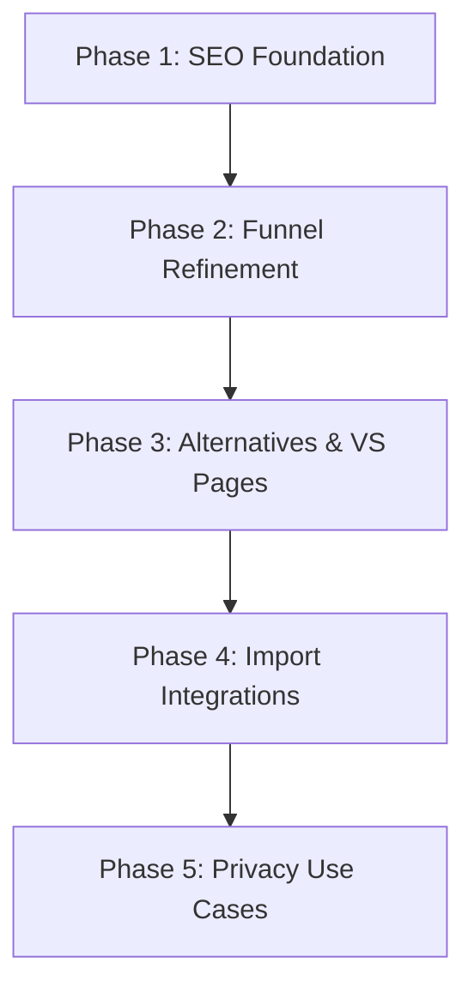

# SEO Actionable Items & Step-by-Step Implementation Plan

Based on the [Grundig Research Rapport](file:///home/espen/proj/Codex-Arcana/docs/seo/grundig-research-rapport.md) and the [Strategic SEO and Product Growth Report](file:///home/espen/proj/Codex-Arcana/docs/seo/seo-deep-research.md), this document extracts key actionable items and lays out a 5-phase execution plan.

---

## 1. Key Actionable Items Extracted

### Technical & Architecture Foundation

- **Structured Metadata**: Automatic generation of `SoftwareApplication` and `Organization` JSON-LD schemas.
- **Locale Targeting**: Setup global English as primary (`en-US`), with pre-configured headers and potential `hreflang` maps.
- **Crawling Architecture**: Dynamic XML sitemap generation including all custom generators, comparison pages, and import routes.

### Interactive Funnels & Onboarding

- **"Save to Vault" Conversion Loop**: Instead of generic sign-up forms, prompt users to save generated entities (NPCs, settlements, factions) directly to their local vault, creating their account _during_ the save action without losing current state.
- **Relational Entity Linking**: Enable linking generated results together in a temporary browser-local graph (e.g., NPC $\rightarrow$ Faction $\rightarrow$ Tavern Location $\rightarrow$ Quest) before prompt-triggering the export.
- **Interactive Flow Metrics**: Implement tracking for both **Micro-Conversion Rate** (generation/editing actions) and **Macro-Conversion Rate** (local vault exports/app downloads).

### Competitor Confrontation & Migration

- **Targeted VS / Alternative Pages**: Launch `/vs/world-anvil`, `/vs/obsidian`, `/vs/kanka`, `/vs/legendkeeper` landing pages.
- **Direct Importers as Landing Page Wedge**: High-intent routes `/import/obsidian` and `/import/world-anvil` providing single-click migration tools.

---

## 2. Step-by-Step Implementation Plan

### Phase 1: Technical & SEO Foundation

- [ ] **Task 1.1: Schema XML & Sitemap Integration**
  - Create a dynamic `sitemap.xml` route that index-crawls all generated, import, feature, and alternative paths.
  - Ensure canonical tags are set correctly across all dynamic `/generators/[slug]` routes.
- [ ] **Task 1.2: Structured Data Injectors**
  - Implement a reusable SEO component that handles standard JSON-LD injection (e.g., `SoftwareApplication` on home/feature pages, `FAQPage` or comparison schemas on VS pages).
- [ ] **Task 1.3: Meta & Title Sanitization**
  - Set strict schema validations for generator meta-descriptions to avoid truncation in Google SERPs.

### Phase 2: High-Converting Public Generators

- [ ] **Task 2.1: Inter-Entity Linking System**
  - Add relationship connections in the generator output UI. For example, when viewing a generated NPC, allow the user to click "Generate Tavern" or "Connect to Faction", keeping them in a unified web-session graph.
- [ ] **Task 2.2: "Save to Vault" CTA Flow**
  - Ensure the "Save to Vault" CTA serializes the current generated entity graph into a transient `localStorage` package.
  - Redirect to account registration/local-vault setup, cleanly unpacking the schema post-initialization.
- [ ] **Task 2.3: Tracking Dashboard**
  - Add lightweight event trackers for micro-conversion clicks (clicks on traits, edit actions) and macro downloads.

### Phase 3: Alternatives & VS Comparison Pages

- [ ] **Task 3.1: Build `/vs/[slug]` Dynamic Engine**
  - Create comparing routes highlighting:
    - World Anvil: Bloat & subscription vs. lightweight local-first.
    - Obsidian: Setup time/complex plugins vs. out-of-the-box TTRPG setup.
    - Kanka: Form-based data entry & cloud vs. reactive markdown/local.
    - LegendKeeper: Browser-offline hybrid & monthly subs vs. desktop-native zero-subs.
- [ ] **Task 3.2: Comparison UI Matrix Component**
  - Build a sleek, interactive matrix comparing feature sets, offline storage capabilities, and pricing models.

### Phase 4: Frictionless Import & Migration Hubs

- [ ] **Task 4.1: Target Import Routes**
  - Implement `/import/obsidian-vault`, `/import/world-anvil`, `/import/kanka`, and `/import/legendkeeper` landing pages.
- [ ] **Task 4.2: Direct Drag-and-Drop Parser UI**
  - Allow users to drop target export formats (e.g., markdown vault zip, JSON export payload) directly onto the web landing page.
  - Process client-side parsing, showing them a live preview of the extracted entity tree with a CTA: _"Download Codex Cryptica to save this data into your local vault."_

### Phase 5: Privacy & Local-First Use Cases

- [ ] **Task 5.1: Key Value Landing Pages**
  - Launch `/features/local-first-rpg-campaign-manager` and `/features/private-offline-worldbuilding-tool`.
  - Incorporate copy focused on data ownership, anti-AI data scraping protection, and offline loading performance.
- [ ] **Task 5.2: AI GM Assistant Privacy Page**
  - Build `/features/ai-gm-assistant` explaining the local-first zero-data-leakage architecture.
