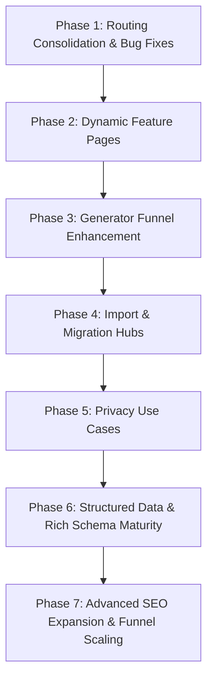

# SEO Actionable Items & Step-by-Step Implementation Plan

Based on the [Grundig Research Rapport](./grundig-research-rapport.md) and the [Strategic SEO and Product Growth Report](./seo-deep-research.md), this document extracts key actionable items and lays out a 5-phase execution plan.

---

## 1. Key Actionable Items Extracted

### Technical & Architecture Foundation

- **Structured Metadata**: Automatic generation of `SoftwareApplication` and `Organization` JSON-LD schemas.
- **Locale Targeting**: Setup global English as primary (`en-US`), with pre-configured headers and potential `hreflang` maps.
- **Crawling Architecture**: Dynamic XML sitemap generation including all custom generators, comparison pages, and import routes.
- **Reactivity Bugfix**: Fix Svelte 5 reactive metadata state bugs where `const meta = slugMeta[data.slug]` fails to update when navigating dynamically between generator types on reused layouts.

### Route Consolidation & Redirects

- **Eliminate Duplications**: Consolidate redundant routes like `/tools/dnd-npc-generator` and `/generators/npc` under a unified `/generators/` hierarchy.
- **SEO Redirections**: Implement 301 redirects for any historical `/tools/*` and `/alternatives/*` paths to point to the canonical `/generators/*` and `/vs/*` routes to preserve link equity.

### Interactive Funnels & Onboarding

- **"Save to Vault" Conversion Loop**: Instead of generic sign-up forms, prompt users to save generated entities (NPCs, settlements, factions) directly to their local vault, creating their account _during_ the save action without losing current state.
- **Relational Entity Linking**: Enable linking generated results together in a temporary browser-local graph (e.g., NPC $\rightarrow$ Faction $\rightarrow$ Tavern Location $\rightarrow$ Quest) before prompt-triggering the export.
- **Interactive Flow Metrics**: Implement tracking for both **Micro-Conversion Rate** (generation/editing actions) and **Macro-Conversion Rate** (local vault exports/app downloads).

### Competitor Confrontation & Migration

- **Targeted VS Pages**: Maintain and enhance `/vs/world-anvil`, `/vs/obsidian`, `/vs/kanka`, `/vs/legendkeeper` landing pages.
- **Direct Importers as Landing Page Wedge**: High-intent routes `/import/obsidian-vault` and `/import/world-anvil-export` providing client-side drag-and-drop parsers to preview imports instantly.

---

## 2. Step-by-Step Implementation Plan

### Phase 1: Routing Consolidation & Bug Fixes

- [x] **Task 1.1: Fix Svelte 5 Reactive Metadata**
  - Refactor page-meta variables in dynamic `/generators/[slug]` and `/solutions/[slug]` routes to use Svelte 5 `$derived()` runes.
- [x] **Task 1.2: Consolidate Duplicate Routes**
  - Set up clean 301 redirects (client-side layout or server response) mapping `/tools/*` to `/generators/*`.
  - Ensure sitemap generator points strictly to canonical `/generators/*` and `/vs/*` endpoints.

### Phase 2: Dynamic Feature Pages

- [x] **Task 2.1: Implement `/features/[slug]` Dynamic Routes**
  - Create dedicated feature landing pages for `/features/local-first-rpg-campaign-manager` and `/features/private-offline-worldbuilding-tool`.
  - Highlight key differentiators: data sovereignty, offline performance, and local file storage.

### Phase 3: Generator Funnel Enhancement

- [x] **Task 3.1: Inter-Entity Linking System**
  - Implement relationships within generator layouts allowing users to dynamically bind NPCs to Factions or Locations in a temporary local session state.
- [x] **Task 3.2: Unified Onboarding Export Flow**
  - Update the "Save to Vault" CTA to package linked entities in `localStorage` before redirection.
- [x] **Task 3.3: Micro-Conversion Tracking**
  - Log micro-customizations (editing name, trait rerolls) alongside macro downloads.

### Phase 4: Import & Migration Hubs

- [x] **Task 4.1: Target Import Routes**
  - Build out landing pages for `/import/obsidian-vault`, `/import/world-anvil-export`, `/import/kanka-json`, and `/import/legendkeeper-json`.
- [x] **Task 4.2: Direct Drag-and-Drop Parser UI**
  - Implement client-side parsers to extract entity trees from vault markdown files or JSON exports, previewing them dynamically before inviting users to download Codex.

### Phase 5: Privacy Use Cases

- [x] **Task 5.1: AI GM Assistant Privacy Page**
  - Launch `/features/ai-gm-assistant` explaining the local-first zero-data-leakage architecture.

### Phase 6: Structured Data & Rich Schema Maturity

- [x] **Task 6.1: Import & Feature Pages Schema Coverage**
  - Generate and inject `BreadcrumbList` and `FAQPage` JSON-LD schemas on `/import/[slug]` and `/features/[slug]` routes.
- [x] **Task 6.2: Core Product & SoftwareApplication Schema**
  - Add explicit `SoftwareApplication` and `Offers` schema definitions to the landing pages, declaring multi-platform local-first capabilities.
- [x] **Task 6.3: Dynamic Generator Result Schemas**
  - Map reactive NPC/Location generator results to `Person` / `Place` schema.org JSON-LD blocks in `SEOGeneratorLayout` for SERP dynamic indexing.
- [x] **Task 6.4: Fix JSON-LD injection (all routes)**
  - Replaced broken literal `` pattern (Svelte never interpolates inside raw script elements) with `{@html safeJsonLd()}` across all 6 affected files. Added `src/lib/utils/json-ld.ts` shared helper with `<`-escaping to prevent `</script>` breakout. Verified via raw SSR HTML on marketing routes.

### Phase 7: Advanced SEO Expansion & Funnel Scaling

- [ ] **Task 7.1: Alternatives Route Mapping & Redirection**
  - Implement `/alternatives/[slug]` routes or redirect aliases mapping to `/vs/[slug]` head-to-head pages to capture alternative-centric searches.
- [ ] **Task 7.2: Interactive Visual Micro-Demos**
  - Integrate a read-only Cytoscape campaign graph visualization or zoomable interactive map preview on `/features/local-first-rpg-campaign-manager` to improve conversion and lower bounce rate.
- [ ] **Task 7.3: Quest & Item Generators (Session Hub Integration)**
  - Expand random generators to support `/generators/quest` and `/generators/item` models and integrate their outputs dynamically into the multi-entity session serialization layer.
- [ ] **Task 7.4: Zero-Data-Leakage Copywriting**
  - Add highly targeted, persuasive marketing copy on the `/features/ai-gm-assistant` page contrasting local-first processing with privacy-invasive cloud SaaS scrapers.
