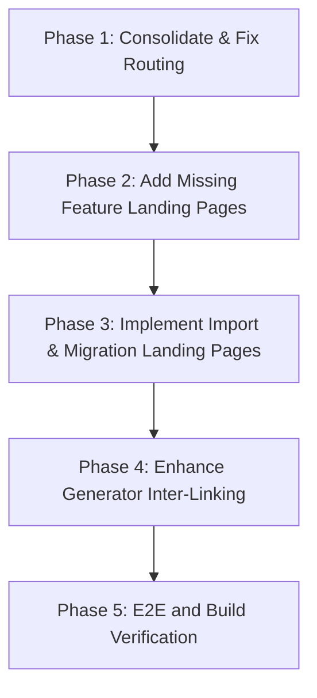

# SEO Implementation Plan Reassessment

Following a detailed review of the existing codebase (`apps/web/src/routes/(marketing)`) and the specification (`specs/129-seo-landing-pages/spec.md`), we have identified critical structural gaps, route duplications, and reactive bugs. Below is a comprehensive reassessment of the SEO plan and recommendations for alignment.

---

## 1. Identified Gaps & Duplications

### Route Duplication: `/tools/*` vs `/generators/*`

There is currently a duplication of entry points for generators:

- **NPC**: `/tools/dnd-npc-generator` AND `/generators/npc`
- **Faction**: `/tools/faction-generator` AND `/generators/faction`
- **Vampire**: `/tools/vampire-clan-generator` (themed faction) and generic horror theme in `/generators/faction`
- _Action_: We should consolidate these. The SEO research reports strongly recommend standardizing on a clean `/generators/` folder hierarchy. We should use 301 redirects or SvelteKit route redirection from `/tools/*` to `/generators/*` to prevent split link equity and crawlers indexing duplicate content.

### URL naming mismatch: `/vs/*` vs `/alternatives/*`

- The codebase implements `/vs/[slug]` (e.g., `/vs/obsidian`, `/vs/world-anvil`).
- The research reports recommend `/alternatives/[slug]` (e.g., `/alternatives/world-anvil`, `/alternatives/obsidian-for-dnd`).
- _Action_: `/vs/[slug]` is standard for head-to-head queries. However, to capture both intents, we should keep `/vs/[slug]` and add SvelteKit redirects from `/alternatives/*` to `/vs/*`, or vice-versa, or support both using a shared template.

### Missing Landing Pages

- **Import / Migration pages**: `/import/obsidian-vault`, `/import/world-anvil-export`, `/import/kanka-json`, and `/import/legendkeeper-json` do not exist.
- **Feature pages**: Only the main `/features` route exists. The individual routes `/features/local-first-rpg-campaign-manager` and `/features/private-offline-worldbuilding-tool` are missing.

---

## 2. Identified Bugs & Technical Debt

### Reactive Metadata Bug in `/generators/[slug]`

In `apps/web/src/routes/(marketing)/generators/[slug]/+page.svelte`:

```typescript
const meta = slugMeta[data.slug];
```

This is a standard Svelte 5 bug. `data` is a reactive prop. When a user navigates from `/generators/npc` to `/generators/settlement`, the page component is reused, but `meta` remains bound to the initial slug value, causing broken title and meta headers.

- _Fix_: Change to a derived rune:
  ```typescript
  const meta = $derived(slugMeta[data.slug]);
  ```

---

## 3. Reassessed Step-by-Step Plan



### Phase 1: Consolidate & Fix Routing

- [ ] **Task 1.1: Fix Svelte 5 reactive metadata bugs**
  - Change all static meta definitions in `generators/[slug]` and `solutions/[slug]` to use `$derived` runes.
- [ ] **Task 1.2: Consolidate duplicate routes**
  - Setup clean 301 redirects (via `+layout.ts` or server redirects) from `/tools/*` to `/generators/*` to preserve SEO value.
  - Update `sitemap.xml` to list the canonical `/generators/*` and `/vs/*` routes.

### Phase 2: Add Missing Feature Landing Pages

- [ ] **Task 2.1: Create `/features/[slug]` dynamic route**
  - Add `/features/local-first-rpg-campaign-manager` and `/features/private-offline-worldbuilding-tool` using `SEOPageLayout.svelte`.
  - Draft copy emphasizing anti-scraping AI, offline capabilities, and local Markdown file access.

### Phase 3: Implement Import & Migration Landing Pages

- [ ] **Task 3.1: Create `/import/[slug]` dynamic route**
  - Build comparison pages for importing: `/import/obsidian-vault`, `/import/world-anvil-export`, `/import/kanka-json`, and `/import/legendkeeper-json`.
- [ ] **Task 3.2: Build frontend client-side drag-and-drop parse components**
  - Let users drop files to preview parsed contents and prompt them to download Codex to save them locally.

### Phase 4: Enhance Generator Inter-Linking

- [ ] **Task 4.1: Update `SEOGeneratorLayout`**
  - Add cross-links and state-preservation to link NPCs to Factions, Locations, or Quests.
- [ ] **Task 4.2: Update "Save to Vault" CTA**
  - Save multi-entity relations into a combined `localStorage` payload.
