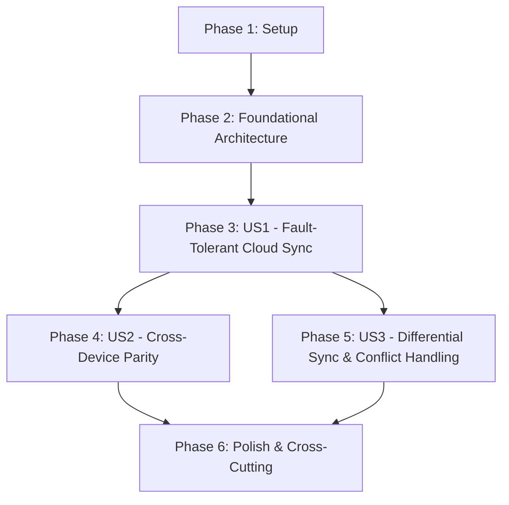

# Tasks: Robust GDrive Sync

## Dependencies & Completion Order

## Implementation Strategy

We will follow an incremental delivery approach, focusing on **User Story 1** as the MVP. The core engine will be refactored to support generic backends, followed by the specific implementation of the Google Drive REST API connector.

## Phase 1: Setup

- [x] T001 Initialize the task list and verify project structure per `specs/060-robust-gdrive-sync/plan.md`
- [x] T002 [P] Configure Google Identity Services (GIS) library injection in `apps/web/src/app.html`
- [x] T003 [P] Add necessary TypeScript types for Google Identity Services and Google Drive v3 API in `packages/sync-engine/src/types.ts`

## Phase 2: Foundational Architecture

- [x] T004 [P] Refactor `packages/sync-engine/src/types.ts` to introduce `ICloudSyncBackend` and `FileMetadata` generalization
- [x] T005 Refactor `packages/sync-engine/src/LocalSyncService.ts` to implement the new `ICloudSyncBackend` interface
- [x] T006 [P] Update `packages/sync-engine/src/SyncRegistry.ts` to support `remoteId`, `remoteHash`, and `lastSyncToken` in IndexedDB
- [x] T007 [P] Create the base `packages/sync-engine/src/GDriveBackend.ts` with foundational auth and connectivity logic

## Phase 3: User Story 1 - Fault-Tolerant Cloud Sync [US1]

**Goal**: Establish a reliable connection and handle basic file synchronization with retry logic.
**Independent Test**: Use the `GDriveBackend` to successfully connect, refresh a token silently, and upload/download a file with simulated network failures.

- [x] T008 [US1] Implement GIS token management and silent refresh flow in `packages/sync-engine/src/GDriveBackend.ts`
- [x] T009 [US1] Implement exponential backoff wrapper for `fetch` requests in `packages/sync-engine/src/GDriveBackend.ts`
- [x] T010 [US1] Implement `uploadFile` and `downloadFile` methods in `packages/sync-engine/src/GDriveBackend.ts`
- [x] T011 [US1] Implement `ICloudSyncService` orchestrator in `packages/sync-engine/src/CloudSyncService.ts`
- [x] T012 [US1] Create unit tests for `GDriveBackend` mocking fetch in `packages/sync-engine/tests/unit/GDriveBackend.test.ts`
- [x] T013 [US1] Implement basic "Connect to GDrive" UI component in `apps/web/src/lib/components/sync/GDriveConnect.svelte`

## Phase 4: User Story 2 - Cross-Device Parity [US2]

**Goal**: Ensure files modified on other devices are pulled down correctly.
**Independent Test**: Manually place a file in GDrive, run sync, and verify it appears in the app's OPFS storage.

- [x] T014 [US2] Implement `scanChanges` using the GDrive `changes` feed in `packages/sync-engine/src/GDriveBackend.ts`
- [x] T015 [US2] Integrate `scanChanges` results into the `CloudSyncService` sync loop in `packages/sync-engine/src/CloudSyncService.ts`
- [x] T016 [US2] Implement deletion tracking and propagation in `packages/sync-engine/src/CloudSyncService.ts`
- [x] T017 [US2] Add unit tests for `scanChanges` and deletion logic in `packages/sync-engine/tests/unit/CloudSyncService.test.ts`

## Phase 5: User Story 3 - Differential Sync & Conflict Handling [US3]

**Goal**: Optimize sync speed and handle simultaneous edits using "Newest Wins".
**Independent Test**: Modify a file in GDrive and locally with different timestamps; verify the newer one is kept.

- [x] T018 [US3] Update `packages/sync-engine/src/DiffAlgorithm.ts` to ensure full compatibility with `GDriveBackend` metadata
- [x] T019 [US3] Implement `lastSyncToken` persistence in `CloudSyncService.ts` to enable incremental delta syncs
- [x] T020 [US3] Implement conflict resolution verification in `packages/sync-engine/tests/unit/DiffAlgorithm.test.ts`
- [x] T021 [US3] Optimize file fingerprinting (hashing) for binary assets in `packages/sync-engine/src/DiffAlgorithm.ts`

## Phase 6: Polish & Cross-Cutting Concerns

- [x] T022 Implement a "Sync Dashboard" showing overall progress, per-file progress bars for large assets, rate-limit status, and results in `apps/web/src/lib/components/sync/SyncDashboard.svelte`
- [x] T023 Add user documentation for GDrive sync in `apps/web/src/lib/config/help-content.ts`
- [x] T024 Perform final integration testing with real GDrive account and unstable network simulation
- [x] T025 Prefix any unused variables with `_` and ensure all linting/type-checks pass project-wide
