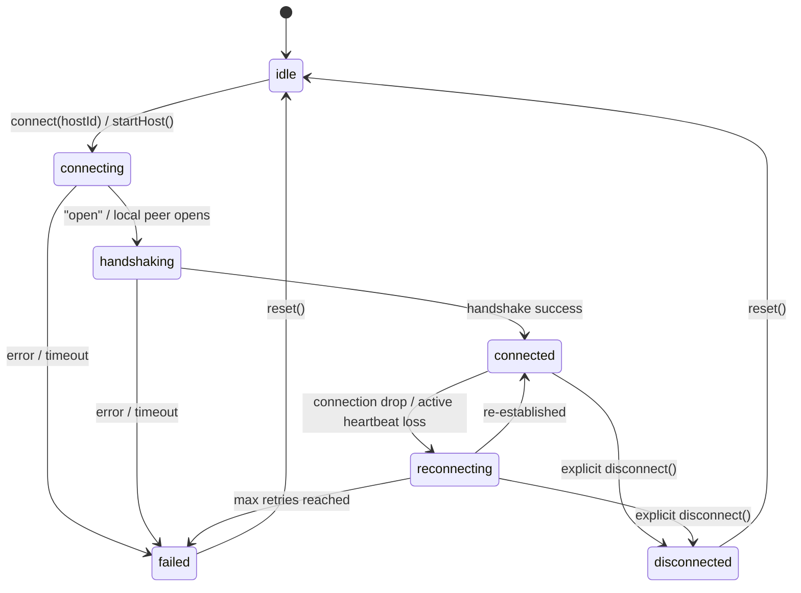

# Data Model: Unified PeerJS Connection Manager

This document defines the core state machine, reactive types, and data schemas for Spec 104.

## 1. Connection State Machine

The connection status transitions through a strict state machine:



### States Defined:

- `idle`: Not connected; signaling server is idle.
- `connecting`: Actively negotiating signaling channel setup or opening peer.
- `handshaking`: Signaling channel open; exchanging and validating protocol handshake.
- `connected`: Active connection with zero packet drops in heartbeat window.
- `reconnecting`: Network dropout detected. Exponential backoff retry loop in progress.
- `failed`: Retries exhausted; manual intervention needed.
- `disconnected`: Connection gracefully closed by player or host.

---

## 2. PeerJSConnectionManager Types

### `ConnectionState`

This interface represents the reactive data exposed by the Connection Manager.

```typescript
export interface ConnectionState {
  status:
    | "idle"
    | "connecting"
    | "handshaking"
    | "connected"
    | "reconnecting"
    | "disconnected"
    | "failed";
  latencyMs: number; // Rolling average RTT
  peerId: string | null; // Self peer ID
  remotePeerId: string | null; // Connected peer ID (or central host ID)
  retryCount: number; // Current reconnect try count (0 to reconnectDelays.length)
}
```

### `PeerJSMessage<T = any>`

All raw WebRTC data packets must conform to this standard payload wrapper.

```typescript
export interface PeerJSMessage<T = any> {
  type: string; // Message namespace (e.g., "ping", "pong", "sync:state", "chat")
  senderId: string; // Peer ID of the sender
  timestamp: number; // Epoch millisecond timestamp
  payload: T; // Main payload data
}
```

---

## 3. Validation Rules

- **Handshake payloads**: MUST be validated upon receipt.
- **Heartbeat Timeout**: If no response is received within 15 seconds after a `ping` message, the manager MUST transition to `reconnecting` and attempt automatic recovery.
- **Message format**: Messages lacking a `type` or `senderId` field MUST be immediately dropped to guarantee type safety and prevent crashes.
