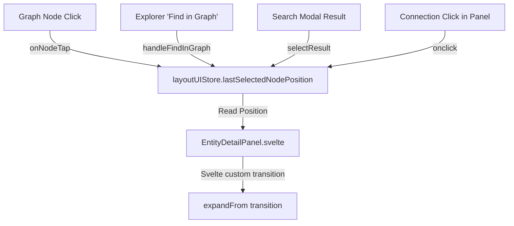

# Implementation Plan: Entity Detail Panel & Graph Node Selected Animation

**Branch**: `feat/animate-node-opening` | **Date**: 2026-05-22 | **Spec**: [spec.md](./spec.md)

## Summary

Implements premium, tactile visual transition animations when opening the entity detail panel and when selecting a node on the relationship graph. The panel expands outwards from the trigger point (graph node, list button, search result, connection tab) on desktop, slides up as a bottom sheet on mobile, and cross-fades content on internal navigation. The selected node highlights itself with an underlay style expansion animation.

## Architecture & Coordinate Flow

The following diagram illustrates how click coordinates propagate from various entry points into `layoutUIStore` and are consumed by `EntityDetailPanel` to position the transform origin:



## Detailed Changes

### UI & Layout Coordinate Tracking

#### [layout-ui.svelte.ts](file:///home/espen/proj/Codex-Arcana/apps/web/src/lib/stores/ui/layout-ui.svelte.ts)

- Introduced `lastSelectedNodePosition` Svelte `$state` property of type `{ x: number, y: number } | null`.
- Provided a `setLastSelectedNodePosition(pos)` method to store target coordinates.

### Coordinate Capture Entry Points

#### [graph-view-controller.svelte.ts](file:///home/espen/proj/Codex-Arcana/apps/web/src/lib/components/graph/graph-view-controller.svelte.ts)

- Inside `onNodeTap`, extracted the Cytoscape node rendered position and converted it to absolute client viewport coordinates using the canvas container bounding rect.
- Stored the position in the UI layout store.

#### [EntityExplorer.svelte](file:///home/espen/proj/Codex-Arcana/apps/web/src/lib/components/explorer/EntityExplorer.svelte) & [EntityList.svelte](file:///home/espen/proj/Codex-Arcana/apps/web/src/lib/components/explorer/EntityList.svelte)

- Passed the mouse `onclick` event through the `onFindInGraph` callback.
- In `handleFindInGraph`, extracted `clientX` and `clientY` from the mouse event to set the store position.

#### [SearchModal.svelte](file:///home/espen/proj/Codex-Arcana/apps/web/src/lib/components/search/SearchModal.svelte)

- Extracted pointer `clientX` / `clientY` inside `selectResult` on result click.

#### [DetailStatusTab.svelte](file:///home/espen/proj/Codex-Arcana/apps/web/src/lib/components/entity-detail/DetailStatusTab.svelte)

- Captured `clientX` / `clientY` of the click event on connection links to preserve origin context before modifying `selectedEntityId`.

### Custom Svelte Transitions

#### [EntityDetailPanel.svelte](file:///home/espen/proj/Codex-Arcana/apps/web/src/lib/components/EntityDetailPanel.svelte)

- Implemented `expandFrom(_node: HTMLElement)` custom transition:
  - **Mobile**: Slides up using a `translateY` offset.
  - **Desktop with coordinates**: Scales (`scale(t)`) and fades (`opacity: t`) from a dynamic `transform-origin` computed as:
    ```js
    const relativeX = pos.x - (window.innerWidth - sidebarWidth);
    const relativeY = pos.y;
    ```
  - **Desktop without coordinates**: Slides in from the right edge.
- Wrapped content wrapper in a Svelte `{#key entity.id}` block to trigger cross-fading.
- Styled the layout container with `display: grid; grid-template-columns: 1fr; grid-template-rows: 1fr;` and placed children at `col-start-1 row-start-1` to align overlapping elements during transitions, preventing double-height vertical stacking.

### Cytoscape Selection Feedback

#### [GraphView.svelte](file:///home/espen/proj/Codex-Arcana/apps/web/src/lib/components/GraphView.svelte)

- Inside the selection effect, triggered an imperative Cytoscape animation on the selected node:
  1. Scales `underlay-padding` to `24px` and increases `underlay-opacity` to `0.5` over 250ms.
  2. Restores `underlay-padding` to `8px` and `underlay-opacity` to `0.3` over 250ms on completion.

---

## Verification Plan

### Automated Tests

- Run full Vitest test suites to check layout stores and component regression:
  ```bash
  bun run test
  ```

### Manual Verification

1. **Desktop Scale Transition**: Click a node on the graph. Verify the panel expands outward from the node center.
2. **Explorer Transition**: Open the entity list and click "Find in Graph" on a character. Verify the panel expands outward from the button clicked.
3. **Internal Nav Cross-fade**: Inside the detail panel, click a connection link. Verify the panel remains static, and old content fades out as the new content fades in.
4. **Mobile Bottom Sheet**: Resize browser to mobile width and click a node. Verify the panel slides up from the bottom.
5. **Graph Selected Pulse**: Click any node on the graph. Verify a subtle ripple expands and shrinks on the node's selection underlay.
