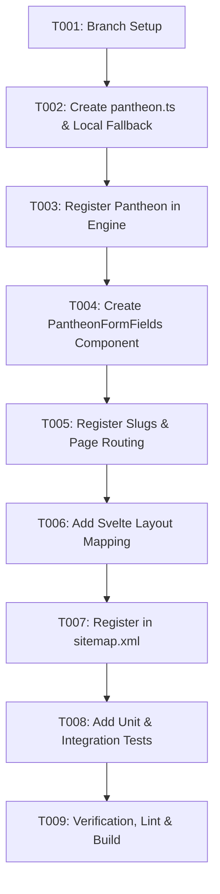

# Task List: Pantheon / God Generator

**Branch**: `1255-pantheon-generator` | **Date**: 2026-06-11
**Spec**: [spec.md](file:///home/espen/proj/remotecodexarcana/specs/1255-pantheon-generator/spec.md)
**Plan**: [plan.md](file:///home/espen/proj/remotecodexarcana/specs/1255-pantheon-generator/plan.md)

## Dependency Graph



## Phase 1: Setup & Initialization

- [x] T001 Verify active branch is `1255-pantheon-generator` and the working tree is clean.

## Phase 2: Foundational Engine Work

- [x] T002 Create the generator file at `apps/web/src/lib/services/seo/generators/pantheon.ts` containing the `pantheonConfig` data structure and the `generatePantheon` function with local fallback tables.
- [x] T003 Register the `generatePantheon` function and configurations in the central engine `apps/web/src/lib/services/seo/generator-engine.ts`.

## Phase 3: Single Deity Generator [US1]

- [x] T004 Create Svelte component `apps/web/src/lib/components/seo/PantheonFormFields.svelte` implementing options (Divine Type, Domains, Tones, Worshippers, Conflict Themes, etc.) and a "Surprise Me" randomization button.
- [x] T005 Update SvelteKit page loader in `apps/web/src/routes/(marketing)/generators/[slug]/+page.ts` to include `"pantheon-generator"` and `"god-generator"` in `validSlugs` and entries.
- [x] T006 Integrate `PantheonFormFields` and config mappings inside the dynamic page `apps/web/src/routes/(marketing)/generators/[slug]/+page.svelte`.
- [x] T007 Register `"pantheon-generator"` and `"god-generator"` in `apps/web/src/routes/sitemap.xml/+server.ts` to expose them to search engines.

## Phase 4: Small Pantheon Generator [US2] & Campaign Context [US3]

- [x] T008 Add unit tests in `apps/web/src/lib/services/seo/generator-engine.test.ts` to verify Single Deity and Small Pantheon generation, local fallback generation, option binding, and UTM link campaigns.
- [x] T009 Run verification tests, style linter, and static builds to ensure no typescript errors exist.

```bash
bun test generator-engine.test.ts && bun run lint
```
