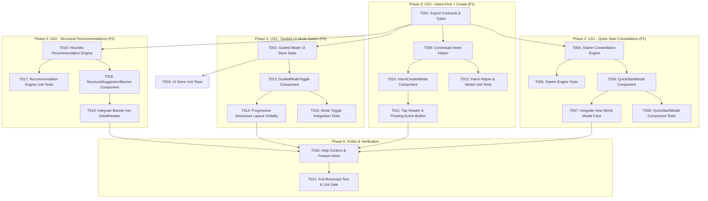

# Tasks: Guided Mode & Quick Start Experience

**Feature Branch**: `148-guided-mode-quickstart`  
**Created**: 2026-07-30  
**Spec**: [`spec.md`](./spec.md) | **Plan**: [`plan.md`](./plan.md)

---

## Task Dependencies & Execution Order

---

## Tasks List

### Phase 1: Setup & Foundational Infrastructure

- [x] T001 Export contracts and type definitions in `packages/generator-engine/src/starter-constellation-types.ts`
- [x] T002 Add `isGuidedMode` rune state and local persistence in `apps/web/src/lib/stores/ui/ui.svelte.ts`
- [x] T003 [P] Write unit tests for `uiStore` Guided Mode toggle and local persistence in `apps/web/src/lib/stores/ui/ui.svelte.test.ts`

---

### Phase 2: User Story 1 - Quick Start Constellation Generation (Priority: P1)

**Story Goal**: Allow users to generate a ~4–6 entity starter constellation from a theme and optional premise when creating a new world.  
**Independent Test**: Select "Quick Start World", pick a theme, enter a seed premise, and verify 4–6 theme-matched entities with cross-links populate the workspace.

- [x] T004 [US1] Implement theme archetype tables and starter constellation generator in `packages/generator-engine/src/starter-constellation.ts`
- [x] T005 [P] [US1] Write unit tests covering local offline fallback & AI starter constellation generation in `packages/generator-engine/src/starter-constellation.test.ts`
- [x] T006 [US1] Build `QuickStartModal.svelte` with theme selector, premise input, and "Generate Starter World" action in `apps/web/src/lib/components/guided/QuickStartModal.svelte`
- [x] T007 [P] [US1] Add "Quick Start World" card alongside "Empty Workspace" on the New World modal in `apps/web/src/lib/components/canvas/CanvasSelectionModal.svelte`
- [x] T008 [P] [US1] Write component tests for `QuickStartModal.svelte` in `apps/web/src/lib/components/guided/QuickStartModal.test.ts`

---

### Phase 3: User Story 2 - Intent-First Context-Aware `+ Create` (Priority: P1)

**Story Goal**: Provide an intent-first `+ Create` menu that infers current world context and generates sensible defaults immediately with an optional "Customize" expander.  
**Independent Test**: From an active entity card, click `+ Create` → "Character", verify context is inferred and draft is generated with 1-click, and verify "Customize" reveals parameters.

- [x] T009 [US2] Create contextual intent pre-fill helper `contextual-intent-helper.ts` in `apps/web/src/lib/components/guided/contextual-intent-helper.ts`
- [x] T010 [P] [US2] Build `IntentCreateModal.svelte` for intent selection (Character, Place, Faction, Event, Item, Custom) with instant draft generation & "Customize" drawer in `apps/web/src/lib/components/guided/IntentCreateModal.svelte`
- [x] T011 [P] [US2] Add top app header `+ Create` button and workspace floating action button in `apps/web/src/lib/components/canvas/CanvasHUD.svelte`
- [x] T012 [P] [US2] Write unit tests for `contextual-intent-helper.ts` and `IntentCreateModal.test.ts` in `apps/web/src/lib/components/guided/IntentCreateModal.test.ts`

---

### Phase 4: User Story 3 - Guided UI & Non-Destructive Mode Switch (Priority: P2)

**Story Goal**: Provide a simplified Guided Mode interface that hides advanced toolbars while allowing non-destructive 1-click toggling back to Full Toolbox mode.  
**Independent Test**: Toggle Guided Mode ON/OFF and verify UI panels hide/show instantly without losing state, open tabs, or unsaved drafts.

- [x] T013 [US3] Build Guided Mode ↔ Full Toolbox toggle switch component `GuidedModeToggle.svelte` in `apps/web/src/lib/components/guided/GuidedModeToggle.svelte`
- [x] T014 [P] [US3] Connect Guided Mode preference visibility rules to simplify app layout toolbars in `apps/web/src/routes/(app)/+layout.svelte` and `ZenHeader.svelte`
- [x] T015 [P] [US3] Write component and integration tests verifying non-destructive state preservation on toggle in `apps/web/src/lib/components/guided/GuidedModeToggle.test.ts`

---

### Phase 5: User Story 4 - Contextual Next Steps & Recommendations (Priority: P2)

**Story Goal**: Automatically recommend structural next steps (e.g., "Who leads this faction?") via a subtle banner at the bottom of entity detail panels.  
**Independent Test**: View a Faction without a leader character, verify recommendation banner appears at panel bottom, click "Add Leader", and verify `+ Create` launches pre-filled.

- [x] T016 [US4] Implement deterministic heuristic recommendation engine in `apps/web/src/lib/services/contextual-recommendations.ts`
- [x] T017 [P] [US4] Write unit tests for structural recommendation rules in `apps/web/src/lib/services/contextual-recommendations.test.ts`
- [x] T018 [P] [US4] Build `StructuralSuggestionBanner.svelte` component rendered at the bottom of the detail panel in `apps/web/src/lib/components/guided/StructuralSuggestionBanner.svelte`
- [x] T019 [P] [US4] Integrate `StructuralSuggestionBanner` into `apps/web/src/lib/components/entity-detail/DetailHeader.svelte`

---

### Phase 6: Polish, User Documentation & Quality Gate

- [x] T020 Add Guided Mode and Quick Start help documentation and feature hints in `apps/web/src/lib/config/help-content.ts`
- [x] T021 [P] Run full monorepo lint (`bun run lint`) and test suite (`bun test`) to ensure clean merge readiness
