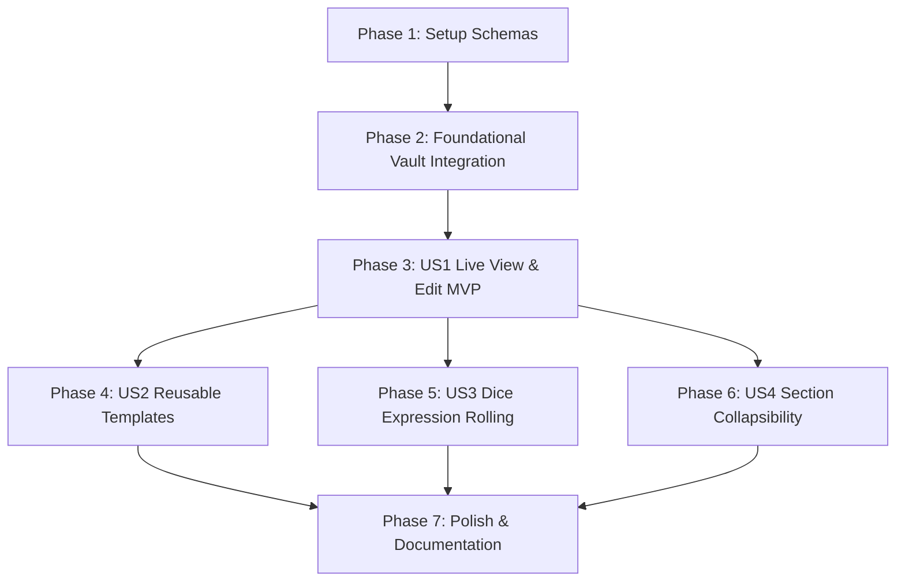

# Tasks: Lightweight Reusable Stat Sheets

**Input**: Design documents from `/specs/149-reusable-stat-sheets/`  
**Prerequisites**: plan.md, spec.md, research.md, data-model.md, quickstart.md

## Format: `[ID] [P?] [Story] Description`

- **[P]**: Can run in parallel (different files, no dependencies)
- **[Story]**: User story phase label ([US1], [US2], [US3], [US4])

---

## Phase 1: Setup (Shared Infrastructure)

**Purpose**: Define schema data types and validation logic in `packages/schema`.

- [x] T001 Define Zod schemas and TypeScript types for `StatSheetFieldType`, `StatSheetField`, `StatSheet`, and `StatSheetTemplate` in `packages/schema/src/stats.ts`
- [x] T002 Export stat sheet types and Zod validators in `packages/schema/src/index.ts`

---

## Phase 2: Foundational (Blocking Prerequisites)

**Purpose**: Core entity frontmatter integration that MUST be complete before UI components can read/write stat sheets.

- [x] T003 Add optional `statSheet` frontmatter field support to `@codex/vault-engine` and `apps/web/src/lib/stores/vault/entities.ts`
- [x] T004 Write unit tests for `statSheet` YAML frontmatter parsing and serialization in `apps/web/src/lib/utils/markdown.test.ts`

---

## Phase 3: User Story 1 - Live Table View & Edit of Entity Stat Sheets (Priority: P1) 🎯 MVP

**Goal**: View and adjust manual entity stats (counters, numbers, short text, long text) in real time during gameplay.

**Independent Test**: Render `StatSheetView.svelte`, tap `-` / `+` on counter fields, edit text values, and verify entity frontmatter updates reactively.

- [x] T005 [P] [US1] Create `StatSheetView.svelte` in `apps/web/src/lib/components/stats/StatSheetView.svelte` for interactive rendering of counter, number, text, and longtext controls
- [x] T006 [P] [US1] Create `StatSheetEditor.svelte` in `apps/web/src/lib/components/stats/StatSheetEditor.svelte` for adding, editing, reordering, and deleting stat fields
- [x] T007 [US1] Integrate `StatSheetView.svelte` into a dedicated "Stats" tab inside `apps/web/src/lib/components/zen/ZenView.svelte` (via new `DetailStatsTab.svelte`, mirroring the existing Family/Timeline tab pattern)
- [x] T008 [US1] Write unit tests for counter adjustments and field edits in `apps/web/src/lib/components/stats/StatSheetView.test.ts`

---

## Phase 4: User Story 2 - Reusable Stat Sheet Templates (Priority: P2)

**Goal**: Save customized stat layouts as templates and apply them across entities to avoid repetitive manual field creation.

**Independent Test**: Create a template in `StatSheetTemplateModal.svelte`, apply it to a new entity, and verify fields populate correctly.

- [x] T009 [P] [US2] Implement `StatSheetTemplateStore` in `apps/web/src/lib/stores/stat-sheet-templates.svelte.ts` backed by IndexedDB
- [x] T010 [P] [US2] Add default built-in templates (D&D Character/NPC, Ship, Settlement) in `apps/web/src/lib/stores/stat-sheet-templates.svelte.ts`
- [x] T011 [US2] Create `StatSheetTemplateModal.svelte` in `apps/web/src/lib/components/stats/StatSheetTemplateModal.svelte` to choose, apply, or save layout templates
- [x] T012 [US2] Write unit tests for template creation, persistence, and application in `apps/web/src/lib/stores/stat-sheet-templates.test.ts`

---

## Phase 5: User Story 3 - Tactical In-Game Action & Dice Expression Rolling (Priority: P2)

**Goal**: Execute 1-tap dice rolls directly from `Dice` stat fields during live play and active VTT sessions.

**Independent Test**: Tap the roll button on a `Dice` field with formula `1d20+5` and verify dice roller execution and VTT log broadcast.

- [x] T013 [US3] Implement `Dice` field control with 1-tap roll button in `apps/web/src/lib/components/stats/StatSheetView.svelte`
- [x] T014 [US3] Wire 1-tap roll button to `diceEngine`/`diceParser` (`dice-engine` package) and `mapSession.sendResolvedRollMessage` VTT broadcast in `StatSheetView.svelte`
- [x] T015 [US3] Write unit tests for `Dice` field formula execution and VTT log emission in `apps/web/src/lib/components/stats/StatSheetView.test.ts`

---

## Phase 6: User Story 4 - Section Grouping & Collapsibility (Priority: P3)

**Goal**: Group fields under collapsible section headings to optimize screen space during sessions.

**Independent Test**: Click section headers in `StatSheetView.svelte` and verify child fields collapse and expand cleanly.

- [x] T016 [US4] Add `Heading` section divider collapse/expand state handling in `apps/web/src/lib/components/stats/StatSheetView.svelte`
- [x] T017 [US4] Write unit tests for section collapsibility in `apps/web/src/lib/components/stats/StatSheetView.test.ts`

---

## Phase 7: Polish & Cross-Cutting Concerns

**Purpose**: Documentation, style guide compliance, and overall suite verification.

- [x] T018 Add user-facing help documentation in `apps/web/src/lib/content/help/stat-sheets.md` (auto-discovered by `loadHelpArticles()`'s `import.meta.glob`, no registration needed in `help-content.ts`)
- [x] T019 Verify UI style guide compliance (Tailwind 4 tokens, Iconify utility icons `icon-[lucide--...]`, Svelte 5 runes) — `bun run lint` and `svelte-check` both clean
- [x] T020 Run complete build and test suite (`bun run lint && bun run test`) — all packages pass (web: 371 files / 2886 tests passed)

---

## Dependencies & Execution Order

---

## Parallel Execution Examples

- **Phase 3 (US1)**: `T005` (`StatSheetView.svelte`) and `T006` (`StatSheetEditor.svelte`) can be developed in parallel.
- **Phase 4 (US2)**: `T009` (`StatSheetTemplateStore`) and `T010` (Built-in default templates) can be developed in parallel.
