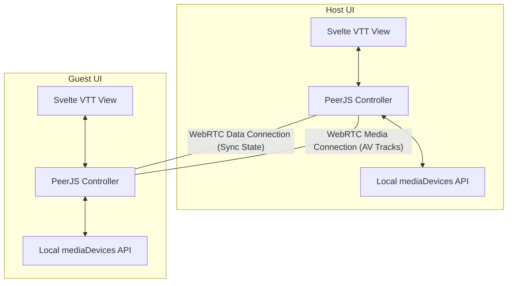

# Technical Feasibility Analysis: P2P Audio/Video Integration

This analysis evaluates the integration of low-latency, peer-to-peer (P2P) voice and video communications directly into Codex Cryptica, extending its local-first, zero-cost networking footprint.

---

## 🏛️ Architectural Context

Codex Cryptica already has a robust WebRTC coordination layer managed via **PeerJS** (Spec 098/100) for real-time map, token, and campaign syncing. Integrating real-time Audio/Video (AV) leverage these existing direct socket connections, appending real-time media streams over the same signaling handshakes.



---

## 🛠️ Implementation Strategy

By utilizing native browser capabilities and building on the decoupled `P2PHostService` and `P2PGuestService`, the core implementation breaks down into three key areas:

### 1. Hardware Access & Handshake

Users explicitly opt-in to AV sharing via a Svelte component interface, prompting standard browser media permissions:

```typescript
async function acquireLocalMedia(
  video = true,
  audio = true,
): Promise<MediaStream> {
  return await navigator.mediaDevices.getUserMedia({
    audio: { echoCancellation: true, noiseSuppression: true },
    video: video ? { width: 320, height: 240, frameRate: 15 } : false,
  });
}
```

### 2. Stream Transmission via PeerJS

When establishing P2P data channels, the host/guest controllers initiate concurrent media calls using WebRTC:

```typescript
// Call initiator (triggers when connection handshakes complete)
const call = peer.call(remotePeerId, localStream);

// Call responder (handles incoming call connections)
peer.on("call", (incomingCall) => {
  incomingCall.answer(localStream);
  incomingCall.on("stream", (remoteStream) => {
    // Pipe to the target guest video overlay component
    remoteStreams.update((map) => {
      map.set(incomingCall.peer, remoteStream);
      return map;
    });
  });
});
```

### 3. Svelte 5 Overlay Component

A lightweight, floating Svelte component overlays player portraits directly onto the VTT workspace, wrapping native `<video>` elements with state-reactive controls for muting, deafening, and cam toggles.

---

## ⚖️ Tenability & Trade-Offs

### The Advantages (Highly Viable)

- **Zero Infrastructure Overhead**: Because media stream delivery is entirely decentralized (P2P Mesh), there are **no server hosting costs** associated with video/audio relay. Bandwidth is distributed entirely among connected clients.
- **Low-Latency Interactions**: Direct node-to-node routing provides exceptionally fast stream delivery (sub-150ms), allowing instantaneous reaction feedback during sessions.
- **Privacy by Design**: Fully satisfies CC’s data-sovereignty principles. Zero media is processed, indexed, or stored on third-party environments.

### The Key Bottleneck (The Mesh Constraint)

In a pure peer-to-peer mesh architecture, every peer must stream outbound video to _every other peer_ in the session.
$$\text{Total Direct Streams} = N \times (N - 1)$$
For a game session of $N$ players, this creates a dramatic scaling curve:

| Connected Players | Outbound Streams / Player | Inbound Streams / Player | Total Network Streams |
| :---------------: | :-----------------------: | :----------------------: | :-------------------: |
|       **2**       |             1             |            1             |           2           |
|       **4**       |             3             |            3             |          12           |
|       **6**       |             5             |            5             |          30           |

- **Impact**: While 4 players is highly stable on residential connections, 6+ players can saturate a user’s upstream bandwidth, causing audio jitter and latency spikes.

---

## 🚦 Recommended Guardrails & Boundaries

To ensure this feature does not compromise the stability of primary encounter state syncs, the system must deploy with strict performance fallbacks:

1. **Independent Life-Cycles**: Audio/Video and Data Sync connections must run on independent channels. A crash or overload in the media track must never disrupt map state syncs.
2. **Aggressive Low-Bandwidth Fallbacks**:
   - Auto-degrade outbound resolution (e.g., dynamically drop from $30\text{fps} \to 15\text{fps}$ under packet loss).
   - Support an **Audio-Only Mode** to preserve upstream bandwidth for slower networks.
3. **Hardware Echo Cancellation**: Explicitly configuration of native `echoCancellation` and `noiseSuppression` streams to prevent room loop feedback without requiring external headset setups.
